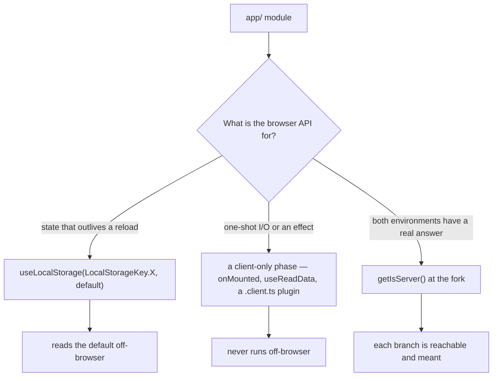

# Browser Execution

[Module boundaries](/docs/architecture/module-boundaries) settles which way an import may point: `app/` is client code and `shared/` may not reach into it. That is a statement about the **import graph**, and it is silent about the thing this page is about — `app/` is _evaluated_ in more than one environment. The SSR render runs it in Node with no `window`, the browser runs it with one, and a test runs it in whichever environment its directive names, which by default is Node.

So every module that touches a browser API faces the same question, and the failure mode is that each one answers it separately. That is not hypothetical: `getDraft` guarded with `getIsServer()`, its siblings `setDraft` and `removeDraft` did not, and a debounced draft save firing after its test environment was torn down threw `window is not defined` — a green test run that still exited non-zero.

**The guard belongs where the environment is decided, and there are only two such places.** A leaf never decides.

## Persisted state is a ref, not a key

Anything the UI reads and writes over time — a collapsed sidebar, a display mode, a device id, a draft — is `useLocalStorage`. VueUse's ref answers the default off-browser, so there is nothing to guard, and the value is reactive, so nothing has to be re-read after a write.

The consequence worth naming: **the ref is the storage, not a copy kept beside it.** The message input store used to hold `drafts` as a `Map` _and_ mirror every change into a key per composer, which is two sources of truth held in step by hand — the arrangement in which one call site can be forgotten, as one was. It is now a single `Map` behind `useLocalStorage`, with a serializer (`draftsSerializer`) that validates on read with the same Zod schema the model already declares. `flush: "sync"` is set there deliberately: a draft is persisted state rather than rendered state, and the default pre-flush write leaves a window in which the composer is empty but the storage still holds what was in it.

A store that needs a `Map` or a class instance passes a `serializer` rather than falling back to raw keys.

## One-shot I/O belongs to a phase

Some reads are genuinely not state: the offline save system reads one JSON blob once and hands it to a class constructor. Those live inside a client-only phase — `onMounted`, or `useReadData`, whose unauthenticated branch is `onMounted` for exactly this reason — and the module carries no guard of its own, because the phase already decided.

`window.localStorage` is a `no-restricted-syntax` error, so this is enforced rather than remembered. The offline save system is the standing exception and disables the rule on the line, with its reason: the key is a parameter there, so no ref can own it. Tests need no exemption either, because a test addresses the global bare (`localStorage.clear()`): the `window.` prefix the rule requires of `app/` source would be a `ReferenceError` in a Node-environment test.

## What `getIsServer()` is still for

A genuine fork, where both branches are real and reachable: `serialize`/`deserialize` choosing `Buffer` over `btoa`, `getTextFromHtml` returning raw HTML where there is no `DOMParser`, `useCursorPaginationOperationData` writing into the Nuxt payload only on the server. These are the only hand-written uses left, and each one exists because the _answer_ differs by environment, not because the _API_ is missing.

`getIsServer()` appearing at the top of a browser leaf is the smell this page exists to name. The question it asks there has already been answered — by a ref that reads a default, or by a phase that does not run — and asking it again is how the answers drift apart.

## Key files

| File                                                  | Role                                                    |
| :---------------------------------------------------- | :------------------------------------------------------ |
| `app/services/shared/LocalStorageKey.ts`              | Every persisted key, so two features cannot collide     |
| `app/services/message/draft/draftsSerializer.ts`      | Map ⇄ storage with schema validation on read            |
| `app/composables/useReadData.ts`                      | The client-only phase for an unauthenticated local read |
| `packages/configuration/eslint/restrictedSyntaxes.js` | The `window.localStorage` ban                           |
| `packages/shared/src/util/environment/getIsServer.ts` | The fork primitive                                      |
