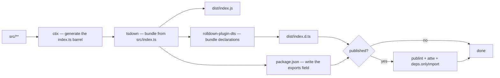
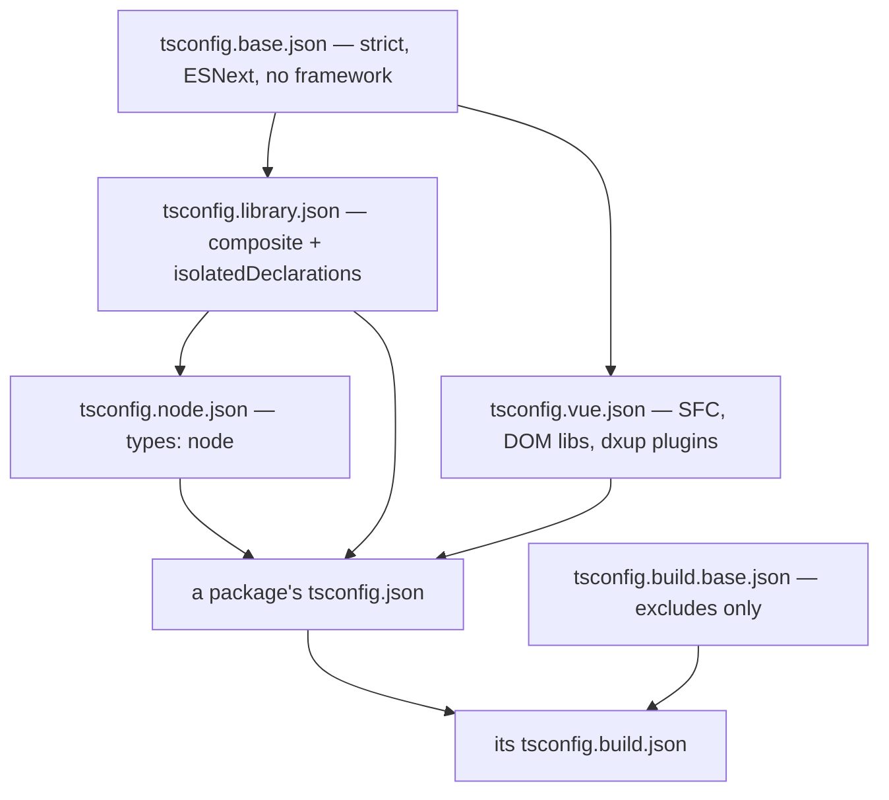

# Build Pipeline

How `src/` becomes `dist/` for every workspace package, and what an individual package therefore never has to decide. Workspace orchestration — which scripts run where, how CI fans them out — is [monorepo tooling](/docs/architecture/monorepo-tooling); this page is what happens inside one package's `build`.

## One bundler

Every package builds with **tsdown**, which is Rolldown plus the things a library build needs on top of it: declaration bundling, a generated `exports` field, and the publishability gates below. Every package's build script runs `export:gen` and then bare `tsdown` — the config file is found by name, never named on the command line.

There is no second build path. The package that ships `.vue` files used to reach Rolldown through Vite for SFC compilation and a `vue-tsc` declaration build; tsdown does both directly, so a component can no longer compile one way for the build and another way for its tests.



The barrel is generated, never committed: `export:gen` runs `ctix` against `tsconfig.build.json` immediately before the bundle, which is why CI caches the generated `src/**/index.ts` files alongside `dist`.

## The shared configuration package

`@esposter/configuration` owns every build input. A package's `tsdown.config.ts` is one factory call plus whatever is genuinely specific to it.

| Factory                         | For                                              |
| ------------------------------- | ------------------------------------------------ |
| `getTsdownConfiguration`        | The base — `platform: "neutral"`                 |
| `getTsdownConfigurationNode`    | The base plus `platform: "node"`                 |
| `getTsdownConfigurationVue`     | The base plus SFC compilation and `dts.vue`      |
| `getVuePlugins`                 | The SFC plugin pair, shared with the Vitest run  |
| `getVitestConfiguration`        | The Vitest config every package's tests run on   |
| `getBenchmarkTestConfiguration` | Just the bench wiring, for configs built scratch |

**Compose these with `mergeConfig`, never by spreading one into an object literal.** A spread replaces a key outright, so a config that adds a single `deps` or `dts` field silently drops every other field the base set on it — which is a build that quietly stops externalizing, or stops reading the build tsconfig, with nothing to show for it. `mergeConfig` merges into those keys instead.

Which package calls which factory is a question the repo answers — read the `tsdown.config.ts` files rather than a table that goes stale.

## Bundled or externalized

A library externalizes exactly what its consumer installs, and tsdown's defaults already say so:

- **`dependencies` are externalized.** The consumer's package manager installs them transitively and dedupes them against everything else in the tree. Nobody types their names.
- **`peerDependencies` are externalized too, but they are a demand rather than a delivery** — the consumer supplies the copy, and gets a warning instead of an install if they do not. That is the point for anything that must be a singleton in the consumer's tree: `vue` and `pinia` bundled, or even installed twice, are two reactivity systems that do not see each other's state.
- **`devDependencies` are bundled** when the source imports them.
- **Workspace siblings follow the same rule** — a published sibling is a normal dependency and stays external.

Bundling a dependency instead is not a saving. It defeats the consumer's deduplication, strands the package on a vendored copy until the next republish when that dependency ships a fix, and splits any type the dependency owns into two nominally distinct copies — a vendored `Result` and the consumer's own `Result` fail `instanceof` against each other.

Two kinds of package opt out, both in their own `tsdown.config.ts`:

- **Self-contained bundles.** `virrun` is a CLI installed with one command and `azure-functions` is a deploy artifact dropped into a host that installs nothing, so both vendor what they use. `virrun` gets this for free — everything it bundles is a `devDependency` — and declares only that `unconfig` stays external, because `unconfig` resolves `jiti` through `createRequire` relative to its own installed file and vendoring rebases that lookup. `azure-functions` derives its `alwaysBundle` list from its own manifest, minus the `@azure/functions` the host provides.
- **`@esposter/configuration` itself**, which externalizes everything including `devDependencies`. It is private, never published, and its dist imports nothing but build tooling every workspace member already has installed.

### What was vendored is written back into the manifest

tsdown records every package a bundle swallowed under `inlinedDependencies` in that package's `package.json`, and the field is committed. That is the answer to "what is actually inside this dist" — and because it lands in a diff next to the change that caused it, it is also the review gate. tsdown will otherwise hint on every build that a `deps.onlyBundle` allowlist is missing; the base turns the hint off, because the allowlist would be a hand-maintained second copy of a list tsdown already writes, and one that could never be bootstrapped — the check runs before the manifest is written, so a new package's first build could not pass.

### Every entry matches subpaths

A bare package name never matches a subpath import, and plenty of packages are only ever reached through one — `drizzle-orm/pg-core`, `@electric-sql/pglite/contrib/pg_trgm`, `vitest/node`. `getPackagePatterns` turns a list of names into prefix patterns so an entry covers the package _and everything under it_. A name handed to `deps` verbatim silently misses exactly those imports.

## The published surface is gated, not reviewed

A published package owes an installable promise to a stranger, and three options hold it to that promise. They are switched on by the absence of `private` in the manifest, so no package opts into them by hand:

| Gate              | Fails the build when                                                          |
| ----------------- | ----------------------------------------------------------------------------- |
| `publint`         | the manifest points at a file the package does not ship                       |
| `attw`            | the declarations break under a resolution mode a consumer might use           |
| `deps.onlyImport` | an emitted chunk imports a package the manifest never told the consumer about |

The third is the one with history. A published package that imports a private sibling resolves nothing on a fresh `npm install`, and nothing in the repo notices — the workspace has the sibling on disk, so every local build, test and typecheck passes. That is an install-time failure for a stranger and a build-time failure for us, and the gate is what moves it.

A private package gets none of these, because nobody installs it.

## How a package refers to its own source

Through **Node subpath imports**, declared in its own manifest and written with an extension:

```json
{ "imports": { "#src/*": "./src/*" } }
```

```ts
import { escapeValue } from "#src/services/transformer/escapeValue.ts";
```

This replaces the `@/*` `paths` alias, and the difference is where the resolution is anchored. `paths` belongs to whichever tsconfig drives the current compilation — so when a sibling bundles a package from source, `@/models/Clause` re-points into the _bundling_ package and resolves to nothing. `azure-functions` and `azure-mock` both vendor siblings, so that was not hypothetical. A `#` specifier is instead resolved by walking up to the nearest `package.json`, which is always the one owning the importing file, so it survives being compiled by anyone. `paths` cannot be configured to do this; it is a compiler-level fiction with no runtime meaning, while `imports` is a resolution feature Node, TypeScript, Rolldown, Vite, esbuild and webpack all implement.

The extension is not decoration. TypeScript performs no extension substitution through an `imports` target: it computes `./src/services/transformer/escapeValue`, finds no file there, and reports the module missing — while the bundler resolves it happily. That split is why `allowImportingTsExtensions` is on. The key cannot be `#/` either, which Node reserves; `#src/*` is the nearest legal spelling to the alias it replaces.

### Which unlocks source exports

A package on `#src/` sets `exports: { devExports: true }`. tsdown then points `exports` at `src` for the workspace and writes the `dist` mapping into `publishConfig.exports` for the registry, so a workspace consumer resolves source while npm still gets the bundle — and `publint` and `attw` keep gating, because both read the publish shape. No rebuild stands between an edit and a consumer seeing it, a fresh clone typechecks without building anything first, and go-to-definition lands on real source.

Which packages have converted is tracked in `.agents/ledgers/package-imports.md`. The `paths` entries in `tsconfig.base.json` are what still resolves the rest, so they come out when the last row is dated.

## The output directory is wiped on every build

tsdown cleans `outDir` before each build. Every emitted chunk carries a content hash, so without that a build whose chunks changed would write new files beside the previous ones rather than replacing them, and any size measurement of `dist` would stop meaning anything.

This is what makes the committed size snapshots (`*/src/index.test.ts`) a real signal — a jump in one of them means something genuinely started being bundled.

## TypeScript configuration layers

Presets live in `@esposter/configuration` and are extended by path. The base carries no framework assumption; Vue-specific options sit in a leaf rather than at the root, so a Node-only package does not inherit `jsx`, a DOM lib set, or the Nuxt language-service plugins.



The build preset contributes **excludes and nothing else** — no `compilerOptions` at all. A package's build program therefore inherits the same platform, libs and `types` as the program it is typechecked with. A build config that re-declared `types` is how a package ends up emitting declarations against a different lib set than the one its source was written for, and the mismatch is invisible until something downstream fails to resolve.

What the build excludes: config files, `scripts/`, and every `*.test.ts` / `*.test-d.ts` / `*.bench.ts`.

`isolatedDeclarations` is on by default and off in the packages that cannot satisfy it: a Drizzle table type cannot be written out by hand, and a package that vendors one of those from source makes their files inputs to its own build. The transform runs over the whole module graph, so this is a property of the tsconfig rather than something a declaration-generator option can waive for one package.

## Declarations see the entrypoints, not the tsconfig

The declaration build seeds its TypeScript program from the entry files and follows imports out from there — it does not load everything the tsconfig's `include` lists. An ambient `.d.ts` that no entry imports is therefore absent from that program, and every symbol it declares resolves to `any` in the emitted types while `vue-tsc` and the bundle both pass. `vue-phaserjs`'s `auto-imports.d.ts` is exactly that file, which is why the Vue factory sets `dts: { eager: true }` to load the tsconfig's full file list instead.

The `index.d.ts` size snapshot in each package's `src/index.test.ts` is what makes this visible: types collapsing to `any` make a declaration file _smaller_, not larger.

## The bootstrap package

`@esposter/configuration` is built by the same factories it exports, and two things follow from that. Its relative imports carry a `.ts` extension, because tsdown loads a config with a native import that will not guess one — every other package resolves this one as a built `.js` file, while this config has to reach TypeScript source before any build has run. And it keeps its exports pointing at `dist` for the same reason.

## Key files

| File                                                   | Role                                            |
| ------------------------------------------------------ | ----------------------------------------------- |
| `packages/configuration/src/getTsdownConfiguration.ts` | The base every config composes onto             |
| `packages/configuration/src/getPackagePatterns.ts`     | Turns package names into subpath-aware patterns |
| `packages/configuration/src/readPackageManifest.ts`    | Reads the manifest every derivation starts from |
| `packages/configuration/tsconfig.base.json`            | Root of the preset chain                        |
| `packages/configuration/tsconfig.build.base.json`      | The build excludes, shared by every package     |
| `packages/configuration/.ctirc-ts`                     | Barrel generation config                        |
