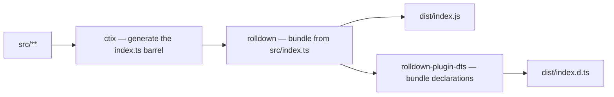
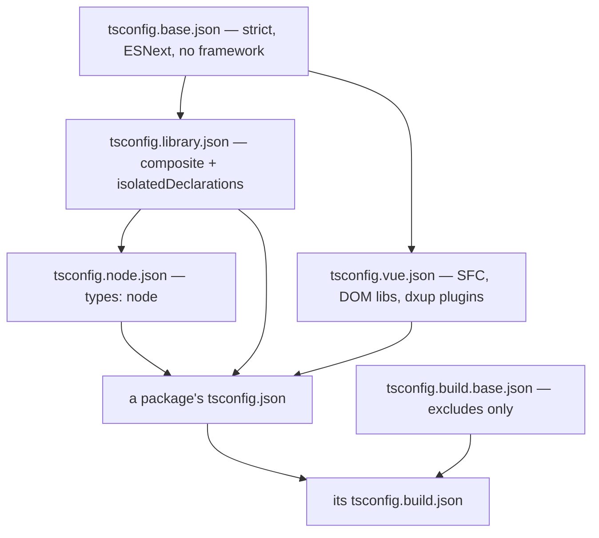

# Build Pipeline

How `src/` becomes `dist/` for every workspace package, and what an individual package therefore never has to decide. Workspace orchestration — which scripts run where, how CI fans them out — is [monorepo tooling](/docs/architecture/monorepo-tooling); this page is what happens inside one package's `build`.

## One bundler

Every package bundles with **Rolldown**. Most reach it directly through `rolldown --config rolldown.config.ts`. `vue-phaserjs` reaches it through **Vite**, because Vite 8 bundles with Rolldown anyway and adds the two things bare Rolldown cannot do for a package that ships `.vue` files: SFC compilation and a `vue-tsc`-backed declaration build. So "we use Vite there" is a statement about the plugin ecosystem, not about the bundler — there is no second bundler in this repo.

The barrel is generated, never committed: `export:gen` runs `ctix` against `tsconfig.build.json` immediately before the bundle, which is why CI caches the generated `src/**/index.ts` files alongside `dist`.

## The shared configuration package

`@esposter/configuration` owns every build input. A package's `rolldown.config.ts` is one factory call plus whatever is genuinely specific to it, and nothing else.

| Factory                              | For                                                     |
| ------------------------------------ | ------------------------------------------------------- |
| `getRolldownConfigurationBrowser`    | The base — no platform assumption                       |
| `getRolldownConfigurationNode`       | The base plus `platform: "node"`                        |
| `getRolldownConfigurationIsomorphic` | The base plus `@rolldown/plugin-node-polyfills`         |
| `getViteConfiguration`               | The one package that ships `.vue` files                 |
| `getVuePlugins`                      | The SFC plugin pair, shared by that build and its tests |
| `getVitestConfiguration`             | The Vitest config every package's tests run on          |
| `getBenchmarkTestConfiguration`      | Just the bench wiring, for configs built from scratch   |

The last one exists because the app builds its Vitest config through `defineVitestProject`, which cannot take `getVitestConfiguration` wholesale. It spreads the bench options instead of restating them, so the reporter and runner cannot drift between the app and everything else.

Which package calls which factory is a question the repo answers — read the `rolldown.config.ts` files rather than a table that goes stale.

## Bundled or externalized is derived, not declared

A library externalizes exactly what it does not ship: the contract its consumer supplies, plus its workspace siblings. Both are already written down in the package's own manifest, so `getExternal` reads them from there rather than from a hand-maintained registry.

- **`dependencies` are bundled.** They are the package's own implementation detail.
- **`peerDependencies` are externalized.** They appear in the published runtime or declaration surface, so the consumer must supply exactly one copy — framework singletons, SDKs mirrored in a public API, the Drizzle and Pulumi runtimes.
- **Workspace siblings are always externalized**, whether or not they are declared.
- Every entry externalizes the package _and everything under it_, because plenty of them are only ever reached through a subpath.

Deriving the list rather than declaring one means a newly added peer can never be silently vendored into a bundle, and no entry can outlive the dependency it named.

Two kinds of package opt out, both in their own `rolldown.config.ts`:

- **Self-contained bundles.** `virrun` and `azure-functions` vendor almost everything so that installing them needs no peer management at all — `virrun` externalizes only `unconfig`, whose runtime `createRequire` resolution breaks if it is inlined, and `azure-functions` only `@azure/functions`, which the Functions host provides.
- **`@esposter/configuration` itself**, which externalizes its `devDependencies`. It is private, never published, and its dist imports nothing but build tooling that every workspace member already has installed — so declaring `rolldown`/`vite`/`vitest` as peers would invent a contract nobody consumes.

## The output directory is wiped on every build

Rolldown never clears `output.dir`, and every emitted chunk carries a content hash in its filename. A build whose chunks changed therefore writes new files _beside_ the previous ones rather than replacing them, forever — left alone the orphans grow without bound and any size measurement of `dist` stops meaning anything. `getCleanDistributionPlugin` removes the directory in `buildStart`, so a `dist` is always exactly one build's output. The Vite path needs no equivalent: Vite empties `outDir` itself.

This is what makes the committed `dist` size snapshots (`*/src/index.test.ts`) a real signal — a jump in one of them means something genuinely started being bundled.

## TypeScript configuration layers

Presets live in `@esposter/configuration` and are extended by path. The base carries no framework assumption; Vue-specific options sit in a leaf rather than at the root, so a Node-only package does not inherit `jsx`, a DOM lib set, or the Nuxt language-service plugins.

The build preset contributes **excludes and nothing else** — no `compilerOptions` at all. A package's build program therefore inherits the same platform, libs and `types` as the program it is typechecked with. A build config that re-declared `types` is how a package ends up emitting declarations against a different lib set than the one its source was written for, and the mismatch is invisible until something downstream fails to resolve.

What the build excludes: config files, `scripts/`, and every `*.test.ts` / `*.test-d.ts` / `*.bench.ts`.

## Key files

| File                                                            | Role                                        |
| --------------------------------------------------------------- | ------------------------------------------- |
| `packages/configuration/src/getExternal.ts`                     | Derives the external list from the manifest |
| `packages/configuration/src/getCleanDistributionPlugin.ts`      | Wipes `dist` before each build              |
| `packages/configuration/src/getRolldownConfigurationBrowser.ts` | The base every rolldown config extends      |
| `packages/configuration/tsconfig.base.json`                     | Root of the preset chain                    |
| `packages/configuration/tsconfig.build.base.json`               | The build excludes, shared by every package |
| `packages/configuration/.ctirc-ts`                              | Barrel generation config                    |
