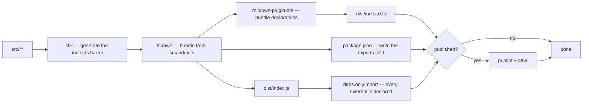
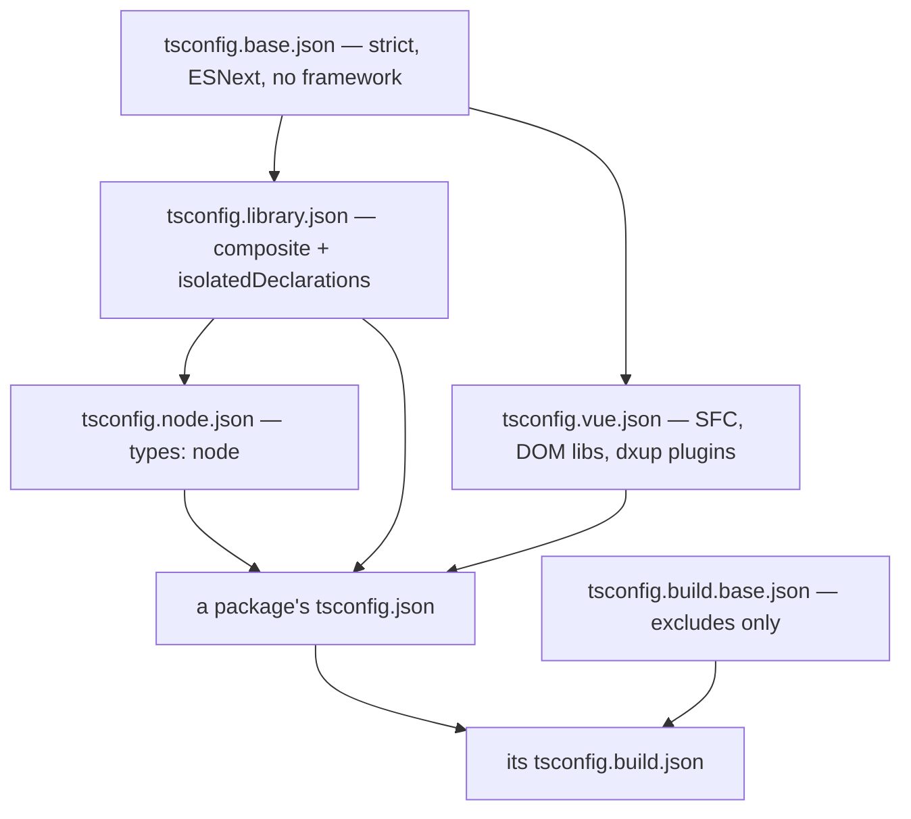

# Build Pipeline

How `src/` becomes `dist/` for every workspace package, and what an individual package therefore never has to decide. Workspace orchestration — which scripts run where, how CI fans them out — is [monorepo tooling](/docs/architecture/monorepo-tooling); this page is what happens inside one package's `build`.

## One bundler

Every package builds with **tsdown**, which is Rolldown plus the things a library build needs on top of it: declaration bundling, a generated `exports` field, and the publishability gates below. Every package's build script runs `export:gen` and then bare `tsdown` — the config file is found by name, never named on the command line.

There is no second build path. The package that ships `.vue` files used to reach Rolldown through Vite for SFC compilation and a `vue-tsc` declaration build; tsdown does both directly, so a component can no longer compile one way for the build and another way for its tests.



The barrel is generated, never committed: `export:gen` runs `ctix` against `tsconfig.build.json` immediately before the bundle, which is why CI caches the generated `src/**/index.ts` files alongside `dist`.

## The shared configuration package

`@esposter/configuration` owns every build input. A package's `tsdown.config.ts` is one factory call plus whatever is genuinely specific to it.

| Factory                         | For                                              |
| ------------------------------- | ------------------------------------------------ |
| `getTsdownConfiguration`        | The base — `platform: "neutral"`                 |
| `getTsdownConfigurationNode`    | The base plus `platform: "node"`                 |
| `getTsdownConfigurationVue`     | The base plus SFC compilation and `dts.vue`      |
| `getVuePlugins`                 | The SFC plugin pair, shared with the Vitest run  |
| `getVitestConfiguration`        | The Vitest config every package's tests run on   |
| `getBenchmarkTestConfiguration` | Just the bench wiring, for configs built scratch |

**Compose these with `mergeConfig`, never by spreading one into an object literal.** A spread replaces a key outright, so a config that adds a single `deps` or `dts` field silently drops every other field the base set on it — which is a build that quietly stops externalizing, or stops reading the build tsconfig, with nothing to show for it. `mergeConfig` merges into those keys instead.

Which package calls which factory is a question the repo answers — read the `tsdown.config.ts` files rather than a table that goes stale.

## Bundled or externalized

A library externalizes exactly what its consumer installs, and tsdown's defaults already say so:

- **`dependencies` are externalized.** The consumer's package manager installs them transitively and dedupes them against everything else in the tree. Nobody types their names.
- **`peerDependencies` are externalized too, but they are a demand rather than a delivery** — the consumer supplies the copy, and gets a warning instead of an install if they do not. That is the point for anything that must be a singleton in the consumer's tree: `vue` and `pinia` bundled, or even installed twice, are two reactivity systems that do not see each other's state.
- **`optionalDependencies` are externalized as well**, and are the one entry that may simply not be there. The consumer installs them when their platform allows it, so runtime code has to reach for one behind a check rather than assume it resolved.
- **`peerDependenciesMeta` counts too**, which is how a peer is declared optional — tsdown reads it alongside the other three, so a name listed only there is still external.
- **`devDependencies` are bundled** when the source imports them.
- **Workspace siblings follow the same rule** — a published sibling is a normal dependency and stays external.

Bundling a dependency instead is not a saving. It defeats the consumer's deduplication, strands the package on a vendored copy until the next republish when that dependency ships a fix, and splits any type the dependency owns into two nominally distinct copies — a vendored `Result` and the consumer's own `Result` fail `instanceof` against each other.

Two kinds of package opt out, both in their own `tsdown.config.ts`:

- **Self-contained bundles.** These are programs rather than libraries — something runs their `dist` directly — so they vendor what they use instead of leaving imports for a resolver. `virrun` is a CLI installed with one command, `azure-functions` is a deploy artifact dropped into a host that installs nothing, and `infra` is the program Pulumi runs. `infra` vendors only its workspace siblings, deriving them from its own `dependencies`; the `@pulumi/*` SDKs stay peers, because the engine hands the program its own instance and a vendored copy would not be it. `virrun` gets this for free — everything it bundles is a `devDependency` — and declares only that `unconfig` stays external, because `unconfig` resolves `jiti` through `createRequire` relative to its own installed file and vendoring rebases that lookup. `azure-functions` derives its `alwaysBundle` list from its own manifest, minus the `@azure/functions` the host provides.
- **`@esposter/configuration` itself**, which externalizes everything including `devDependencies`. It is private, never published, and its dist imports nothing but build tooling every workspace member already has installed.

### Only the deploy artifact is minified

Nothing else is. A library ships readable output because whoever debugs it is reading a stack trace through it, and every consumer's own bundler minifies afterwards anyway. `azure-functions` is the exception: the Functions host downloads and parses `dist/index.js` on every cold start and no one reads it, so it is compressed — 7.25 MB to 5.00 MB.

**Identifier mangling stays off**, which is why the option is spelled out rather than `minify: true`. Mangling reaches 3.67 MB and renames every identifier, so a thrown error's stack names `t` rather than the handler — and for an EventGrid delivery that has already happened, that stack is the whole diagnosis. `dce-only` was measured as well and changes nothing, because rolldown already tree-shakes.

Minified output is the one thing the test suite cannot check: the tests import source, and only the size snapshot reads `dist`.

### What was vendored is written back into the manifest

tsdown records every package a bundle swallowed under `inlinedDependencies` in that package's `package.json`, and the field is committed. That is the answer to "what is actually inside this dist" — and because it lands in a diff next to the change that caused it, it is also the review gate. tsdown will otherwise hint on every build that a `deps.onlyBundle` allowlist is missing; the base turns the hint off, because the allowlist would be a hand-maintained second copy of a list tsdown already writes, and one that could never be bootstrapped — the check runs before the manifest is written, so a new package's first build could not pass.

### Every entry matches subpaths

A bare package name never matches a subpath import, and plenty of packages are only ever reached through one — `drizzle-orm/pg-core`, `@electric-sql/pglite/contrib/pg_trgm`, `vitest/node`. `getPackagePatterns` turns a list of names into prefix patterns so an entry covers the package _and everything under it_. A name handed to `deps` verbatim silently misses exactly those imports.

## Every bundle's externals are gated

`deps.onlyImport` fails a build whose emitted chunks leave external anything the package's own manifest does not name. It is on for every package, published or not, because the same check answers two different questions.

For a **published** package it is an installability promise. A package that imports a private sibling resolves nothing on a fresh `npm install`, and nothing in the repo notices — the workspace has the sibling on disk, so every local build, test and typecheck passes. That is an install-time failure for a stranger and a build-time failure for us, and the gate is what moves it.

For **any** package it is the only thing that notices a specifier which resolved to nothing. Rolldown treats an unresolvable `#src/...` as external rather than failing, so the built `dist` ships an import that Node later resolves through the package's own `imports` map to a `.ts` file it cannot load. The error then lands in a consumer at runtime, naming a source path that consumer never referenced — `Cannot find module .../packages/db-schema/src/services/dayjs.ts imported from .../db-schema/dist/index.js` — a phase and a package away from the typo that caused it.

`@esposter/configuration` is the single package that widens the allowlist, adding its `devDependencies`: it externalizes everything, and the base derives the list from the runtime dependency fields alone.

## The published surface is gated further

A published package owes an installable promise to a stranger, and two more options hold it to that promise. They are switched on by the absence of `private` in the manifest, so no package opts into them by hand:

| Gate      | Fails the build when                                                |
| --------- | ------------------------------------------------------------------- |
| `publint` | the manifest points at a file the package does not ship             |
| `attw`    | the declarations break under a resolution mode a consumer might use |

A private package gets neither, because nobody installs it.

## How a package refers to its own source

Through **Node subpath imports**, declared in its own manifest:

```json
{ "imports": { "#src/*": "./src/*.ts" } }
```

```ts
import { escapeValue } from "#src/services/transformer/escapeValue";
```

The `.ts` in the **target** is what makes it resolve. Nothing in the chain does extension substitution through an `imports` target, so a bare `"./src/*"` sends TypeScript looking for `./src/services/transformer/escapeValue`, where there is no file. The pattern substitutes into `./src/*.ts` instead, so specifiers stay extensionless and the fix lives in one line of the manifest rather than on every import. The key cannot be `#/` either, which Node reserves; `#src/*` is the nearest legal spelling to the alias it replaces.

`./src/*.ts` is the default arm rather than a claim that a package holds only `.ts`. A package that self-imports another kind of file adds a key whose suffix says so, and the longer suffix wins the match:

```json
{ "imports": { "#src/*": "./src/*.ts", "#src/*.vue": "./src/*.vue" } }
```

Those specifiers keep their own extension, which is what a `.vue` or `.json` import carries in any case. An **array** target looks like the tidier way to avoid the second key and is not one: TypeScript walks the fallbacks and Vite does not, so the package typechecks and then fails to resolve under Vitest.

A **directory is not a specifier**, which is the one place the substitution is less forgiving than the alias it replaced. `@/store` resolved by directory lookup to `src/store/index.ts`; `#src/store` substitutes to the literal `./src/store.ts` and nothing else, so a directory has to be spelled `#src/store/index`. Where a file and a directory share a name — `db-schema` has both `src/schema.ts` and `src/schema/` — the file is what the alias used to mean, so only the barrel takes the `/index`.

## Why a library uses `#src/` and the app uses `@/`

`#src/` wins on four counts, and every one of them is about a package being consumed by something other than itself:

- **The resolution is anchored to the file, not to the compiler.** A `paths` entry belongs to whichever tsconfig drives the current compilation, so when a sibling bundles a package from source, `@/models/Clause` re-points into the _bundling_ package and resolves to nothing. `azure-functions`, `virrun` and `infra` all vendor siblings, so that was never hypothetical. A `#` specifier is resolved by walking up to the nearest `package.json`, which is always the one owning the importing file, so it survives being compiled by anyone. This is the reason source exports are possible at all.
- **It is a real resolution feature rather than a compiler fiction.** `imports` is in the Node ESM specification and is implemented by Node itself, TypeScript, Rolldown, Vite, esbuild, webpack, Vitest and jiti. `paths` has no runtime meaning whatsoever — it is a typecheck-time mapping every bundler has to be told about separately, which is why an alias convention costs one entry per tool and drifts the moment a tool is added.
- **It is declared once, where the package already declares everything else.** The manifest travels with the package, and a fresh clone resolves it before any configuration is loaded.
- **It is private and cannot collide.** `#` specifiers are unreachable from outside the package by specification. `@/*` was reachable only because `tsconfig.base.json` mapped it, and it sat beside a `"*"` fallback that shadowed real package names — a mapping that turns a mistyped dependency into a same-named local file rather than an error.

`packages/app` has none of those pressures. Nothing bundles it from source, nothing publishes it, nothing resolves into it; it is the leaf of the graph. Its `@/` and `~/` are **Nuxt's own aliases**, generated into `.nuxt/tsconfig.*.json` and understood by the Vite and Nitro builds without anything being configured — so they are the framework's convention rather than one of ours, and replacing them would mean fighting generated configuration for a property the app cannot use.

The repo-root `scripts/` tree is not a package either, but it converted anyway — it declares `"#scripts/*": "./scripts/*.ts"` in the root manifest. It had no framework generating an alias for it, so keeping one meant keeping a `paths` block and the `resolve.tsconfigPaths` that made Vitest read it; converting deleted both. **There is now no `paths` entry anywhere in the repo that anyone here wrote** — only the ones Nuxt generates for the app.

An `.oxlintrc.json` override bans `@/**` and `~/**` under `packages/*/src/**`, `scripts/**` and `.agents/**` — everything except the app — so the split is enforced rather than remembered.

## Which unlocks source exports

Because a `#` specifier resolves the same way no matter who is compiling, a package can safely publish a second
view of itself: its own source. `getTsdownConfiguration` sets `exports: { devExports: SOURCE_CONDITION }` for
every package, so tsdown gives every generated entry two arms:

```json
{
  "exports": { ".": { "source": "./src/index.ts", "default": "./dist/index.js" } },
  "publishConfig": { "exports": { ".": "./dist/index.js" } }
}
```

A tool that opts into the condition resolves TypeScript source; everything else falls through to the build; and
npm gets the `publishConfig` map, which is also what `publint` and `attw` gate against. No rebuild stands
between an edit and a consumer seeing it, a fresh clone typechecks without building anything first, and
go-to-definition lands on real source rather than a bundled declaration.

The condition is called **`source`**, which is what the ecosystem calls this: Parcel and Metro both resolve a `source` condition, and it is the spelling every workspace-source setup uses. A repo-namespaced name (`esposter-source`) buys protection against a stranger's resolver matching it by accident — protection worth nothing here, because tsdown writes a `dist`-only map into `publishConfig.exports` and nothing published carries a source arm at all. Inside the workspace, no tool enables `source` unless told to: Vite's server defaults are `module`, `node` and `development`/`production`, and Nuxt adds nothing that would match.

Two places opt in, and that is the entire mechanism: `customConditions` in `tsconfig.base.json` and
`resolve.conditions` in `getVitestConfiguration`. Anything else that wants source says so explicitly.

**The `default` arm is the load-bearing half.** `devExports: true` omits it and points every condition at
source, which reads as the simpler configuration and is not: Node's own ESM loader cannot read TypeScript
source, twice over. It resolves no extensionless relative specifier, so the generated barrel's
`export * from "./models/BinaryOperator"` fails outright, and its type-stripping cannot transform a TS `enum`.
Two things here hand a package to that loader — Nitro's prerender, which imports the built server, and Pulumi,
which runs `infra`'s `dist` — so both break.

Neither breaks anywhere near its cause. The prerender failure names a module path nobody edited, and the Pulumi
one surfaces as a failed `preview` in CI. The workarounds cost more than the feature is worth. Inlining into
the Nitro server cannot be limited to the source-exporting packages — a `dist` sibling externalizes its own
siblings, so it has to cover all of them — and `infra` has to vendor its siblings, taking it from 127 kB to
1.27 MB. Both are standing configuration a new consumer has to know about. A `default` arm costs nothing,
because nothing has to be configured to keep working.

One consequence worth holding onto: **a `dist` sibling externalizes its own siblings.** `db-schema`'s build
emits `from "@esposter/azure"`, so that import resolves independently, under whatever conditions the resolver
is running with. There is no single consumer where the decision can be made once — which is exactly why the
answer belongs in the exports map rather than in a bundler's config.

The app is the deliberate non-participant. Nuxt's Vite and Nitro builds do not carry the condition, so the app resolves every sibling's `dist` — which is what keeps the Nitro server bundle externalizing them rather than pulling every package's TypeScript into a single graph. The practical consequence: a package's own tests see a sibling's edit immediately, and the app does not until that sibling is rebuilt, which is what `watch:packages` is still for.

**A build that vendors a sibling now vendors its source.** Rolldown reads `customConditions` from the tsconfig it was handed, so the self-contained bundles pull their siblings' TypeScript rather than their `dist`. That is the behaviour worth having — a deploy artifact can no longer be built from a stale sibling — and it is also precisely what `paths` made impossible, because a `@/` inside the vendored package would have re-anchored to the bundling package. It is why `isolatedDeclarations` has to be off in a package that vendors one of the packages that cannot satisfy it: the transform runs over the whole module graph, and those files are now inputs to it.

## The output directory is wiped on every build

tsdown cleans `outDir` before each build. Every emitted chunk carries a content hash, so without that a build whose chunks changed would write new files beside the previous ones rather than replacing them, and any size measurement of `dist` would stop meaning anything.

This is what makes the committed size snapshots (`*/src/index.test.ts`) a real signal — a jump in one of them means something genuinely started being bundled.

## TypeScript configuration layers

Presets live in `@esposter/configuration` and are extended by path. The base carries no framework assumption; Vue-specific options sit in a leaf rather than at the root, so a Node-only package does not inherit `jsx`, a DOM lib set, or the Nuxt language-service plugins.



The build preset contributes **excludes and nothing else** — no `compilerOptions` at all. A package's build program therefore inherits the same platform, libs and `types` as the program it is typechecked with. A build config that re-declared `types` is how a package ends up emitting declarations against a different lib set than the one its source was written for, and the mismatch is invisible until something downstream fails to resolve.

What the build excludes: config files, `scripts/`, and every `*.test.ts` / `*.test-d.ts` / `*.bench.ts`.

`isolatedDeclarations` is on by default and off in the packages that cannot satisfy it: a Drizzle table type cannot be written out by hand, and a package that vendors one of those from source makes their files inputs to its own build. The transform runs over the whole module graph, so this is a property of the tsconfig rather than something a declaration-generator option can waive for one package.

## Declarations see the entrypoints, not the tsconfig

The declaration build seeds its TypeScript program from the entry files and follows imports out from there — it does not load everything the tsconfig's `include` lists. An ambient `.d.ts` that no entry imports is therefore absent from that program, and every symbol it declares resolves to `any` in the emitted types while `vue-tsc` and the bundle both pass. `vue-phaserjs`'s `auto-imports.d.ts` is exactly that file, which is why the Vue factory sets `dts: { eager: true }` to load the tsconfig's full file list instead.

The `index.d.ts` size snapshot in each package's `src/index.test.ts` is what makes this visible: types collapsing to `any` make a declaration file _smaller_, not larger.

## The bootstrap package

`@esposter/configuration` is built by the same factories it exports, and two things follow from that. Its relative imports carry a `.ts` extension rather than the `#src/` every other package uses, because tsdown loads a config with a native import that will not guess an extension, and this is the one config that has to reach TypeScript source before any build has run. Its `default` export arm still points at `dist`, which is what every other package's config resolves it through.

## Key files

| File                                                   | Role                                            |
| ------------------------------------------------------ | ----------------------------------------------- |
| `packages/configuration/src/getTsdownConfiguration.ts` | The base every config composes onto             |
| `packages/configuration/src/getPackagePatterns.ts`     | Turns package names into subpath-aware patterns |
| `packages/configuration/src/readPackageManifest.ts`    | Reads the manifest every derivation starts from |
| `packages/configuration/tsconfig.base.json`            | Root of the preset chain                        |
| `packages/configuration/tsconfig.build.base.json`      | The build excludes, shared by every package     |
| `packages/configuration/.ctirc-ts`                     | Barrel generation config                        |
