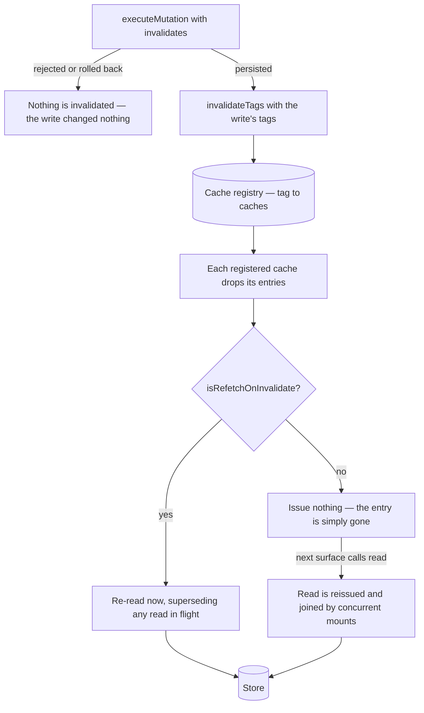

# Caching

A handful of reads are the same for the whole session: the favourite set every row's star checks against, the recently-opened list Home previews, the storage number the meter renders, one room's thread-follow state. Every surface that shows one asks for it on mount, and asking the server again on each mount is a round trip for an answer that cannot have changed.

`useCachedRead` (`packages/app/app/composables/shared/useCachedRead.ts`) is the only thing that caches such a read, and `CacheTag` plus the cache registry are the only way one is invalidated. **No store keeps a read-once flag of its own**, and no composable holds a list of which caches a mutation affects.

## The primitive

```ts
const { isPending: isLoading, read: readFavorites } = useCachedRead(() => $trpc.resource.readFavorites.query(), {
  isRefetchOnInvalidate: true,
  onError: createErrorNotification,
  onSuccess: (newFavorites) => {
    favorites.value = newFavorites;
  },
  tags: [CacheTag.Resources],
});
```

- **`read(key?)`** — what a surface calls on mount. It issues nothing once the entry has landed, and the concurrent first callers join one request through `executeQuery`'s `isExclusive` single-flight.
- **`refetch(key?)`** — an unconditional re-read, deliberately **not** single-flight: a read issued _because_ something changed must not join the answer that the change just invalidated. It supersedes it on latest-wins instead.
- **`onSuccess(result, key)`** — the caller owns what the response writes. One read can populate two maps (`threadFollow`) or a data ref plus an error ref (`recent`), so the primitive never owns the data.
- **`isPending`** — the instance reads one cache, so the primitive's pending state _is_ that cache's loading flag. No store keeps an `isLoading` ref.

Two invariants the primitive exists to hold:

- **Gate on success only.** A failed read leaves the entry unloaded, so the next mount — or the surface's own Retry button — reissues it. Caching a failure as "loaded" leaves the surface empty for the whole session with a Retry that does nothing.
- **Caching is not concurrency.** The gate sits _on top of_ `executeQuery`, never in place of it. `isExclusive` only joins a read still in flight; a settled read is no longer joinable, which is exactly the gap this fills. See [async operations](/docs/architecture/async-operations#reads--executequery).

**Keyed and unkeyed are one shape.** A cache is keyed by a `string`, and a session-scoped cache is that with a single, unnamed key — so `threadFollow`'s read-once-per-room is `read(roomId)` and nothing about the primitive changes. A key's entries are independent: one room loading says nothing about another's.

**A cache belongs to a store.** Cached data is shared data; an instance per component would cache per component, which is what [`useQuery`](/docs/architecture/client-data#usequery) already is. The two are not variants to pick between — `useQuery` is a component's own read, `useCachedRead` is a store's shared one.

## The tag model

A write declares what it changed; a cache declares what it depends on. Neither knows the other exists.

```ts
await executeMutation(() => $trpc.resource.deleteResources.mutate({ ids }), {
  invalidates: [CacheTag.Resources],
  key: Symbol("deleteResources"),
});
```

`CacheTag` (`packages/app/app/models/cache/CacheTag.ts`) is small on purpose — a tag is the smallest fact a cache can subscribe to, not an entity id:

| Tag         | Means                                             | Written by                        |
| ----------- | ------------------------------------------------- | --------------------------------- |
| `Resources` | which resources exist and are live                | create, delete, restore, purge    |
| `Recents`   | the recency ordering, without membership changing | `recordAccess` — a recorded visit |

`invalidates` lives on `useMutation`'s write options and **never** on its read options: a read has no reason to invalidate anything. It fires **after the write has landed**, so a rejected or rolled-back write invalidates nothing — it changed nothing to be stale about.

The registry itself is a Pinia store (`packages/app/app/store/cache.ts`) rather than a module-level `Map`, because a module map is shared across Pinia instances: it would leak registrations between tests and, on the server, from one request's app into the next's.

Three consequences worth knowing:

- **A cache that was never constructed is never invalidated**, and that is correct — it holds nothing stale. Registration happens when the store is first used.
- **Adding a cached set is one `tags` entry.** Nothing central enumerates caches, so nothing central has to be found and edited.
- **Untagged is a decision, and it gets written down.** `storage` carries no tags because its counter only moves when Azure's `BlobCreated` event lands seconds after the PUT — there is no moment a write could invalidate it and read a different number. `threadFollow` carries none because no resource write changes who follows which thread.

## Why an invalidated cache is re-read, not edited

The obvious simplification — splice the deleted row out of the cached list the way `toggleFavorite` optimistically edits it — is wrong here, and it is the constraint the rest of the design follows from.

Favourites and Recent are **capped** lists (`MAX_READ_LIMIT`, `RECENT_RESOURCES_LIMIT`). Deleting a row from a capped list is not a local edit: the list has to backfill with the row that was previously past the cap, and only the server knows what that row is. A client that splices shows four recents where there should be five, silently, until a reload.

`toggleFavorite` gets to stay optimistic precisely because starring changes membership **without** moving the cap boundary.

## `isRefetchOnInvalidate` — declared per cache, not judged per call site

An invalidated cache either re-reads at once or drops and waits for whatever reads it next. That choice used to be made at every call site that invalidated something, by an author who had to know which surfaces were mounted; it is now one flag on the cache, decided once:

| Cache          | Refetches now | Why                                                                          |
| -------------- | ------------- | ---------------------------------------------------------------------------- |
| `favorite`     | yes           | its stars render in the very table a delete is issued from                   |
| `recent`       | no            | you are on the resource or the workbench — nothing showing Recent is mounted |
| `storage`      | n/a           | untagged                                                                     |
| `threadFollow` | no            | untagged                                                                     |

A refetching cache re-reads **from cold** as well, even if nothing has read it yet: the surface that mounts next must find the new set rather than be the thing that discovers it changed. That is a session-scoped shape — a keyed cache re-reads only the keys it actually holds, and none opts in.



## The one write that invalidates on failure

`deleteResources` sends its ids chunk-by-chunk, and each chunk commits independently — so a later chunk's failure still leaves earlier chunks deleted server-side. It therefore calls `invalidateTags` by hand from `onError`, on top of its `invalidates`. This is the only place that reaches for the registry directly, and it is not a hole in the "a failed write invalidates nothing" rule: the write genuinely did persist part of itself.

## Key files

| File                                                   | Role                                                             |
| ------------------------------------------------------ | ---------------------------------------------------------------- |
| `packages/app/app/composables/shared/useCachedRead.ts` | The primitive — the read-once gate, keyed or session-scoped      |
| `packages/app/app/store/cache.ts`                      | The registry — tag to invalidators, scoped to the Pinia instance |
| `packages/app/app/models/cache/CacheTag.ts`            | The tags                                                         |
| `packages/app/app/composables/shared/useMutation.ts`   | `invalidates` on the write path                                  |
