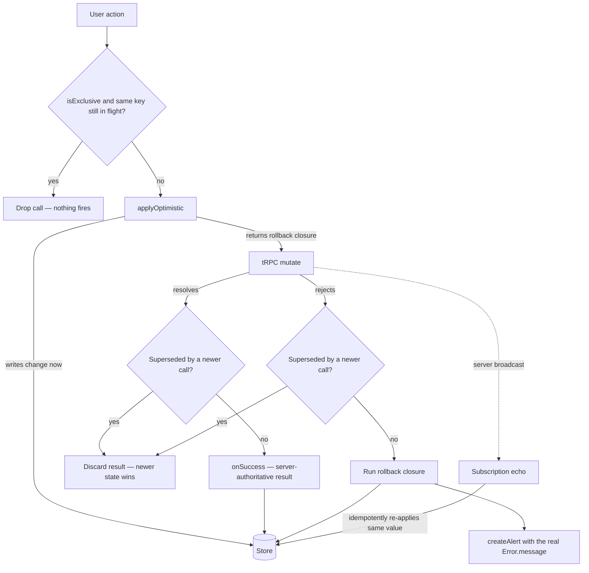

# Client Data Access

Every user-facing tRPC call on the client goes through one of two symmetric primitives, both in `packages/app/app/composables/shared/`:

- **`useQuery`** — reads. Fetches without blocking setup, populates reactive data, surfaces errors.
- **`useMutation`** — writes. Applies optimistically, rolls back on failure, surfaces errors.

Both share the same error stack (`getResultAsync` → `createAlert`) and latest-wins staleness guarding, so no call site re-implements loading, error handling, or race protection.

## useQuery

`useQuery` (`composables/shared/useQuery.ts`) replaces top-level `await $trpc.x.query(...)` in a **component** whose read is ancillary — the component should render immediately and populate when data lands. A top-level await forces the component under a `<Suspense>` boundary and throws on failure; `useQuery` fetches in the background instead, so the component renders immediately and populates when data lands — no `Suspense`, no `NuxtErrorBoundary`.

It is **not** for page-level loaders that must gate rendering or 404 on a missing resource — those keep the top-level `await` and `throw createError(...)` / navigate on failure (see the page-level bullet under [When not to use them](#when-not-to-use-them)).

```ts
const { data, refresh } = useQuery(() => $trpc.room.readMyInvite.query({ roomId }), {
  onSuccess: (result) => {
    // rare: derive local state from the loaded result
  },
});
```

- `query` — the tRPC read. The only required argument.
- `data` — a `shallowRef` holding the result, `undefined` until the first fetch resolves. Render loading/empty state off `data.value === undefined`.
- `refresh` — re-runs the query (retry after a failure, or refetch on demand). The initial fetch fires automatically on setup.
- `onSuccess` — rare; for seeding local state from the loaded result.

On failure the real `Error.message` is raised as an alert and `data` stays `undefined`, so the component falls back to its empty state. A superseded fetch (a newer `refresh`, a remounted component) can never overwrite a newer result.

## useMutation

`useMutation` (`composables/shared/useMutation.ts`) returns `{ executeMutation, isPending }` and bundles the four things every write needs:

- **Optimistic apply + rollback** — write the change to the store immediately, roll it back if the server rejects it.
- **Staleness guarding** — when the same action fires repeatedly (rapid clicks, drags, select changes), a slower earlier call can never overwrite a newer call's state. Staleness is tracked **per `key`**, so one instance serving many sibling items (a store action keyed by `postId`) never lets item B's call cancel item A's callbacks.
- **Pending state** — `isPending` is true while any of the instance's calls is in flight. It is what the triggering control binds as `:loading`/`:disabled` (see [In-flight guarding](#in-flight-guarding)).
- **Error surfacing** — a failed mutation raises the actual error message as an alert; no call site writes `try`/`catch` or bespoke alert strings.

```ts
const { executeMutation, isPending } = useMutation();

await executeMutation(mutate, {
  applyOptimistic: () => {
    // write the change to the store now
    return () => {
      // rollback closure — undo the write
    };
  },
  onSuccess: (result) => {
    // rare: write a server-authoritative result
  },
});
```

- `mutate` — the tRPC call. The only required argument.
- `key` — scopes staleness, pending, and exclusivity bookkeeping when one instance serves many sibling items; calls with different keys are fully independent. Omitted, every call shares one default key — correct only when overlapping calls genuinely supersede each other (repeated saves of the same single target). Any per-entity action keys by the entity id (`key: input.id`, a member-role pair, a blob path) so operations on different entities never stale-drop each other; a create with no natural entity key passes `key: Symbol()` per call, since every create is its own independent operation. Never call `useMutation()` inside an action to fake isolation — that leaks a detached effect scope; key the shared store-root instance instead.
- `isExclusive` — single-flight: while a call with the same key is in flight, further calls are dropped outright — nothing fires, no staleness bump. For non-idempotent creates that must never double-fire (`createLike`).
- `applyOptimistic` — the normal path. Apply the local change and return its rollback closure. On failure the rollback runs (unless a newer call has superseded this one); the confirming server state still arrives via subscriptions, which idempotently re-apply the same value.
- `onSuccess` — the rare path, for mutations whose result the client can't predict (server-generated ids/tokens like `createInvite`). Omit `applyOptimistic` and take the server result here; it is written only if this call is still the latest.
- `onError` — replaces the default alert, only for surfaces that own a different error channel: the platform resource operations route failures into the [notifications bell](/docs/platform/notifications), including the stale-`contentVersion` warning with its Refresh action. Everything else omits it and gets the alert.

Both `applyOptimistic` and `onSuccess` are staleness-guarded so a superseded call leaves the newer state intact. The error alert always fires with the real `Error.message`.



Call `useMutation()` once per logical action — each instance owns its own staleness and pending bookkeeping, so two independent actions must **never** share one. A shared instance lets a newer unrelated call supersede an older action's `onSuccess`/rollback (fire `deleteRole` while `createRole` is in flight and the created role never lands in the store). In a store with several mutations, declare one named instance per action via destructure renames (`const { executeMutation: executeCreateRoleMutation } = useMutation();`, with `isPending: isCreateRolePending` where the pending state is consumed); a single flow that branches into two tRPC calls (create-or-update save) correctly shares one instance, because its successive calls do supersede each other. One instance serving many sibling **items** of the same action is the `key` case, not a reason for per-item instances.

**Placeholder creates instantiate their executor _inside_ the action, one per call** (`createRoomCategory`). Each call owns a distinct placeholder object, so successive creates are independent — they must never supersede each other. With a shared store-level instance, a second create marks the first stale and skips its `onSuccess`, stranding a temp-id placeholder for a row that exists server-side under a different id (a later rename/delete then 404s). Superseding is only correct when the later call targets the _same_ state as the earlier one.

## In-flight guarding

Latest-wins staleness protects **state**, not **the server**: every `executeMutation` call still fires its network write. The surface that triggers a write is therefore responsible for making a second trigger impossible while the first is in flight. Exactly one guard applies per surface — pick by shape, never hand-roll a pending flag:

- **Form dialogs** — free. `StyledFormDialog`'s submit path holds `isSubmitting`: it early-returns re-entrant submits and drives the confirm button's `loading`/`disabled`. Consumers wire nothing.
- **Plain buttons firing a non-optimistic write** (publish, duplicate, deploy, generate, restore) — bind the instance's `isPending` as both `:loading` and `:disabled`. When the mutation lives in a composable, the composable returns the renamed ref (`isPublishPending`) and it threads down as an ordinary prop; overflow/action list items bind it as `disabled`.
- **Per-item creates through a shared instance** — `key` + `isExclusive` (`createLike`), so one item's in-flight create drops only its own duplicates while sibling items stay live.
- **Optimistic writes** — no guard. The state flips synchronously, so a second click reads the new state and means something new (a favorite toggle un-favorites); disabling the control would swallow real intent, and a superseded call is already staleness-guarded.
- **Synchronous unmount** — closing/unmounting the triggering control before the round trip (`onComplete()`-first dialog closes, a selection toolbar cleared on click) is a complete guard by construction; don't add a second one.

## Optimistic by default

**Every `useMutation` write applies optimistically (`applyOptimistic`) unless it falls into a documented exception below.** Waiting for the server round-trip before the UI reflects a change is a bug, not a default — the user acted, so the UI updates now and rolls back only if the server rejects it. When a subscription echoes the change back to the caller (most room/message/friend/role actions), the optimistic apply and the idempotent echo coexist: apply immediately, the echo re-applies the same value on success, the rollback undoes it on failure.

A **server-generated id alone is not an exception.** When the created row appears in an on-screen list **and the client can faithfully build it**, insert a **temp placeholder row** optimistically and reconcile the real row in `onSuccess` — the `createMessage` flow in `store/message/data.ts` is the reference, and `createRoomCategory` follows it for its flat row. The client invents a throwaway `crypto.randomUUID()` id (the store keys by id), then `Object.assign(placeholder, serverRow)` swaps in the real one on the **same reactive object**, so the row keeps its list position instead of being removed and re-appended. The placeholder must be `reactive()` — `createItem` pushes the raw object into a `ref([])`, and mutating a raw target there wouldn't trigger the re-render.

Two tests gate this, and both must pass — otherwise the ceremony is pure cost:

1. **Faithful** — if the placeholder would have to guess server-computed or relational fields the client doesn't have, it renders **wrong data** for a frame (see the relational-row exception below).
2. **On-screen** — the list must actually be visible when the create fires (see the off-screen exception below).

A mutation may skip `applyOptimistic` **only** in these cases (surface the result via `onSuccess`/`onError` instead):

- **Relational / server-computed row** — the created row carries fields the client cannot faithfully fabricate: aggregate counts + author/relation graphs (`createPost`, `createComment`) or a server-assigned ordinal/permission bitfield (`createRole`). A guessed placeholder would flash incorrect data, and where the create also has a subscription echo (`createRole`, `sendFriendRequest`) the server-id row races the temp-id placeholder into a transient duplicate. Take the real row in `onSuccess`; the echo (if any) reconciles the other clients.
- **Off-screen create** — the created row lands in a view that isn't visible at creation time, so an optimistic apply updates a list nobody can see and buys nothing. `scheduleMessage`/`scheduleReminder` land in the drafts/sent list on another view. `createSearchHistory` is the subtler case: it fires from `useReadSearchedMessages` at the moment the right drawer switches to **results**, while the history list itself lives inside the search input's `v-menu` dropdown — which is closed by then. Hand-fabricating the row there would cost ~20 lines for zero perceived UX. Use `onSuccess`.

- **The server-generated value _is_ the visible result** — the mutation exists to reveal data the client cannot predict: a secret token or share link (`createInvite`, `createWebhook`, `rotateToken`), or a dedup-resolved id used only to navigate (`joinRoom`, `createDirectMessage`, resource `duplicate`). There is no on-screen state to pre-apply.
- **Optimistic-concurrency writes** — the server returns a bumped version token that drives the _next_ write, and a stale token must surface a refresh prompt: `saveResourceContent` (`contentVersion`), survey `createSurveyResponse`/`updateSurveyResponse` (`modelVersion`), resource `publish` (`publishVersion`). Handle the conflict in `onError`.
- **Server-authoritative outcome** — moderation (`executeAdminAction`): the effect shape (ban / mute / kick / timeout) is decided server-side and applied via the subscription echo, so there is nothing correct to apply before the server responds.
- **Rapid-fire integrity hazard** — `createLike`: a temp local like lets a rapid second click fire another `createLike` and hit the likes primary-key constraint; guarded single-flight with `{ isExclusive: true, key: postId }` instead of an optimistic row.

Any new non-optimistic mutation must justify itself against this list; if it doesn't fit, it is optimistic.

## When not to use them

Both primitives alert on failure. Two neighbouring patterns stay on the lower-level `getConcurrentFunction` (`packages/app/shared/util/function/getConcurrentFunction.ts`), which provides staleness guarding alone:

- **Paginated / event-driven reads** (e.g. `useReadMessages`, `useDataset`) — own their own cursor/error state and surface failure inline rather than as an alert; they are not one-shot setup fetches, so `useQuery` doesn't fit.
- **Local-only concurrency** (e.g. LiveKit virtual-background switching) — no server call, nothing to alert.
- **Search-as-you-type reads** go through `useAutoSearch` (see [Search](/docs/architecture/search)) — it shares the `getResultAsync` → `createAlert` error stack but replaces `getConcurrentFunction` with an `AbortController`, cancelling the superseded request instead of merely ignoring its result.
- **Background bookkeeping writes** (mark-read + mention-count clear on room enter, typing pings, push-subscription registration) — the user didn't act, so surfacing a failure as an alert would be noise; they stay raw fire-and-forget calls.
- **Composed SAS-upload flows** (generate upload URL → `uploadBlocks` → assign public URL) — the mutation is one step of a multi-step flow whose error/loading handling belongs to the composing function, like the device-coupled call operations.
- **The message send path** (`createMessage` in `store/message/data.ts`) — a bespoke optimistic flow (reactive `isLoading` placeholder + `MessageHookMap` hooks) that predates and exceeds what `applyOptimistic` models.
- **Call-session lifecycle operations** — `createCall` / `joinCall` / `joinCallByRoomId` / `leaveCall` (`store/message/room/call/index.ts`) stay on raw `getResultAsync(...).match(...)` (or a bare `await` when only the return value is needed). They can't use `useMutation` because they (a) consume the mutation's **return value** — `livekitToken`, `livekitUrl`, `participantMap`, `callSessionId` — to drive the LiveKit connect step, and (b) compose a local LiveKit `connect`/`disconnect` teardown with the remote sync. `setCameraEnabled` / `setMuteEnabled` are the device-coupled leaves of the same family: they hand-roll optimistic apply + rollback + **rethrow** so the composing `toggle*` / `joinCall` / `selectVirtualBackground` flow owns the outcome — `useMutation` would alert-and-swallow instead, breaking that contract. (The lobby `knock`/`admit`/`dismiss` actions in `knocker.ts` are **not** in this family — they are ordinary user actions and use `useMutation` with `applyOptimistic`.)
- **Page-level gating loaders** — a page (or a publish-view root component like `Resource/Dashboard/View.vue`) whose read _is_ the reason to render keeps the top-level `await` and, on failure, `throw createError({ statusCode: 404 })` or navigates away. The failure must block/redirect, not render an empty component behind an alert, so `useQuery`'s non-blocking background fetch is the wrong tool. Event-triggered imperative reads (fetch on button click, not on setup) likewise stay on `getResultAsync(...).match(..., createAlert)` — `useQuery` auto-fetches on setup and can't be deferred to a user action.
