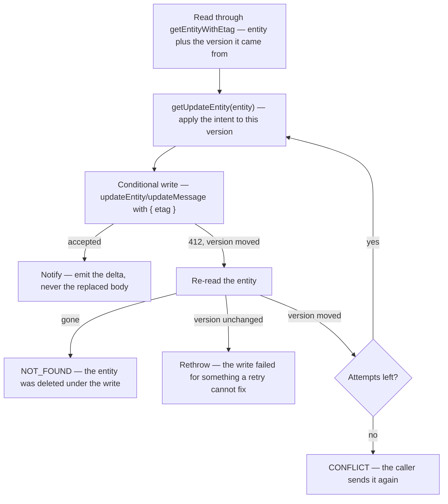

# Conditional Writes

A procedure that reads an entity, computes something from it, and writes the result back is not one operation — it is two, with a gap in between that another caller can write into. Azure Table stores an entity as a single blob, so the write carries the whole version the procedure read. Two of them running at once both compute from that same version, and the later write echoes back a body that never saw the earlier change.

Nothing surfaces. There is no error, no log, and the caller whose write landed first was already told it succeeded. The change is simply gone, and the only witness is a user who watches their edit revert.

So: **a write derived from what the procedure just read is conditional on the version it read.** This is [Persist Then Notify](/docs/architecture/persist-then-notify)'s persist phase under concurrency — the guard/persist/notify ordering is unchanged, the persist step just carries the version it depends on.

## Which writes this covers

A write is a read-modify-write whenever the value it stores could not have been computed without first reading the entity:

| Write                              | Why it qualifies                                                                                                        |
| ---------------------------------- | ----------------------------------------------------------------------------------------------------------------------- |
| A map or array rewritten wholesale | `votePoll` stores the whole votes map; `deleteFile` stores the whole surviving `files` array                            |
| Any `"Replace"`                    | Merge cannot unset a property, so clearing one (`deleteLinkPreviewResponse`, `unpinMessage`) has to write the full body |
| A counter or accumulator           | The new value is the old value plus one                                                                                 |

A `"Merge"` of fields taken straight from the caller's input is **not** one — `updateMessage` writing the text the user typed, or `pinMessage` setting `isPinned: true`, depends on nothing it read.

The `"Replace"` row is the one that gets missed, and it is the worst of the three: the write carries every property, so replaying it from a stale read reverts _all_ concurrent changes to that entity, not just the field the procedure meant to touch.

## The lifecycle

The loop back to `getUpdateEntity` is the whole design: **the retry re-applies the intent, it does not replay the body.** "Record this vote", "drop this file", "clear this field" are all still valid after losing a race — only the body computed against the version that moved is stale. Writing that body again is the bug the conditional write exists to prevent.

`updateEntityConditionally` (`server/services/azure/table/`) owns this loop. A caller supplies `getUpdateEntity`, which receives the **fresh** entity on every attempt, and `writeEntity`, which decides the mode and whether the write stamps message metadata. Do not hand-roll the loop per procedure.

## Rules that fall out of it

- **Read through `getEntityWithEtag`, not `getEntity`.** The latter exists to drop the etag. Where a shared procedure already performs the read — as `getMessageProcedure` does — the etag rides on the procedure context beside the entity, so the round trip is paid once and every procedure built on it gets the option.
- **Retries are bounded.** A fixed small number of attempts, never until it lands, or one hot row spins a request a user is waiting on.
- **Exhaustion is an outcome the call chooses.** Anything a user is waiting on throws `CONFLICT`, so they can send it again rather than being shown success over a change that never landed. Fire-and-forget telemetry drops it instead.
- **Only a lost race retries.** The re-read is what tells a stale version from a broken write, without a status code to read. An unchanged version means retrying cannot help, so that error propagates as itself — otherwise a transient fault degrades into `CONFLICT` and names the wrong cause.
- **Notify with the delta.** The subscription payload stays the fields that changed, so a client merges one property instead of adopting a whole entity it may hold newer state for.
- **Derive follow-up work from the attempt that won.** `deleteFile` captures the removed file's name inside `getUpdateEntity`, so the blobs it publishes for deletion belong to the file it actually removed.

## Testing it

`MockTableClient` honours the condition — a mismatched etag throws a `412`, and every write re-etags — so the loop is fully testable. What it does not reproduce is the interleaving: every mock Azure client resolves in the same microtask drain, so two concurrent procedures run to completion one after the other and **a bare `Promise.all` passes against the unconditional bug**. Hold the first write open and release it only after the second has landed. A green concurrency test that never actually overlapped is worse than no test — it reports the hazard as covered.
