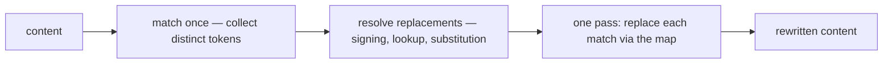

# Content Token Rewriting

Several features find a token inside content someone else authored and rewrite it: blob urls in a resource's saved content ([/docs/platform/resource-file-assets](/docs/platform/resource-file-assets)), `{{variable}}` merge fields in email personalization, `{{entry:key}}` aliases in a blueprint. The content is arbitrary — HTML, CSS, JSON, or all three nested — so "where does this token end" is the whole problem, and getting it wrong silently corrupts a document rather than failing.

These rules apply to every such rewrite.

## Match on a delimiter, never on a leftover charset

A match must be **self-delimiting**. There are exactly two ways to earn that:

- **The token carries its own delimiters.** `{{key}}` is bounded by the delimiters that define it, so a lazy body between them is unambiguous. Prefer this whenever the token format is ours to choose.
- **The match is anchored on the delimiter that opened it.** A token we do not control the shape of — a url — is still always introduced by something: a quote, a css `url(`, whitespace. Anchor on that opener and the terminator is _known_, so each context can permit the characters the others reserve.

What is banned is the third option: defining the match as "everything except the characters that might end it". A negated charset is a guess at a closed set that is never closed — every character it forgets truncates a token mid-way, and every character it over-claims is one that can no longer appear inside a token. The blob-url matcher was rewritten three times under that model before being anchored on its opener.

## Rewrite in one pass, keyed by a map

Collect the tokens first, resolve their replacements, then rewrite the content in **one** pass over the same matcher, looking each match up in a `Map`:

Never loop a per-token search over the whole document instead. That shape is wrong twice over:

- **Correctness** — a token that is a prefix of another token consumes it. `logo.png` searched on its own matches inside `logo.png.webp` and overwrites it, and the longer token is then gone before its own turn comes.
- **Cost** — the document is rescanned once per token, so the work scales with tokens × content size on a path that runs on every read and every publish.

## Walk the parsed structure, never the serialized form

Always walk the parsed value and map its string leaves (`deepReplaceStrings`), never regex `JSON.stringify(content)`. A serializer adds an escaping layer of its own, so a matcher pointed at the serialized form has to read the content's grammar _and_ the serializer's — and the second one it must model without ever being the thing that produced it.

This holds whether the token occupies a whole string value (a blueprint alias) or sits embedded inside a larger one (a url inside an HTML attribute or a css declaration). Walking settles the outer layer by construction; only the inner one is left, and that is what the opener anchoring above reads. Structure and non-string leaves are untouched either way.

`deepReplaceStrings` reproduces exactly what a `JSON.stringify` → `jsonDateParse` round trip produced — own enumerable entries, `undefined` values dropped, Dates preserved — so replacing that round trip with a walk is a drop-in.

## Converge on read, do not backfill

When the canonical form of a token changes, make the matcher read both forms and let the rewrite emit only the new one. Content is re-matched and rewritten on every read, so it converges as it is used, and the old form disappears from storage without a migration pass over stored content.

The reader must be widened deliberately and the ambiguity it accepts stated, because "read both forms" is where a matcher regrows the guesswork the first rule bans. This is the server-owned counterpart to [persisted data — latest shape only](/docs/architecture/persisted-data-latest-shape-only): a client-authoritative blob can reset to a fresh default, but authored content cannot be thrown away, so it converges instead.

## A token that resolves to nothing is data, not an error

Authored content can carry something that looks like a token and resolves to nothing — a hand-typed url with invalid percent escapes, a merge field naming a key the context lacks. Leave it exactly as the content carries it and rewrite everything else. One unresolvable token must never fail the save, publish, or read of the whole document.
