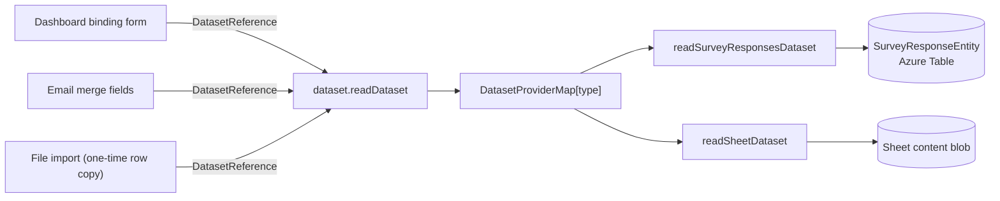

# Datasets

The standard for serving tabular data across products. Whenever one product needs to read another product's data (survey responses in a dashboard, file rows in an import), it goes through this contract — never through product-specific reads.

Serving is the **DatasetProvider capability** ([/docs/architecture/resources](/docs/architecture/resources)): a resource type opts in via `ResourceDefinitionMap`, and `DatasetProviderType` keys the provider map so a declared-but-unregistered provider is a compile error. _Consuming_ is not a capability — it is just calling `dataset.readDataset` from a component (dashboard binding form, email merge fields).

## Contract

Shared models in `packages/app/shared/models/dataset/` (one type + schema per file, interface-first). `ColumnType` and `ColumnValue` are reused from the Sheet resource models — they are already the canonical cell-type vocabulary.

```typescript
interface DatasetColumn {
  name: string;
  type: DatasetColumnType; // ColumnType minus Computed — computed values are derived at render time
}

interface Dataset {
  columns: DatasetColumn[];
  rows: Record<string, ColumnValue>[];
}

enum DatasetProviderType {
  Sheet = "Sheet",
  SurveyResponses = "SurveyResponses",
}

interface DatasetReference extends ItemEntityType<DatasetProviderType> {
  id: string; // the resource id
}
```

A reference is just a resource id — a Sheet resource _is_ the dataset (no sub-item selector; the old table document's `itemId` died with the multi-item document). `DatasetProviderType` (server-resolvable references) is a different axis from `DataSourceType` (Csv/Json/Xlsx — file formats parsed client-side). Do not merge them: one describes _where data lives_, the other _how a file is encoded_.

## Serving

One procedure resolves every reference:

| Procedure             | Auth           | Input              | Purpose                            |
| --------------------- | -------------- | ------------------ | ---------------------------------- |
| `dataset.readDataset` | Resource owner | `DatasetReference` | Resolve a reference to a `Dataset` |

Public viewers never call this: published resources bake resolved datasets in at publish time.



Server structure (`server/services/dataset/`): `DatasetProviderMap.ts` maps `DatasetProviderType` → provider function, one provider per folder. Each provider owns its auth check and its column/row derivation:

- **`readSurveyResponsesDataset`** — columns from the survey model's questions (name + question-type → `ColumnType` mapping); rows flattened from `SurveyResponseEntity` JSON in Azure Table, non-primitive answers JSON-stringified; auth via resource ownership.
- **`readSheetDataset`** — reads the Sheet resource's content blob and converts `content.data` via `dataSourceToDataset`; auth via resource ownership.

## Rules

- **Row cap** — `AZURE_MAX_PAGE_SIZE` (1000) on every provider; datasets are for visualization and import, not bulk export. Add pagination only when a real consumer hits the cap ([deferred](/docs/platform/deferred/dataset-row-cap-pagination)).
- **Consumers choose copy or reference.** Import (Sheet resource) copies rows once. Binding (dashboard visuals, email editor merge fields) stores the `DatasetReference` and re-resolves on load. All call the same procedure.
- **Fetch on load + manual refresh.** No live subscriptions through this layer ([deferred](/docs/platform/deferred/realtime-dataset-refresh)).
- **No external providers** (HTTP APIs, SQL) until secret storage and injection-safety work is scoped ([deferred](/docs/platform/deferred/api-sql-dataset-providers)) — the enum grows one value per new provider, nothing else changes.
