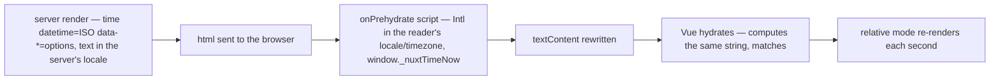

# Date and time display

A date rendered by a component is formatted twice: once on the server, once again when the client hydrates. Those two runs do not agree. The server formats in the container's locale and timezone (UTC on Azure), the browser in the reader's — so `formatDate(...)`, `toLocaleDateString()` and `useTimeAgo()` in a template produce different text on each side. Vue reports that as `Hydration completed but contains mismatches`, silently re-renders the subtree, and the reader is left looking at the server's clock rather than their own.

**Anything a reader sees is a `<NuxtTime>`.** Formatting a date any other way inside a `.vue` file is a `vue/no-restricted-syntax` error. The one exception is the client-rendered message list, [below](#where-a-format-string-still-belongs).

```vue
<NuxtTime :datetime="post.createdAt" relative />
<NuxtTime :datetime="resource.createdAt" day="numeric" month="short" year="numeric" />
```

## Why it is hydration-safe

`<NuxtTime>` renders the server's own formatting into the html, but it also renders the machine-readable instant and the formatting options as attributes, and ships a tiny script that reformats the text from those attributes **before** Vue hydrates. So the server's text never survives to be compared: by the time Vue hydrates, the DOM already holds the browser's own string, computed against one page-wide frozen `now`, which is exactly what Vue's own render then produces.



## Options, not format strings

Formatting is [`Intl.DateTimeFormat`](https://developer.mozilla.org/en-US/docs/Web/JavaScript/Reference/Global_Objects/Intl/DateTimeFormat) options passed as attributes (`weekday`, `year`, `month`, `day`, `hour`, `minute`, `timeZoneName`, `dateStyle`, `timeStyle`), so the shape of the output is chosen by the reader's locale rather than by a pattern we wrote. `relative` switches to `Intl.RelativeTimeFormat` for time-ago text and self-ticks once a second per instance. `title` is **not** a localized tooltip: the boolean form renders `toISOString()`, and the prehydrate script rewrites only the element's text, never its `title`, so a reader hovering gets UTC machine text. Pass `title` a string when an exact instant is genuinely wanted; otherwise leave it off.

A format shared by more than one call site is one constant of attributes, spread in — `RESOURCE_DATE_TIME_ATTRIBUTES` beside its string counterpart in `app/services/resource/constants.ts`:

```vue
<NuxtTime :="RESOURCE_DATE_TIME_ATTRIBUTES" :datetime="resource.createdAt" />
```

A `<NuxtTime>` is a component, so it cannot live inside a prop string. A subtitle or a sentence that embeds a time is written as slot content with the time in inline flow, never assembled with template literals in script.

## Where a format string still belongs

`formatDate` formats **data**, not display: filenames, CSV exports, the value accessors a data table sorts on, and the cell value a date input writes back. It is the repo's own token formatter — the dayjs `format` subset the repo actually writes, over `Temporal` — and `parseDate` is its strict inverse, which is what a sheet's date column round-trips a cell through. The date _logic_ underneath is Temporal directly, through the day-level helpers in `@esposter/shared` (`getStartOfDay`, `checkIsSameDay`, `checkIsToday`); a duration is a `Temporal.Duration`, never a library's. The lint rule only covers `.vue` files; services and server code format freely.

The one display exception is the message list. Its labels (`Yesterday at 14:03`, the day divider, the compact 24-hour gutter clock) branch on the reader's own day boundary, which no single `<NuxtTime>` expresses, and its 24-hour format has to stay identical across three surfaces. That is safe because `/messages/**` is client-rendered — like `/resource-explorer/**`, it is an auth-gated app surface with no SEO value, so there is no server render to disagree with. The labels live in `app/util/date/`, outside any component.

## Themes have the same failure mode

The same "server guesses, client knows" split hits the theme: Vuetify resolves `ThemeMode.system` through a `matchMedia` ref that only exists in the browser, so the server would always render `v-theme--light`. `NuxtTheme` resolves the mode itself — from the vuetify-nuxt-module client hint during SSR, then from the media query once mounted — so both renders start on the same concrete theme.

## Key files

| File                                                  | Role                                                                    |
| :---------------------------------------------------- | :---------------------------------------------------------------------- |
| `packages/configuration/eslint/overrides/vueRules.js` | The `vue/no-restricted-syntax` rule, and the `<time>` element ban       |
| `packages/app/app/services/resource/constants.ts`     | `RESOURCE_DATE_TIME_ATTRIBUTES` and its string counterpart              |
| `packages/app/app/util/date/`                         | The message-list labels, the one place a display format is hand-written |
| `packages/app/shared/util/date/`                      | `formatDate`/`parseDate` and the token map they share                   |
| `packages/app/configuration/routeRules.ts`            | The client-rendered app surfaces                                        |
| `packages/app/app/components/Nuxt/Theme.vue`          | System-theme resolution, the theme half of the same problem             |
| `packages/app/configuration/vuetify.ts`               | `ssrClientHints.prefersColorScheme`, which carries the scheme into SSR  |
