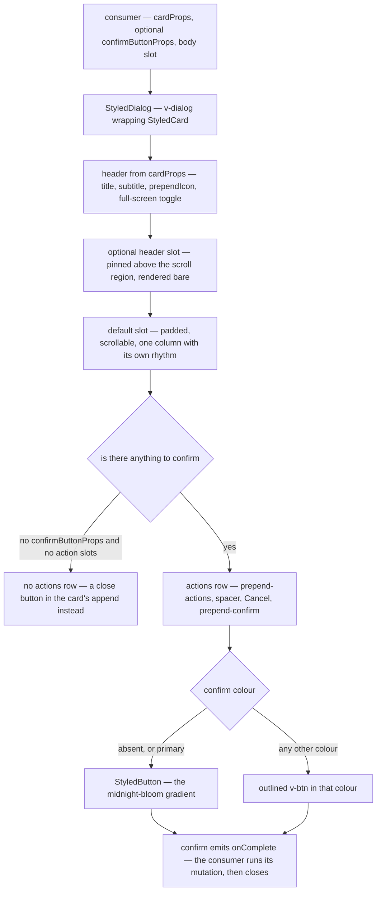

# Dialog Shell

`StyledDialog` is the shell every dialog composes, with one documented exception below. It owns the whole frame — the `v-dialog`, the `StyledCard` inside it, the full-screen toggle in the card's append slot, the padded scrollable body, and the actions row — so the contract is what the header says (`cardProps`), what the confirm button says (`confirmButtonProps`), and bare body content in the default slot. Only the body is really required: a dialog with nothing to confirm omits `confirmButtonProps` and loses the actions row with it. Four optional controls sit alongside — `#header` for a region pinned above the scroll, `#prepend-actions` for the row's leading edge, `#prepend-confirm` for a third decision in the trailing group, and `hideCancelButton` for a dialog whose only way out is confirming. Nothing else in the app hand-rolls a `v-dialog` + confirm-button pair.

Three shells build on each other. `StyledFormDialog` wraps the base with a `v-form`, a generated form id and submit wiring, so its confirm button is a real submit that carries validity, `loading` and the disabled state without the consumer computing any of them. `StyledDeleteFormDialog` wraps that with the red `Delete` button and the opt-in type-the-name guard described in [destructive confirmation](/docs/architecture/destructive-confirmation). `StyledEditFormDialog` is the editor-shaped sibling rather than a fourth layer: it trades the card title for a `v-toolbar` header carrying save, delete, validity and full-screen controls, because an editor's actions live at the top where the form below can scroll past them.

## How one dialog renders

## The rules the shell enforces

**Body content is the default slot, never `cardProps.text`.** `cardProps` describes the header — title, subtitle, prepend icon — and Vuetify's `text` prop renders outside the shell's own `v-card-text`, so a message passed that way escapes the scroll container and the column rhythm the shell sets for every other dialog. A sentence of prose is still a body: pass it as children.

**The actions row belongs to the shell.** Cancel is the shell's and closes the dialog. A third choice — discard, skip, "export anyway" — is a decision the same weight as the other two, so it goes in `#prepend-confirm` and sits between them: the whole trailing group reads cancel → alternative → confirm, and every decision the dialog offers is under the pointer at once. `#prepend-actions` is the other edge and is not for decisions: it carries what annotates the row rather than answers it — a `3/10 options` counter, a hint — kept away from the buttons so it is not clicked as one. An informational dialog that only acknowledges passes `hideCancelButton`, because cancelling is meaningless when nothing is pending.

**The confirm button comes from the shell, not from the caller.** A confirm with no colour is the app's primary action and paints as the `StyledButton` gradient — a colourless flat `v-btn` is transparent on the app's base, which is why the `vuetify` skill bans one as a primary action. Naming a colour means the confirm should not look inviting — `error` for a destructive action, `warning` for a cautionary one — and the shell renders an outlined button in that colour instead. Either way the consumer passes only `confirmButtonProps`, and never reaches past the shell to build its own button.

`primary` is the exception the gate has to spell out, because it is `StyledButton`'s own colour rather than a request for a plain one. Reading _any_ colour as "the caller wants a plain button" meant a dialog that named the default silently opted out of the gradient it was asking for.

**`modelValue` and `fullscreen` are not the caller's to pass.** `dialogProps` is the escape hatch onto the underlying `v-dialog`, and those two are excluded from its type: the close button and the full-screen toggle write them, so a caller setting either takes over a control the shell owns and the dialog stops responding to its own chrome.

**Confirming is asynchronous and the consumer closes the dialog.** `confirm` emits an `onComplete` callback rather than closing on click, so a failed mutation leaves the dialog open with the user's draft intact. `StyledFormDialog` extends the same callback with an `isSuccessful` flag and keeps its submit button in `loading` until it is called.

**Section dividers take the theme default.** The hairlines the shell draws between header, body and actions are Vuetify's own. A `thickness="2"` divider means something different and is not a heavier version of the same thing: it is the separator between a toolbar and the content it commands — the edit-form header, the rich-text menu bar, the note editor — and its vertical form separates control groups inside such a toolbar. Reading a divider tells you which of the two you are looking at, so neither takes the other's weight.

**Quote what the action is about with `StyledPreviewCard`.** A confirm dialog that names one message, post or comment renders it inside `StyledPreviewCard` — a bordered, shadowed box rather than a `StyledCard`. That is deliberate: the dialog is already a surface, so a nested surface-coloured card would be invisible against it, and the point of the preview is to read as a quotation of content lifted out of somewhere else.

## Dialogs with nothing to confirm

A dialog that only shows something — the search palette, the keyboard shortcuts sheet — composes the same shell. Omitting `confirmButtonProps` drops the whole actions row, cancel included: there is no pending change for cancel to abandon, and a read-only dialog forced to carry one button it never wanted is a dialog that re-rolls the frame to get rid of it. The shell still owes exactly one explicit dismissal, so it moves a close button into the card's append slot beside the full-screen toggle — otherwise the only way out is clicking away.

Such a dialog usually needs something pinned above the scroll region: a search field, a filter row. That is the `#header` slot, rendered bare so the consumer owns its own padding, because what goes there is normally a full-bleed input. `StyledSearchDialog` is the shared palette and the entry point for every command palette in the app ([search](/docs/architecture/search)); `StyledKeyboardShortcutsDialog` renders a `KeyboardShortcutCategory[]` the same way.

## When a dialog may keep its own shell

`MessageModelMessageForwardRoomDialog` is the one dialog that does not compose `StyledDialog`, and that is settled rather than pending. What it needs is a pinned **footer** — a message preview and a rich-text editor stacked full-width above a full-width send button, between the scroll block and the actions row.

Nothing else in the app wants that region, and a slot earning its existence from a single consumer is the flag the `file-organization` skill rules out: the shell would grow a concept every other dialog has to read past. The bar for adding one is a second consumer, not a first — so if another dialog needs the same region, the footer becomes a slot and this dialog composes the shell like the rest.

## Key files

| File                                                                | Role                                                                                   |
| ------------------------------------------------------------------- | -------------------------------------------------------------------------------------- |
| `app/components/Styled/Dialog.vue`                                  | The shell — card, full-screen toggle, body slot, actions row and confirm button        |
| `app/components/Styled/FormDialog.vue`                              | Adds the `v-form`, submit wiring, validity and loading state to the shell              |
| `app/components/Styled/DeleteFormDialog.vue`                        | The destructive layer — red Delete plus the type-the-name guard                        |
| `app/components/Styled/EditFormDialog/Index.vue`                    | Editor-shaped dialog — toolbar header, full-screen width, dirty-close confirmation     |
| `app/components/Styled/EditFormDialog/ConfirmCloseDialogButton.vue` | Save / discard / cancel on a dirty close, composed on the shell with `prepend-confirm` |
| `app/components/Styled/Card.vue`                                    | The bordered card every dialog renders inside                                          |
| `app/components/Styled/PreviewCard.vue`                             | The quoted-content box a confirm dialog shows the target in                            |
| `app/components/Styled/SearchDialog.vue`                            | The action-less palette shell — hotkey, search field, results slot                     |
