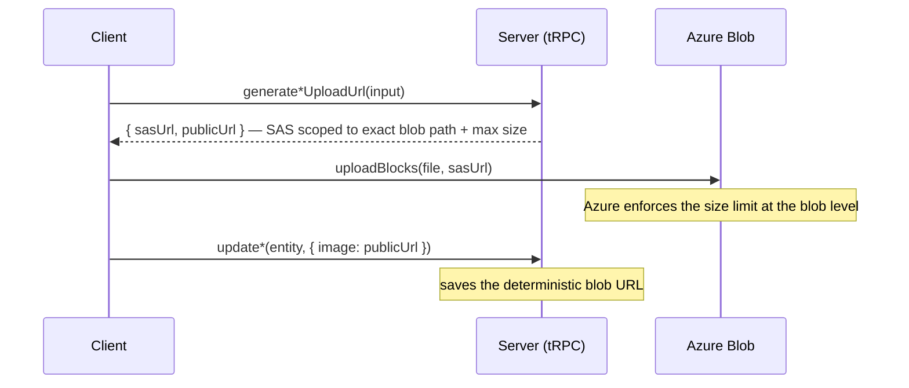

# File Uploads

All binary uploads use a two-step SAS flow: the server issues a short-lived SAS (shared access signature) URL scoped to an exact blob path, and the client uploads directly to Azure Blob Storage. tRPC never carries binary bodies — `octetInputParser` (tRPC's raw-body mode) cannot pass any input alongside the binary stream (no `roomId` or other context) and its size limit falls through to the general tRPC body limit (`MAX_REQUEST_SIZE = 2 MB`) rather than a dedicated file limit. Azure Blob's SAS scoping is strictly better.

## Pattern



Client helper: `uploadBlocks(file, sasUrl)` in `app/services/azure/container/uploadBlocks.ts` — chunks into 4 MB blocks, uploads in parallel, commits the block list.

## Upload procedures

| Procedure                                          | Router    | Blob path                     | Size limit              | Auth         |
| -------------------------------------------------- | --------- | ----------------------------- | ----------------------- | ------------ |
| `generateUploadFileSasEntities({ files, roomId })` | `message` | `{roomId}/{fileId}`           | `MAX_FILE_REQUEST_SIZE` | member       |
| `generateUploadFileSasEntities({ files, id })`     | `survey`  | `{surveyId}/files/{fileId}`   | `MAX_FILE_REQUEST_SIZE` | owner        |
| `generateProfileImageUploadUrl()`                  | `user`    | `{userId}/ProfileImage`       | `MAX_FILE_REQUEST_SIZE` | authed       |
| `generateProfileImageUploadUrl({ roomId })`        | `room`    | `rooms/{roomId}/ProfileImage` | `MAX_FILE_REQUEST_SIZE` | `ManageRoom` |

Message attachments land in `AzureContainer.MessageAssets`; survey asset files in `AzureContainer.ResourceAssets`; profile images (user + room) in `AzureContainer.PublicUserAssets`. The separate attachments container lets a lifecycle policy tier old attachments without touching hot, small profile images (see [/docs/architecture/azure-services](/docs/architecture/azure-services)).

## Size constants

```ts
// shared/services/app/constants.ts
export const KIBIBYTE = 2 ** 10;
export const MEGABYTE = KIBIBYTE ** 2;
export const MAX_REQUEST_SIZE = 2 * MEGABYTE; // tRPC body limit (JSON payloads)
export const MAX_FILE_REQUEST_SIZE = 10 * MEGABYTE; // SAS max blob size (file uploads)
```

`MAX_REQUEST_SIZE` applies to all tRPC requests. `MAX_FILE_REQUEST_SIZE` is baked into the SAS token — Azure rejects uploads that exceed it at the blob level, with no tRPC involvement.

## Notes

- **Naming**: both the user and room upload procedures are named `generateProfileImageUploadUrl`; the router context (`user.` vs `room.`) disambiguates — consistent with procedures being named by action, not by the entity they touch.
- **`octetInputParser` removed**: `user.uploadProfileImage` previously used it. It could not accept input alongside the binary body (no way to scope to a `roomId`), shared the 2 MB tRPC limit with all requests, and could only enforce size client-side. The SAS pattern resolves all three issues.
