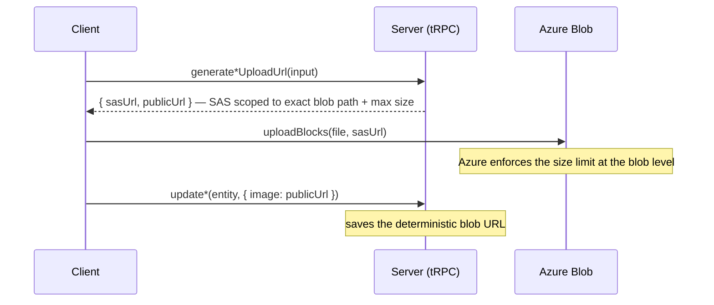

# File Uploads

All binary uploads use a two-step SAS flow: the server issues a short-lived SAS (shared access signature) URL scoped to an exact blob path, and the client uploads directly to Azure Blob Storage. tRPC never carries binary bodies — `octetInputParser` (tRPC's raw-body mode) cannot pass any input alongside the binary stream (no `roomId` or other context) and its size limit falls through to the general tRPC body limit (`MAX_REQUEST_SIZE = 2 MB`) rather than a dedicated file limit. Azure Blob's SAS scoping is strictly better.

## Pattern



Client helper: `uploadBlocks(file, sasUrl)` in `app/services/azure/container/uploadBlocks.ts` — chunks into 4 MB blocks, uploads in parallel, commits the block list.

## Upload procedures

| Procedure                                          | Router                                                     | Blob path                     | Size limit              | Auth         |
| -------------------------------------------------- | ---------------------------------------------------------- | ----------------------------- | ----------------------- | ------------ |
| `generateUploadFileSasEntities({ files, roomId })` | `message`                                                  | `{roomId}/{fileId}`           | `MAX_FILE_REQUEST_SIZE` | member       |
| `generateUploadFileSasEntities({ files, id })`     | any [FileAssets](/docs/platform/resource-file-assets) type | `{id}/files/{fileId}`         | `MAX_FILE_REQUEST_SIZE` | owner        |
| `generateProfileImageUploadUrl()`                  | `user`                                                     | `{userId}/ProfileImage`       | `MAX_FILE_REQUEST_SIZE` | authed       |
| `generateProfileImageUploadUrl({ roomId })`        | `room`                                                     | `rooms/{roomId}/ProfileImage` | `MAX_FILE_REQUEST_SIZE` | `ManageRoom` |

Message attachments land in `AzureContainer.MessageAssets`; resource asset files in `AzureContainer.ResourceAssets`; profile images (user + room) in `AzureContainer.PublicUserAssets`. The separate attachments container lets a lifecycle policy tier old attachments without touching hot, small profile images (see [/docs/architecture/azure-services](/docs/architecture/azure-services)).

Reads differ per domain: message attachments fetch download SAS urls per batch of attachments (`message.generateDownloadFileSasUrls`) and cache them per room in the download store until `READ_SAS_DURATION_MS` runs out. **A page read is not enough to keep that cache alive** — it only mints urls for files it does not already hold, so a room left open longer than the SAS duration would render every attachment broken and fail every download until reload. The download store therefore sweeps its own cache every `READ_SAS_REFRESH_INTERVAL_MS` and re-mints whatever is inside that margin of expiry; the same margin is what a page read counts as already expired, so no url is ever handed to the renderer that could die while on screen. A tick that finds nothing aging out issues no query, which is what makes the sweep affordable. Resource assets instead embed a stable app url built client-side after the upload and served through `/api/resource-assets` ([resource file assets](/docs/platform/resource-file-assets)) — resource types have no download procedure, and nothing about them expires.

## Sweeping orphans: never delete a blob younger than its write SAS

A blob whose owning row is updated to a new upload leaves the old one behind, so the update sweeps the entity's blob prefix and publishes everything that is not the url it was just handed ([persist then notify](/docs/architecture/persist-then-notify)). "Not the current url" is not on its own a safe test for staleness: upload names are per-upload unique, so a blob a second editor uploaded seconds ago — and has not saved yet — also fails it, and sweeping it points that editor's save at a blob that no longer exists.

**Every prefix sweep therefore filters on age, keeping only blobs created before `now - WRITE_SAS_DURATION_MS`** (`listBlobNames(client, prefix, { createdBefore, isDeep })`). The write SAS that authorized an upload expires after `WRITE_SAS_DURATION_MS`, so no upload can still be in flight past that age, while a blob older than it is either the previous version or an abandoned upload — an orphan either way. This applies to any sweep that infers staleness from the current row rather than from a name it stored, and it is why the sweep is a filtered listing rather than a plain "delete everything else". The one blob exempt from the age filter is the version the row itself just stopped pointing at: the update knows that url was current, so it is a known orphan at any age — without that exemption an image replaced minutes after upload would never be collected.

## Batch input is validated all-or-nothing

Client-side validation of a multi-item input (a multi-file drop, a bulk paste, a multi-select action) **rejects the whole batch on the first invalid item, and the alert names that item**. Never filter the batch down to its valid members: the user would be left holding a set they never chose, with the dropped item easy to miss before they commit. `useValidateFile(file, maxSize)` takes the whole `File` for exactly this reason — it needs the name for the message.

## Size constants

```ts
// shared/services/app/constants.ts
export const KIBIBYTE = 2 ** 10;
export const MEGABYTE = KIBIBYTE ** 2;
export const MAX_REQUEST_SIZE = 2 * MEGABYTE; // tRPC body limit (JSON payloads)
export const MAX_FILE_REQUEST_SIZE = 10 * MEGABYTE; // SAS max blob size (file uploads)
```

`MAX_REQUEST_SIZE` applies to all tRPC requests. `MAX_FILE_REQUEST_SIZE` is baked into the SAS token — Azure rejects uploads that exceed it at the blob level, with no tRPC involvement.

## Notes

- **Naming**: both the user and room upload procedures are named `generateProfileImageUploadUrl`; the router context (`user.` vs `room.`) disambiguates — consistent with procedures being named by action, not by the entity they touch.
- **`octetInputParser` removed**: `user.uploadProfileImage` previously used it. It could not accept input alongside the binary body (no way to scope to a `roomId`), shared the 2 MB tRPC limit with all requests, and could only enforce size client-side. The SAS pattern resolves all three issues.
