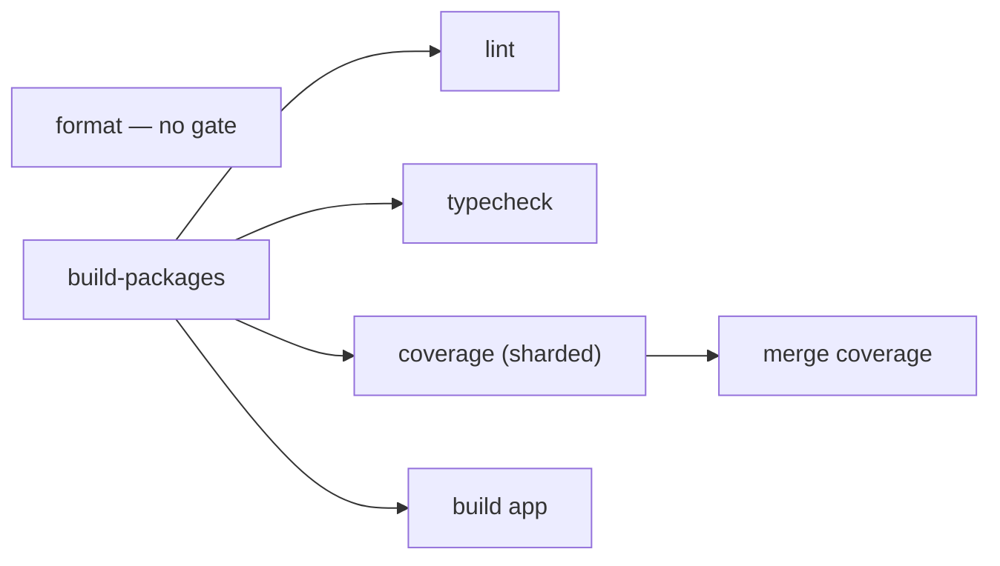

# Monorepo Tooling

How workspace package scripts, dependency installs, publishing, and CI runners are organized.

## Package management

Esposter uses **pnpm workspaces** as the package manager and workspace script runner. Workspace packages are declared in `pnpm-workspace.yaml`, and package versions are centralized in the root catalog.

Use the root `package.json` scripts as the canonical entry points for cross-package work. Package-local scripts should stay small and predictable (`build`, `export:gen`, `lint`, `lint:fix`, `typecheck`, `test`) so root recursive commands can compose them. Coverage is not a package-local script — it is owned entirely by the root `vitest` `projects` run.

The toolchain entry-point scripts run through the [`virrun`](https://github.com/Esposter/Esposter/tree/main/packages/virrun) sandbox via a `virrun -- <cmd>` prefix (the prefix _is_ the per-command switch). The committed `virrun.config.ts` branches on `process.platform`: **win32 → `os`** (the WSL sandbox with its warm snapshot + Linux-generated `.nuxt` prepare layer — the platform whose host artifacts misfire Linux type-aware tooling), **everything else → `native`** (Linux/CI already generates platform-correct artifacts in place, so the sandbox would only add overhead; a win32 host without bubblewrap/WSL-Linux-Node still auto-falls back to native). Routed today: the read-only `format:check`/`lint`/`lint:packages`/`typecheck*`/`test*`, the producing `build:app`/`build:docs`/`depcruise:graph` (write-back flushes their output to host), and the mutating dev-loop `format`/`lint:fix`/`lint:fix:packages` (each underlying `oxlint`/`eslint`/`oxfmt`/`pnpm -r` step wrapped; the prefix only wraps the root orchestrator, never the per-package scripts it fans out to, so there is no nested sandbox). Native by design: `build:packages` is the bootstrap that builds the `virrun` bin itself (a circular self-host) and `coverage` writes a report the os-backend tmpfs upper would discard; `db:gen` awaits an equivalence proof (its migration output lands outside the `db-schema` overlay mount). The mutating scripts are never run in CI (CI runs checks, not fixes). See [virrun CI](https://github.com/Esposter/Esposter/blob/main/packages/virrun/readme/ci.md).

## TypeScript compiler

Every package's `typecheck` is plain `tsc` — `vue-tsc` where the package holds `.vue` files — and the `typescript` package itself is a pnpm `overrides` alias onto [`typescript-native-bridge`](https://github.com/johnsoncodehk/typescript-native-bridge), a fork that keeps the classic TypeScript API surface while running the Go compiler in-process behind it. The override is the whole switch: `vue-tsc`, `@vue/language-core` and the editor's `tsserver` all consume that classic API, so one entry accelerates every one of them without any of them having to move to the TypeScript 7 API they cannot yet read. That is why there is no separate native-compiler dependency and no `tsgo` invocation left in any script. A run announces itself with `▎ TNB ACTIVE` on stderr — the line's absence means stock TypeScript loaded instead, and the override is not taking effect.

The trade is memory for wall-clock: the Go state shares the Node process, so peak RSS is several times a stock run's while the JS heap stays lower, and the app's `vue-tsc` pass loses roughly a third of its wall-clock. Diagnostics are the Go compiler's, not stock TypeScript's, so an error's wording may differ from what the same code reports under the `typescript` version the catalog names.

`oxlint-tsgolint` is unaffected either way — it ships its own Go binaries as optional dependencies and never loads the `typescript` package, so the type-aware lint pass neither gains nor loses from the override.

## Recursive script orchestration

Use pnpm recursive commands instead of Lerna Lite for running scripts across packages.

Common patterns:

```bash
pnpm -r run build
pnpm -r --parallel --aggregate-output run lint
pnpm -r --parallel --aggregate-output run typecheck
pnpm -r --filter "!@esposter/app" run build
pnpm --filter @esposter/app run build
```

Guidelines:

- Tests are the exception: `test`/`coverage` run through one root `vitest.config.ts` `projects` config (a single `vitest run`), not a recursive fan-out, so the whole suite shares one run, one coverage report, and one `--shard` axis.
- Use `--parallel` for independent checks such as linting and typechecking.
- Use `--aggregate-output` in CI-style commands so package logs remain readable.
- Use filters instead of Lerna scopes/ignores.
- Keep `build:packages` separate from `build:app`; the app can depend on compiled package output.
- Use `--if-present` only for scripts that are optional across packages.
- Pass tool flags with `pnpm exec <binary> <args>` (e.g. `pnpm exec vitest run --shard=1/4`), or as direct args (`pnpm test -u`). Do **not** use the `pnpm <script> -- <args>` separator form — pnpm forwards the literal `--` into the script's arguments, so the underlying tool treats the trailing flags as post-`--` positionals and silently ignores them (this dropped `--shard`/`--reporter` in CI).

## Lerna Lite

Lerna Lite is retained for publishing only:

```bash
lerna publish --yes
```

Do not use Lerna Lite for recursive script execution or watch orchestration. If a root script is not publishing, prefer pnpm workspace commands. This means `@lerna-lite/cli` and `@lerna-lite/publish` remain in dev dependencies, while `@lerna-lite/run` and `@lerna-lite/watch` are unnecessary.

`pnpm release` is the chain in front of it, and **every step is a check rather than a fix**: `format:check`, `build:packages`, `lint:packages`, `typecheck:packages`, `test:packages`, then the publish. `format:check` is the one check that runs cold, so it is the only one that can precede the build; everything after it reads what the build writes, because the ctix barrels and `dist` are both generated and gitignored — from a clean checkout lint and typecheck resolve no `packages/*/src/index.ts` and the size snapshots measure no bundle. The fix variants led this chain once, which made a release rewrite the tree it was about to publish — whatever they changed shipped under the new version and got tagged without anyone reading it. A release is the one moment a dirty tree has to fail loudly rather than be tidied away. The suite is in the chain for the same reason the checks are: CI runs it on every push, but nothing tied a green suite to the tree lerna actually publishes, and a publish is the only step here that a later commit cannot walk back.

## Dependency installs

Use plain `pnpm i` from the repo root when package manifests change.

Do not set `CI=true` locally to bypass pnpm prompts, and do not use `pnpm install --config.confirmModulesPurge=false` or other store override workarounds. Those approaches can create a local `.pnpm-store/` in the repository.

When only dependency versions change, follow the dependency update process and refresh the lockfile with:

```bash
pnpm refresh:lockfile
```

An install that dies in the app's `postinstall` (`nuxt prepare`) on `Cannot find module '@nuxt/devtools-kit'` is local `node_modules` drift, not a bad lockfile. `@tresjs/nuxt` imports that package without declaring it, so it resolves only through pnpm's hoisted `node_modules/.pnpm/node_modules`; once those links go missing, every `pnpm <script>` fails too, because pnpm's deps-status check re-runs the install before running any script. `pnpm i` reports `Already up to date` and changes nothing — `pnpm i --force` relinks. A forced reinstall also clears `packages/*/dist`, so run `pnpm build:packages` before the next typecheck, or the app reports missing exports from the workspace packages (`@esposter/db`, `@esposter/configuration`) that are really just unbuilt.

To bump the node version, run `pnpm update:node [version]` — it edits `engines.node` + the `@types/node` catalog, installs the version and makes it the fnm default, and removes the old version in one call (then refresh the lockfile). Already-open shells keep the old version until reopened.

## CI job shape

The reusable `build-packages` workflow gates every package-consuming check, and 🏎️ Bench calls the same definition (`uses: ./.github/workflows/build-packages.yaml`) — one build and one cache key, so a workflow reaching an already-populated key skips the build entirely. It is a saving rather than a guarantee: both workflows trigger on the same push, so they can miss the key together and each build once — the entry only helps whoever arrives after it is written. A reusable workflow shares its caller's run, so the `package-builds` artifact reaches that caller's other jobs; the `actions/cache` entry behind it is keyed by content hash and shared repo-wide, which is what carries a build across workflows. Two composite actions split the setup work: `setup-project-dependencies` installs node then pnpm (in that order — `pnpm/action-setup` picks a broken standalone bootstrap when the system node is too old) and re-runs `setup-node` with `cache: pnpm` to wire up the pnpm store cache, optionally installing bubblewrap behind its `bubblewrap-sandbox` input. `setup-packages` then runs a plain `pnpm i` (served by that store cache — its `postinstall: nuxt prepare` generates the Linux `.nuxt` in place) and downloads the compiled `package-builds` artifact. The platform-branched `virrun.config.ts` resolves `native` on the Linux runners, so every `virrun -- <cmd>` is a passthrough — no bubblewrap, no warm overlay layers, no warm-cache stage on the critical path. Only `coverage` installs bubblewrap (and pins `ubuntu-26.04` for bwrap >= 0.10.0): its shards test virrun's own os backend. → [virrun CI](https://github.com/Esposter/Esposter/blob/main/packages/virrun/readme/ci.md)



`format` is the one check with no `needs`. oxfmt is a standalone binary over source files — no barrels, no package `dist`, and no `virrun` in the command to build one for — so gating it on the package build only made the workflow's quickest check wait out its slowest job. It installs with `--ignore-scripts` for the same reason it skips `setup-packages`: it wants the lockfile-pinned binary, not the built artifact and not the app's `nuxt prepare`.

Tests run through a single root `vitest.config.ts` with three kinds of `projects` entry: `packages/*` (every package by its own config, the app as a Nuxt project via `defineVitestProject`), the root `scripts/` suite, and the `agents` suite over `.agents/**/*.test.ts` — the workflow scripts, driven with stubbed agents. Neither `scripts/` nor `.agents/` is a workspace package, so each needs its own entry with both its `include` and its `benchmark.include` scoped to its own tree; the default `**/*.bench.ts` would otherwise pull every package's benches into it. So `coverage`/`test` are `vitest run` at the root, not a `pnpm -r` fan-out, and a coverage shard can land a workflow-script test as readily as a package one.

`coverage` runs as a matrix over `.github/workflows/CI.yaml`'s `matrix.shard`: `pnpm exec vitest run --coverage --reporter=default --reporter=blob --shard=i/n` splits _all_ test files across runners (each shard runs a distinct slice and writes the collision-safe `.vitest-reports/blob-i-n.json`, which carries that shard's coverage data). The default reporter is paired with the blob one on purpose: blob alone writes the file and prints nothing, so a shard that exits non-zero says nothing about which test failed. A dependent `merge coverage` job downloads every blob and runs `pnpm exec vitest run --merge-reports --coverage` to recombine them into one unified coverage report — this re-emits the report only, it does not re-run tests. CI invokes `vitest` via `pnpm exec` (not `pnpm coverage -- …`) because pnpm does not reliably forward post-`--` args to the script here, which silently dropped `--shard`/`--reporter`.

Sharding shortens the coverage work itself but not total CI time, which is gated by `build app` — the longest job by a wide margin, and roughly twice `lint` or `typecheck`. Sharding is kept for faster test-failure feedback and because the root-level run covers every suite, which a per-package coverage fan-out does not. There are no coverage thresholds, so a partial per-shard report cannot false-fail. Matrix shards are isolated runners with no shared filesystem, so each repeats checkout + install + `setup-packages`; the package _build_ is not repeated (it is downloaded as an artifact), so the per-shard cost is setup only.

Shard count is therefore sized against `build app`, not minimised: the useful target is a `coverage` → `merge coverage` chain that finishes inside the app build, and shards beyond that buy no wall-clock at all while still paying full setup each. Per-shard setup is roughly a third of a shard's runtime, so the marginal shard returns steadily less; coverage runs 8 shards. Bench is unsharded — it is a smoke test that every `*.bench.ts` still executes rather than a walltime measurement, so splitting it only multiplies setup. Changing the coverage count means changing `developMainStatusChecks`' `coverageShardCount` in the same commit: each shard publishes its own `Coverage (n)` required check, and a stale count either requires a context that never reports (blocking every PR) or silently stops requiring a live one.

### What a CI proposal has to beat

The repository is **public**, so Actions minutes are free and **wall-clock is the only currency**. A change that trades runner-minutes at unchanged wall-clock buys nothing here, which is what retires most of the optimisations that suggest themselves — trimming shards is the recurring one, and the shard chain already finishes inside the app build, so the shards it would remove cost nothing to keep and their `Coverage (n)` required checks cost a branch-protection edit to drop.

Nor is per-job setup where the time is. A whole `setup-packages` — `pnpm i`, the app's `postinstall: nuxt prepare`, and the artifact download — runs in well under half a minute, because the pnpm store cache already absorbs the install. **Caching `.nuxt` to skip `nuxt prepare` is a non-starter** on top of that: its output is derived from app source (the component, import and typed-route declarations), so any honest key hashes `packages/app` and therefore misses on precisely the commits that change app source, which is most of them. It would be a cache that hits only when it was not needed.

What is left is the app build, and it is the whole answer: it is several times the next-longest job and every other job finishes in its shadow.

The `build-packages` job builds the packages once and uploads `packages/*/dist` plus the generated `packages/*/src/**/index.ts` barrels as a single `package-builds` artifact (both share the `packages/` common ancestor, so consumers download into `packages`; neither path is a dotfile, so no `include-hidden-files`). The build itself is gated by an `actions/cache` whose key is a content hash — mode, blob hash and path — computed by the `get-package-builds-key` composite action so the save and every restore derive it from one definition (🚀 Pulumi and both Functions deploys restore this same entry). It hashes every tracked file under `packages/` and **subtracts** exactly two things: `packages/app`, which no consumer of this cache builds, and `*.test.ts` / `*.test-d.ts` / `*.bench.ts`, which no entrypoint reaches and which change far more often than anything they sit beside. The root manifest, lockfile and catalog are added as blobs — infra bundles the first via `import packageJson from "../../../../package.json"`.

Everything is an input until proven otherwise, because the two failure directions are not symmetric: subtracting too little costs one rebuild on a push that was already touching a package's internals, while subtracting too much serves a `dist` that does not match the source it claims to be built from, and every check downstream then passes against the stale artifact. So **a build input of a new shape needs nothing done to it — it is already in the key**, which is the property an enumerated allowlist could not offer. The trade is the one it buys: a commit touching only a non-app package's README, CHANGELOG or lint config rebuilds, where an allowlist would have hit. Test-only and app-only commits still hit. Reading `git ls-tree` keeps generated output (`dist`, barrels, `*.tsbuildinfo`, `node_modules`) out by construction, and hashing content rather than refs is what lets a `pull_request` event hit an entry a `push` saved. On a cache hit `pnpm build:packages` is skipped and the restored output is uploaded as-is; on a miss the job builds and seeds the cache, installing with `pnpm --filter "!@esposter/app" i` because the app's dependency tree and its `postinstall: nuxt prepare` are the one part of an install this job never reads. The downstream `setup-packages` composite installs dependencies and downloads the artifact — no build, no per-job cache.

The key is deliberately whole-set rather than per-package: any real input change rebuilds all of them. Per-package keying — what Turborepo and Nx derive automatically from the workspace graph — is rejected in [monorepo task runners](/docs/architecture/rejected/monorepo-task-runners), because the set builds in a fraction of an app build that gates the workflow either way, so a third content-hash cache beside virrun's and this one buys a fraction of the one job nothing waits on.

**The `package-builds` entry keeps an exact key.** Its `packages/*/src/**/index.ts` glob also catches the hand-written directory barrel a package may keep under `src` — a tracked file, covered by the key, so an exact hit proves the restored copy is the checked-out copy. Restored by prefix it would be another commit's version of that file, extracted over the checkout and built, green. 🏗️ Pulumi and the two Functions deploys restore this same entry and skip their build when a `dist` is on disk, so a prefix hit would hand them another commit's output to deploy.

The shared gate is preferred over per-job caching because the package _build_ then happens at most once per run (no redundant parallel rebuilds on a package-change commit), and on an app-only commit — the common case — the gate's own build is a cache hit, so the gate cost collapses to restore + upload — the install hangs off the miss too, since a hit uploads straight from the restored paths and needs no `node_modules` at all. The trade is the serial gate wait before the consuming checks start.

The generated barrels must be cached alongside `dist` because `build:packages` generates them from a `build:prepare` hook and the barrel files are not committed — TypeDoc and the package lint/typecheck steps fail without them even when `dist` is present. Preserve all generated source index files, not just root `src/index.ts`, since some generators create nested barrels.

## CI security

Set `persist-credentials: false` on every `actions/checkout` step.

Declare job permissions explicitly and narrowly:

- Read-only jobs: `contents: read`. Downloading an artifact produced by the **same** run needs nothing further — `actions: read` is for reading another run's artifacts or logs.
- OIDC deployment jobs: `id-token: write`, `contents: read`.
- Release jobs: `contents: write`.
- PR-commenting previews: minimum scopes for OIDC, repo reads, and PR comments.

## Local verification

Run local formatting checks from the repo root with `pnpm format:check`; run local lint fixing from `packages/app` with `pnpm lint:fix`.

Vitest runs on Windows because `packages/app/configuration/modules.ts` gives Nuxt a minimal module allowlist under `process.env.VITEST` (no UnoCSS/PWA/security/SEO); loading the full list there crashes the config load with `spawn EPERM`. If a new test needs an excluded module, add it to the Vitest branch there.

## GitHub Action versions

Pin actions to full commit SHAs with a trailing version comment:

```yaml
uses: actions/checkout@3d3c42e5aac5ba805825da76410c181273ba90b1 # v7.0.1
```

To resolve the SHA for a pin, look up the latest stable `vX.Y.Z` tag via:

```bash
git ls-remote --tags --sort='v:refname' https://github.com/<owner>/<repo>.git 'v*'
```

Ignore broad aliases (`v6`) and pre-release tags. For annotated tags `git ls-remote` prints both `refs/tags/<version>` and `refs/tags/<version>^{}` — pin the `^{}` (dereferenced) SHA.

Use normal zipped artifacts unless there is a measured need for direct artifact uploads. If artifact uploads use `archive: false`, use `actions/download-artifact` v8 or newer so direct/non-zipped artifacts are handled correctly.
