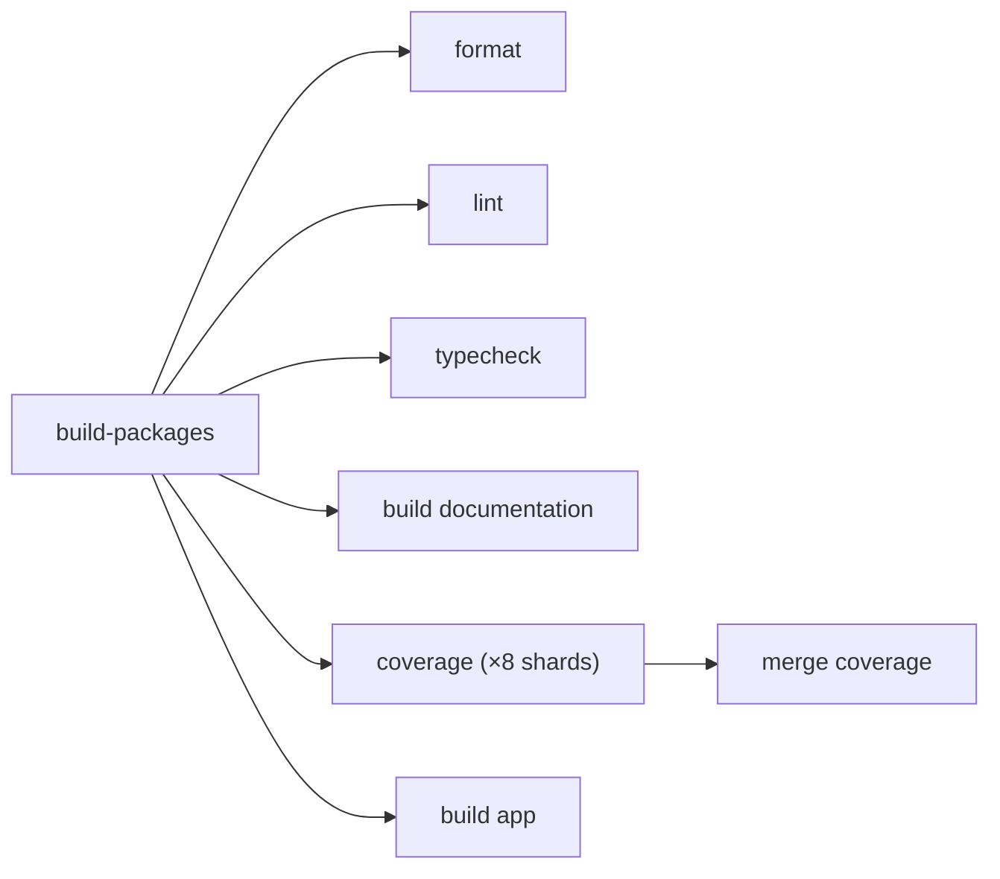

# Monorepo Tooling

How workspace package scripts, dependency installs, publishing, and CI runners are organized.

## Package management

Esposter uses **pnpm workspaces** as the package manager and workspace script runner. Workspace packages are declared in `pnpm-workspace.yaml`, and package versions are centralized in the root catalog.

Use the root `package.json` scripts as the canonical entry points for cross-package work. Package-local scripts should stay small and predictable (`build`, `lint`, `lint:fix`, `typecheck`, `test`, `export:gen`) so root recursive commands can compose them. Coverage is not a package-local script — it is owned entirely by the root `vitest` `projects` run.

The toolchain entry-point scripts run through the [`virrun`](https://github.com/Esposter/Esposter/tree/main/packages/virrun) sandbox via a `virrun -- <cmd>` prefix (the prefix _is_ the per-command switch). The committed `virrun.config.ts` branches on `process.platform`: **win32 → `os`** (the WSL sandbox with its warm snapshot + Linux-generated `.nuxt` prepare layer — the platform whose host artifacts misfire Linux type-aware tooling), **everything else → `native`** (Linux/CI already generates platform-correct artifacts in place, so the sandbox would only add overhead; a win32 host without bubblewrap/WSL-Linux-Node still auto-falls back to native). Routed today: the read-only `format:check`/`lint`/`lint:packages`/`typecheck*`/`test*`, the producing `build:app`/`build:docs`/`depcruise:graph` (write-back flushes their output to host), and the mutating dev-loop `format`/`lint:fix`/`lint:fix:packages` (each underlying `oxlint`/`eslint`/`oxfmt`/`pnpm -r` step wrapped; the prefix only wraps the root orchestrator, never the per-package scripts it fans out to, so there is no nested sandbox). Native by design: `build:packages` is the bootstrap that builds the `virrun` bin itself (a circular self-host) and `coverage` writes a report the os-backend tmpfs upper would discard; `db:gen` awaits an equivalence proof (its migration output lands outside the `db-schema` overlay mount). The mutating scripts are never run in CI (CI runs checks, not fixes). See [virrun CI](https://github.com/Esposter/Esposter/blob/main/packages/virrun/readme/ci.md).

## Recursive script orchestration

Use pnpm recursive commands instead of Lerna Lite for running scripts across packages.

Common patterns:

```bash
pnpm -r run build
pnpm -r --parallel --aggregate-output run lint
pnpm -r --parallel --aggregate-output run typecheck
pnpm -r --filter "!@esposter/app" run build
pnpm --filter @esposter/app run build
```

Guidelines:

- Tests are the exception: `test`/`coverage` run through one root `vitest.config.ts` `projects` config (a single `vitest run`), not a recursive fan-out, so the whole suite shares one run, one coverage report, and one `--shard` axis.
- Use `--parallel` for independent checks such as linting and typechecking.
- Use `--aggregate-output` in CI-style commands so package logs remain readable.
- Use filters instead of Lerna scopes/ignores.
- Keep `build:packages` separate from `build:app`; the app can depend on compiled package output.
- Use `--if-present` only for scripts that are optional across packages.
- Pass tool flags with `pnpm exec <binary> <args>` (e.g. `pnpm exec vitest run --shard=1/4`), or as direct args (`pnpm test -u`). Do **not** use the `pnpm <script> -- <args>` separator form — pnpm forwards the literal `--` into the script's arguments, so the underlying tool treats the trailing flags as post-`--` positionals and silently ignores them (this dropped `--shard`/`--reporter` in CI).

## Lerna Lite

Lerna Lite is retained for publishing only:

```bash
lerna publish --yes
```

Do not use Lerna Lite for recursive script execution or watch orchestration. If a root script is not publishing, prefer pnpm workspace commands. This means `@lerna-lite/cli` and `@lerna-lite/publish` remain in dev dependencies, while `@lerna-lite/run` and `@lerna-lite/watch` are unnecessary.

## Dependency installs

Use plain `pnpm i` from the repo root when package manifests change.

Do not set `CI=true` locally to bypass pnpm prompts, and do not use `pnpm install --config.confirmModulesPurge=false` or other store override workarounds. Those approaches can create a local `.pnpm-store/` in the repository.

When only dependency versions change, follow the dependency update process and refresh the lockfile with:

```bash
pnpm refresh:lockfile
```

To bump the node version, run `pnpm update:node [version]` — it edits `engines.node` + the `@types/node` catalog, installs the version and makes it the fnm default, and removes the old version in one call (then refresh the lockfile). Already-open shells keep the old version until reopened.

## CI job shape

A single `build-packages` job gates every package-consuming check. Two composite actions split the setup work: `setup-project-dependencies` installs node then pnpm (in that order — `pnpm/action-setup` picks a broken standalone bootstrap when the system node is too old) and re-runs `setup-node` with `cache: pnpm` to wire up the pnpm store cache, optionally installing bubblewrap behind its `bubblewrap-sandbox` input. `setup-packages` then runs a plain `pnpm i` (served by that store cache — its `postinstall: nuxt prepare` generates the Linux `.nuxt` in place) and downloads the compiled `package-builds` artifact. The platform-branched `virrun.config.ts` resolves `native` on the Linux runners, so every `virrun -- <cmd>` is a passthrough — no bubblewrap, no warm overlay layers, no warm-cache stage on the critical path. Only `coverage` installs bubblewrap (and pins `ubuntu-26.04` for bwrap >= 0.10.0): its shards test virrun's own os backend. → [virrun CI](https://github.com/Esposter/Esposter/blob/main/packages/virrun/readme/ci.md)



Tests run through a single root `vitest.config.ts` with a `projects: ["packages/*", <scripts>]` config — every package (the app as a Nuxt project via `defineVitestProject`, the rest by their own configs) plus the root `scripts/` suite is one project in one vitest run. So `coverage`/`test` are `vitest run` at the root, not a `pnpm -r` fan-out.

`coverage` runs as an 8-way matrix: `pnpm exec vitest run --coverage --reporter=blob --shard=i/8` splits _all_ test files across runners (each shard runs a distinct eighth and writes the collision-safe `.vitest-reports/blob-i-8.json`, which carries that shard's coverage data). A dependent `merge coverage` job downloads all eight blobs and runs `pnpm exec vitest run --merge-reports --coverage` to recombine them into one unified coverage report — this re-emits the report only, it does not re-run tests. CI invokes `vitest` via `pnpm exec` (not `pnpm coverage -- …`) because pnpm does not reliably forward post-`--` args to the script here, which silently dropped `--shard`/`--reporter`.

Sharding shortens the coverage work itself but not total CI time, which is gated by `lint`; it is kept for faster test-failure feedback and so every suite (previously `vue-phaserjs` and the `scripts/` tests were skipped by the coverage fan-out) is covered. There are no coverage thresholds, so a partial per-shard report cannot false-fail. Matrix shards are isolated runners with no shared filesystem, so each repeats checkout + install + `setup-packages`; the package _build_ is not repeated (it is downloaded as an artifact), so the per-shard cost is setup only.

The `build-packages` job builds the packages once and uploads `packages/*/dist` plus the generated `packages/*/src/**/index.ts` barrels as a single `package-builds` artifact (both share the `packages/` common ancestor, so consumers download into `packages`; neither path is a dotfile, so no `include-hidden-files`). The build itself is gated by an `actions/cache`: the key is the git tree hash of every workspace package except the app, plus the lockfile and catalog blobs — a tree hash covers only _tracked_ files, so generated/gitignored output (`dist`, barrels, `*.tsbuildinfo`, `node_modules`) is excluded by construction and there is no glob list to keep in sync; any tracked build-input change rebuilds, while app-only commits (the app is excluded from the key) hit. On a cache hit `pnpm build:packages` is skipped and the restored output is uploaded as-is; on a miss the job builds and seeds the cache. The downstream `setup-packages` composite installs dependencies and downloads the artifact — no build, no per-job cache.

The shared gate is preferred over per-job caching because the package _build_ then happens at most once per run (no redundant parallel rebuilds on a package-change commit), and on an app-only commit — the common case — the gate's own build is a cache hit, so the gate cost collapses to install + restore + upload. The trade is the serial gate wait before the consuming checks start.

The generated barrels must be cached alongside `dist` because `build:packages` runs `export:gen` and the barrel files are not committed — TypeDoc and the package lint/typecheck steps fail without them even when `dist` is present. Preserve all generated source index files, not just root `src/index.ts`, since some generators create nested barrels.

## CI security

Set `persist-credentials: false` on every `actions/checkout` step.

Declare job permissions explicitly and narrowly:

- Read-only jobs: `contents: read`, add `actions: read` when downloading artifacts.
- OIDC deployment jobs: `id-token: write`, `contents: read`.
- Release jobs: `contents: write`.
- PR-commenting previews: minimum scopes for OIDC, repo reads, and PR comments.

## Local verification

Run local formatting checks from the repo root with `pnpm format:check`; run local lint fixing from `packages/app` with `pnpm lint:fix`.

Vitest runs on Windows: the former `spawn EPERM` / UnoCSS config-load crash was fixed by giving `packages/app/configuration/modules.ts` a minimal Nuxt module allowlist under `process.env.VITEST` (no UnoCSS/PWA/security/SEO). If a new test needs an excluded module, add it to the Vitest branch there.

## GitHub Action versions

Pin actions to full commit SHAs with a trailing version comment:

```yaml
uses: actions/checkout@df4cb1c069e1874edd31b4311f1884172cec0e10 # v6.0.3
```

To resolve the SHA for a pin, look up the latest stable `vX.Y.Z` tag via:

```bash
git ls-remote --tags --sort='v:refname' https://github.com/<owner>/<repo>.git 'v*'
```

Ignore broad aliases (`v6`) and pre-release tags. For annotated tags `git ls-remote` prints both `refs/tags/<version>` and `refs/tags/<version>^{}` — pin the `^{}` (dereferenced) SHA.

Use normal zipped artifacts unless there is a measured need for direct artifact uploads. If artifact uploads use `archive: false`, use `actions/download-artifact` v8 or newer so direct/non-zipped artifacts are handled correctly.
