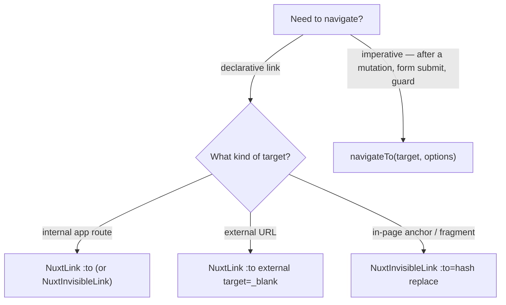

# Navigation

Every navigation in the app goes through Nuxt's client-side router. A raw `<a>` is never written — it bypasses the router (triggering a full-page reload), drops route prefetching, and loses the app's default link styling. The rule is enforced by lint (`vue/no-restricted-html-elements` bans the `a` element), so a stray anchor fails CI rather than shipping.

## Which construct to use

- **Internal route** — `<NuxtLink :to="RoutePath.Resource(id)">` (or `<NuxtInvisibleLink>` when the link should inherit surrounding styling). Real anchors, so keyboard and middle-/ctrl-click work. Vuetify components (`v-btn`, `v-card`, `v-list-item`, `v-tab`, `v-chip`) with a plain destination take `:to` directly — same real-anchor semantics; reserve an inline `@click="navigateTo(...)"` handler for actions that run logic before navigating or compute the target at click time. Route targets always come from `RoutePath` (`@esposter/shared`), never string-built.
- **External URL** — `<NuxtLink :to="url" external target="_blank">`; NuxtLink adds `rel="noopener noreferrer"` for `_blank`, so a manual `rel` is redundant.
- **In-page anchor** — `<NuxtInvisibleLink :to="{ hash: '#id' }" replace>`, and nothing else. The router already resolves a hash to its element and honours the heading's `scroll-margin-top`, which is what clears the sticky app bar; `router.options.scrollBehaviorType` in `configuration/router.ts` is the only thing it cannot infer, and it is set once. `replace` keeps a run of anchors from filling the back stack, which is the one thing a hand-rolled `history.replaceState` was buying. **Never `@click.prevent` an anchor to scroll it yourself** — a `replaceState` writes a hash the router does not know about, so `currentRoute` and the address bar disagree from then on and the next navigation inherits the stale hash, which the router reports as a selector matching no element.
- **Imperative** — `navigateTo(target, { replace: true })` for post-mutation redirects, form submits, and route-guard cases where there is no element to click. `router.push` is banned by lint (`no-restricted-syntax`) — use `navigateTo`. `router.replace({ query })` is a query-string update, not navigation, so it is exempt and allowed.

## NuxtInvisibleLink

`NuxtInvisibleLink` is a `defineNuxtLink({ componentName: "NuxtInvisibleLink" })` clone — a full `NuxtLink` (all its props: `to`, `external`, `target`, `replace`, hash locations) whose only addition is stripping the default link colour/underline (`a { color: inherit; text-decoration: none }`). Use it as the base link primitive wherever a link should inherit surrounding styling.

A link-styled affordance that has no destination (it only emits/handles an event) is not a link — render a ``, not an anchor.

## Where navigation state lives

Three places can hold state a navigation produces, and picking the wrong one is the recurring mistake. Decide by asking what the value _is_, never by what is easiest to reach:

| The value is…                                              | Lives in              | Why                                                                                                                     |
| ---------------------------------------------------------- | --------------------- | ----------------------------------------------------------------------------------------------------------------------- |
| Part of what the page is showing (a filter, a page, a tab) | the **url**           | It identifies the view, so it must survive a share, a bookmark and a refresh — two people opening it must see one thing |
| How the visitor got here (a trail, a drill-down)           | the **history entry** | It is true of this entry, not of the address; the browser keeps it across a reload and restores it on back/forward      |
| What the visitor prefers (a collapsed rail, a theme)       | **localStorage**      | It outlives the tab and belongs to the person, not to any one page                                                      |

The middle row is the one worth stating, because both neighbours look tempting. Putting "how I got here" in the url mints a second address for one page — worse for sharing, bookmarks and analytics, and editable by anyone who types. Putting it in storage makes it outlive the journey that produced it, so a tab restored a week later claims a path nobody walked. History-entry state (`history.replaceState`, read back from `window.history.state`) is the only one whose lifetime matches: per entry, restored on back and forward, gone when the entry is.

Write it in **one** place — a `router.afterEach` hook — never at each link. A value appended by hand at N call sites is one the N+1th link silently drops, and the page that lost it is indistinguishable from a page that never had it. [Breadcrumb trail](/docs/platform/breadcrumb-trail) is the worked example.

## Instant docs navigation

The docs page (`pages/docs/[...slug].vue`) must feel instant when moving between pages via the sidebar or the prev/next surround. It does **not** force a full component remount per route: `path` is a `computed` off the route and is passed as the reactive `useAsyncData` key (`watch: [path]`), so page content refetches in place instead of tearing down and rebuilding the page (and re-blocking on `await` during the transition). `useSeoMeta` takes getters so the title/description track the active page. The surround and sidebar are Vuetify components that navigate via their `:to` props — no bespoke navigation.

## Key files

| File                                                  | Role                                                                                        |
| ----------------------------------------------------- | ------------------------------------------------------------------------------------------- |
| `app/components/Nuxt/InvisibleLink.vue`               | `NuxtInvisibleLink` — base link primitive, a `NuxtLink` clone with default styling stripped |
| `packages/configuration/eslint/overrides/vueRules.js` | bans the raw `a` element and `router.push` in templates                                     |
| `packages/configuration/eslint/typescriptRules.js`    | bans `router.push` in `.ts` + `.vue` script (`no-restricted-syntax`)                        |
| `app/pages/docs/[...slug].vue`                        | reactive-key docs page — instant in-place navigation                                        |
| `app/components/Docs/TableOfContents/Item.vue`        | in-page hash anchor — a plain `NuxtInvisibleLink`, no handler                               |
| `configuration/router.ts`                             | `scrollBehaviorType: "smooth"` — the whole of our hash-scrolling code                       |
