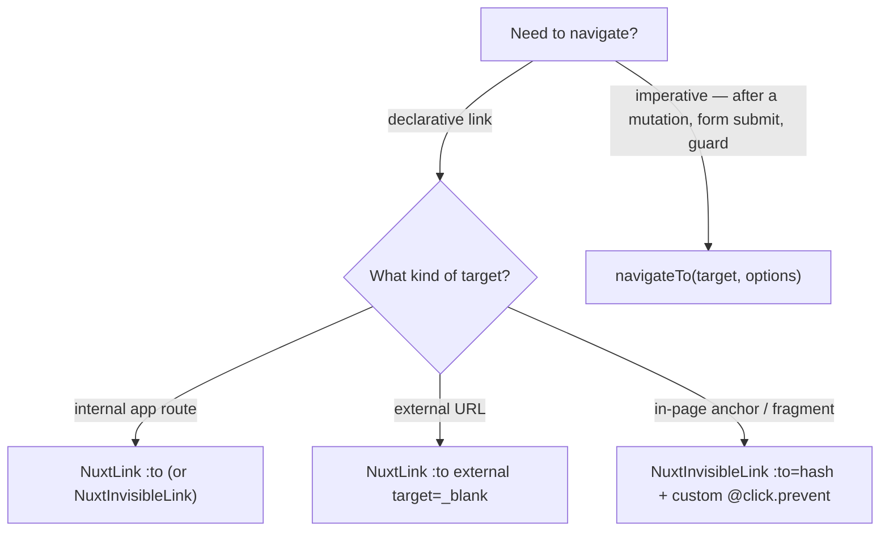

# Navigation

Every navigation in the app goes through Nuxt's client-side router. A raw `<a>` is never written — it bypasses the router (triggering a full-page reload), drops route prefetching, and loses the app's default link styling. The rule is enforced by lint (`vue/no-restricted-html-elements` bans the `a` element), so a stray anchor fails CI rather than shipping.

## Which construct to use

- **Internal route** — `<NuxtLink :to="RoutePath.Resource(id)">` (or `<NuxtInvisibleLink>` when the link should inherit surrounding styling). Real anchors, so keyboard and middle-/ctrl-click work. Vuetify components (`v-btn`, `v-card`, `v-list-item`, `v-tab`, `v-chip`) with a plain destination take `:to` directly — same real-anchor semantics; reserve an inline `@click="navigateTo(...)"` handler for actions that run logic before navigating or compute the target at click time. Route targets always come from `RoutePath` (`@esposter/shared`), never string-built.
- **External URL** — `<NuxtLink :to="url" external target="_blank">`; NuxtLink adds `rel="noopener noreferrer"` for `_blank`, so a manual `rel` is redundant.
- **In-page anchor** — `<NuxtInvisibleLink :to="{ hash: '#id' }" @click.prevent="…">`; the `.prevent` suppresses router navigation so a custom smooth-scroll + `history.replaceState` handler drives the behavior (see the docs table of contents).
- **Imperative** — `navigateTo(target, { replace: true })` for post-mutation redirects, form submits, and route-guard cases where there is no element to click. `router.push` is banned by lint (`no-restricted-syntax`) — use `navigateTo`. `router.replace({ query })` is a query-string update, not navigation, so it is exempt and allowed.

## NuxtInvisibleLink

`app/components/Nuxt/InvisibleLink.vue` is a `defineNuxtLink({ componentName: "NuxtInvisibleLink" })` clone — a full `NuxtLink` (all its props: `to`, `external`, `target`, `replace`, hash locations) whose only addition is stripping the default link colour/underline (`a { color: inherit; text-decoration: none }`). Use it as the base link primitive wherever a link should inherit surrounding styling.

A link-styled affordance that has no destination (it only emits/handles an event) is not a link — render a ``, not an anchor.

## Instant docs navigation

The docs page (`pages/docs/[...slug].vue`) must feel instant when moving between pages via the sidebar or the prev/next surround. It does **not** force a full component remount per route: `path` is a `computed` off the route and is passed as the reactive `useAsyncData` key (`watch: [path]`), so page content refetches in place instead of tearing down and rebuilding the page (and re-blocking on `await` during the transition). `useSeoMeta` takes getters so the title/description track the active page. The surround and sidebar are Vuetify components that navigate via inline `@click="navigateTo(...)"` — no bespoke navigation.

## Key files

| File                                                  | Role                                                                 |
| ----------------------------------------------------- | -------------------------------------------------------------------- |
| `app/components/Nuxt/InvisibleLink.vue`               | base link primitive — `NuxtLink` clone with default styling stripped |
| `packages/configuration/eslint/overrides/vueRules.js` | bans the raw `a` element and `router.push` in templates              |
| `packages/configuration/eslint/typescriptRules.js`    | bans `router.push` in `.ts` + `.vue` script (`no-restricted-syntax`) |
| `app/pages/docs/[...slug].vue`                        | reactive-key docs page — instant in-place navigation                 |
| `app/components/Docs/TableOfContentsItem.vue`         | in-page hash anchor via `NuxtInvisibleLink` + custom smooth scroll   |

## Notes

- `RoutePath` in `@esposter/shared` is the single source of truth for internal routes; feed it to `:to` and `navigateTo` alike.
- **Declarative over imperative.** `NuxtLink`/`NuxtInvisibleLink` or a component's `:to` for declarative links, `navigateTo` for imperative cases (logic before navigating, click-time targets, redirects). A plain destination on a Vuetify component belongs on `:to`, which keeps real anchor semantics.
