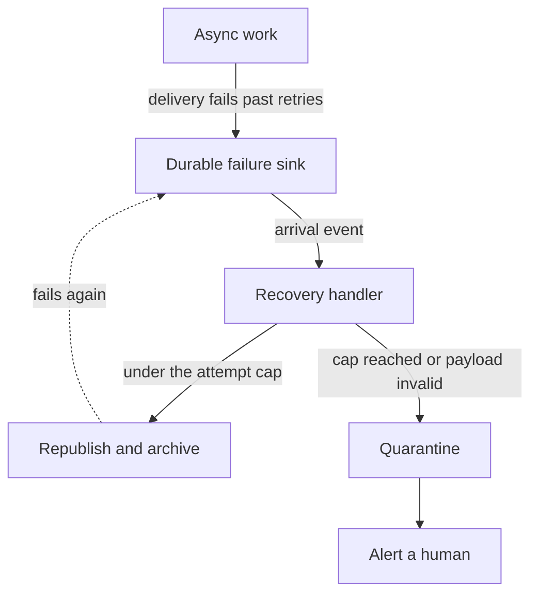

# No Manual Recovery

When async work fails past its retries, the recovery path must be **automatic and push-triggered**. A recovery step that only happens because a human noticed and ran something is not a recovery path — it is an outage with extra steps, and it decays the moment the person who knew about the script stops looking.

Every failure sink in this repository follows the same three-stage shape:

1. **Land the failure somewhere durable.** Exhausted deliveries are written down, never dropped — Event Grid dead-letters to a blob container, and the write itself is what starts recovery.
2. **React to the landing as an event.** Something arriving in the failure sink pushes to a handler. No cron sweeping a container, no operator command — that would be [polling](/docs/architecture/no-polling) wearing an ops hat.
3. **Cap the attempts, then quarantine.** Automatic retry without a ceiling is a poison-message loop: the event fails, lands, is replayed, fails again, forever. The handler carries an attempt counter with the payload and, once the cap is reached — or the payload fails validation, so it can never succeed — moves it to a quarantine the trigger filter excludes, and raises an alert. A human is paged for the poison case only, which is the one case that genuinely needs judgement.

The attempt counter travels with the payload — as metadata on the stored artifact, not in the handler's memory — so the count survives the round trip through the failure sink. A counter that resets each cycle is the same infinite loop with more code.

Manual operations scripts are still legitimate for work that is inherently a human decision — a one-off backfill, a search index rebuild — but never as the recovery path for a failure the system can see happening. Such a script also belongs in the package whose environment it uses, not hoisted into a shared package.

The reference implementation is [Event Grid dead-letter](/docs/infra/eventgrid-dead-letter).
