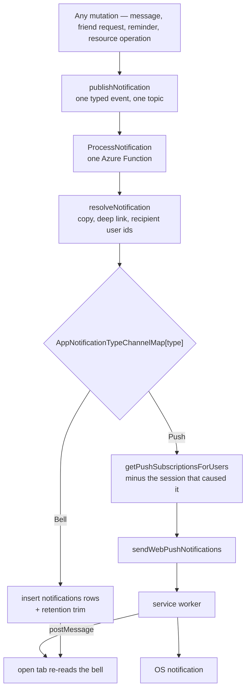

# Notifications

Everything that tells a person something happened is one thing here: a typed event, published through `publishNotification`, delivered by the `ProcessNotification` Function, and fanned out to the surfaces its type declares. A chat message, a thread reply, a friend request, a `/remind` reminder, a todo that came due and a resource operation all travel that one path — so "is this a notification?" has exactly one answer, and a new one cannot accidentally pick a different pipeline.

The publisher states **what happened and who it concerns**. Everything about how it renders and where it lands is resolved at delivery, off the request path the person is waiting on.

## The pipeline

Two properties fall out of the shape rather than out of discipline:

- **Recipient resolution happens once, at delivery.** A publisher never asks who will receive what it publishes, so it never pays for that query and can never disagree with the delivery about the answer.
- **A reply raises one event, not two.** A thread's followers widen the message's recipient set instead of being a second notification that the first has to be de-duplicated against. The `excludedUserIds` handshake the two-event shape needed is gone with it.

## The envelope

`NotificationEventGridData` is a discriminated union on `AppNotificationType`. Each member carries exactly what its own recipient resolution needs and nothing more — a message carries the message and, when it is a reply, its thread root; a friend request carries the two user ids. Nothing carries a rendered name or avatar: those are resolved at delivery from the ids, so the same nickname rule applies to every notification and no publisher restates it.

`ResourceOperation` is the one member that carries its own copy, and deliberately: the wording depends on what the caller did — one resource or fifty, a version number, the name a row had before it was deleted — and none of that survives to delivery time. Its wording is shared with the tab that also shows it immediately, through `ResourceOperationTitleMap`, so the two can never drift.

## Channels

`AppNotificationTypeChannelMap` declares which surfaces each type reaches. It is exhaustive over `AppNotificationType`, so a new type has to state its surfaces rather than inherit a default that silently drops it from the bell or wakes a device it had no business waking.

| Type                | Bell | Push | Why                                                             |
| ------------------- | ---- | ---- | --------------------------------------------------------------- |
| `Message`           | —    | ✓    | a room already carries its own unread count and mention badge   |
| `FriendRequest`     | ✓    | ✓    |                                                                 |
| `Reminder`          | ✓    | ✓    | [scheduled messages](/docs/esbabbler/scheduled-messages)        |
| `TodoReminder`      | ✓    | ✓    | [todolist due reminders](/docs/platform/todolist-due-reminders) |
| `ResourceOperation` | ✓    | ✓    | the operation happened on one device and is news on the others  |

Feedback about the tab's own action — a mutation error, a save conflict, an export that finished here — is **not** a member. Nothing on another device could act on it and nothing needs it after the reload, so it never leaves the tab and never becomes a row. That half of the bell is [notifications bell](/docs/platform/notifications).

## The bell row

A type whose channels include the bell writes one `notifications` row per recipient, in one statement. The row is the render shape the panel already uses, and its `severity` comes from `AppNotificationTypeSeverityMap` rather than from a field every publisher would restate identically.

Rows are trimmed to `NOTIFICATION_RETENTION_MS` on the write path, where the recipients are already known — nothing else trims them, and the only other delete is the cascade that takes a user's rows with the user, so an untrimmed bell is a table that only grows. The unread badge is a property of what the panel read, so no count rides on the push payload and no service worker writes one.

## Delivery

`sendWebPushNotifications` is the single caller of `web-push` and owns the retry logging and the `410 Gone` subscription cleanup. `getPushNotificationPayload` is the single envelope the service worker parses: the body is capped and the deep link is made absolute there, so neither is something a new notification can forget, and `severity`/`type` ride in `data` so a tab that receives one knows whether its bell is meant to show it.

A subscription is per-session, which is what lets a resource operation exclude the session that caused it: that tab showed the toast synchronously, and every other device of the same user is still owed the push.

Failure is Event Grid's once it has the event, not the publisher's. Every notification has a dead-letter destination and a replay ([dead-letter replay](/docs/infra/eventgrid-dead-letter)), the reminder among them — it publishes an event like every other notification rather than calling `web-push` inline, and an inline send has neither. That covers accepted events only: a publish that fails before Event Grid accepts it has no event to retry and no dead letter to alert on, so it reaches the publisher's `console.error` and nothing else. Publishes sit after the write they report and never fail it ([persist then notify](/docs/architecture/persist-then-notify)).

## Adding a notification type

Three edits, and the type system asks for all three:

1. A member on `AppNotificationType`, and its data shape in the `NotificationEventGridData` union.
2. An entry in `AppNotificationTypeChannelMap` and `AppNotificationTypeSeverityMap` — both exhaustive, so omitting one is a type error.
3. A `case` in `resolveNotification` returning the copy, the deep link and the recipient user ids.

There is no new Function, no new Event Grid subscription and no new delivery path. Adding the enum member also widens the `appNotificationType` Postgres enum, so the change carries a migration.

## Key files

| File                                                                          | Role                                                 |
| ----------------------------------------------------------------------------- | ---------------------------------------------------- |
| `packages/db-schema/src/services/azure/eventGrid/publishNotification.ts`      | the single publish path                              |
| `packages/db-schema/src/models/azure/eventGrid/NotificationEventGridData.ts`  | the one envelope, discriminated by type              |
| `packages/db-schema/src/models/notification/AppNotificationTypeChannelMap.ts` | which surfaces each type reaches                     |
| `packages/db-schema/src/schema/notifications.ts`                              | the persisted bell row                               |
| `packages/azure-functions/src/services/notification/resolveNotification.ts`   | copy, deep link and recipients per type              |
| `packages/azure-functions/src/services/notification/sendNotification.ts`      | the fan-out — bell rows, then devices                |
| `packages/db/src/services/notification/getMessageRecipientUserIds.ts`         | a message's recipients, thread followers included    |
| `packages/db/src/services/notification/getPushSubscriptionsForUsers.ts`       | the one device lookup, minus the originating session |
| `packages/app/app/plugins/pushNotification.client.ts`                         | the tab end of the service worker's postMessage      |
