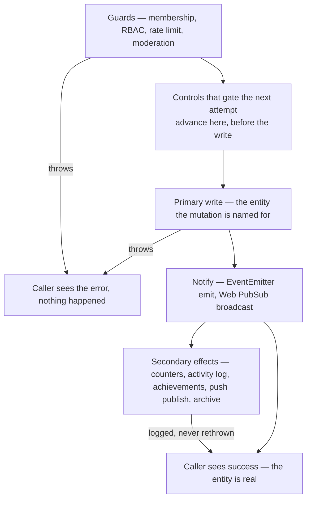

# Persist Then Notify

Every mutation in this repository runs the same three phases in the same order: **guard, persist, notify** — and then, only then, its bookkeeping. The ordering is the standard; the error handling falls out of it. Before the primary write a failure is fatal, because nothing has happened yet and the caller can safely be told no. After it a failure is best-effort, because the entity exists and no error the caller receives can make it stop existing.

The phase that gets skipped in practice is the third. A write that lands but whose event never fires is invisible: connected clients hold a list that no longer matches storage until something else forces a refetch, and everything hanging off that event — push notifications, badge counts, follower fan-out — never runs either. So the notify is not "one of the side effects". It is the delivery half of the write, and nothing fallible may sit between the two.

## How it works



**Guards are fatal.** Validation, membership, permissions, moderation — anything that decides whether the mutation is allowed. A throw here is the correct answer to the caller.

**Controls that gate the next attempt go before the write, not after it.** A slowmode clock, a quota counter, an attempt tally — anything whose stored value the _next_ call is checked against — is part of the guard, not part of the bookkeeping. Placed after the write it can only fail open: the write succeeds, the counter doesn't advance, and the limit it enforces silently stops applying. Placed before, the worst case is a failed write that cost one window, which is the direction a limit should fail. This also keeps the write-to-notify gap clean, since the control is no longer sitting in it.

**The primary write is fatal**, and it includes every write that _constitutes_ the entity — a message lands in both `Messages` and `MessagesAscending`, and neither is optional. What makes a write primary is whether the mutation's name is a lie without it.

**The notify follows immediately.** No `await` of anything fallible between the two. If a value the event needs must be fetched, fetch it before the write.

**Everything after the notify is best-effort**, wrapped and logged, never rethrown:

```typescript
// Best-effort after the Table write — a failed increment loses one badge count, never a message.
const mentionedUsersToRooms = await getResultAsync(() => incrementMentionCounts(db, newMessageEntity))
  .orTee(console.error)
  .unwrapOr([]);
```

The comment is part of the pattern: state what the failure actually costs, so the next reader can see the trade was made deliberately rather than by omission.

A tail step that nothing downstream reads may be fired rather than awaited — `getSynchronizedFunction(writeResourceActivity)(...)` returns immediately and still lets tests drain it deterministically ([no polling](/docs/architecture/no-polling)). Same rule, one less `await`.

Where the side effect is a write with its own event — a system message announcing that someone left a room — the write and its emit are wrapped **together** as one unit (`createSystemRoomMessage`), because relative to the mutation that triggered it the pair is a single best-effort effect.

## Why best-effort, specifically

Rethrowing after a successful write is wrong in two distinct ways, and the second one is why this is a standard rather than a preference.

A tRPC mutation that rethrows reports failure for work that landed. The client rolls back an optimistic update that storage disagrees with, the user retries, and the retry writes a second entity.

An Azure Functions handler that rethrows asks for a retry — EventGrid delivery is at-least-once, and a redelivered event reruns the handler from the top. Since a message carries a fresh time-based `rowKey`, the replay does not overwrite the first write, it creates a duplicate. A best-effort failure path is what keeps at-least-once delivery from meaning at-least-once _entities_ ([dead-letter replay](/docs/infra/eventgrid-dead-letter) covers what happens once the retries run out).

Both reduce to the same sentence: after the persist, the only honest thing a failure can do is get logged.

Idempotent post-write steps are the one place a rethrow is admissible — a step that can rerun without duplicating anything loses nothing by being retried. Handlers declare this explicitly rather than by inference (`IsIdempotentAzureFunctionMap`), and everything not on that list is best-effort.

## Where a failure surfaces

Server-side (tRPC routers, services, Nitro routes) the terminal handler is `console.error`, via `.orTee(console.error)`. Azure Functions log through their `InvocationContext` instead, so the message is attached to the invocation an operator can find. Neither ever swallows silently — a best-effort effect is one whose failure doesn't fail the caller, not one nobody hears about.

## Key files

| File                                                                 | Role                                                                    |
| -------------------------------------------------------------------- | ----------------------------------------------------------------------- |
| `packages/app/server/services/message/createUserMessage.ts`          | Canonical shape — guards, slowmode clock, write, emit, best-effort tail |
| `packages/app/server/trpc/routers/message/index.ts`                  | `forwardMessage` — the same shape per room, under `Promise.allSettled`  |
| `packages/app/server/services/message/createSystemRoomMessage.ts`    | A write and its emit wrapped together as one best-effort effect         |
| `packages/app/server/trpc/plugins/achievementPlugin.ts`              | Post-mutation work that always returns the original mutation's result   |
| `packages/app/server/services/resource/writeResourceActivity.ts`     | Best-effort activity write behind every resource mutation               |
| `packages/azure-functions/src/services/createAndBroadcastMessage.ts` | Handler-side write then best-effort broadcast                           |

## Notes

- Per-item fan-out (forwarding into several rooms, notifying several followers) runs each item through the full shape independently under `Promise.allSettled`, so one item's guard rejection never strands another item's already-persisted write.
- "Best-effort" is not a licence to skip the effect on the happy path. If losing it is genuinely unacceptable, it doesn't become fatal — it becomes durable: published as an event and retried by a handler ([no manual recovery](/docs/architecture/no-manual-recovery)).
