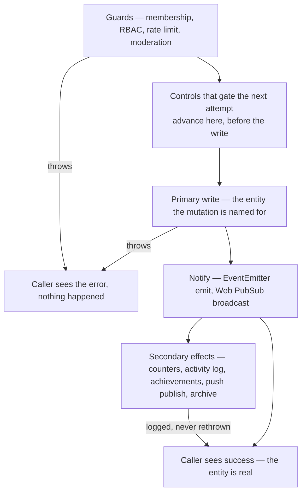

# Persist Then Notify

Every mutation in this repository runs the same three phases in the same order: **guard, persist, notify** — and then, only then, its bookkeeping. The ordering is the standard; the error handling falls out of it. Before the primary write a failure is fatal, because nothing has happened yet and the caller can safely be told no. After it a failure is best-effort, because the entity exists and no error the caller receives can make it stop existing.

The phase that gets skipped in practice is the third. A write that lands but whose event never fires is invisible: connected clients hold a list that no longer matches storage until something else forces a refetch, and everything hanging off that event — push notifications, badge counts, follower fan-out — never runs either. So the notify is not "one of the side effects". It is the delivery half of the write, and nothing fallible may sit between the two.

## How it works



**Guards are fatal.** Validation, membership, permissions, moderation — anything that decides whether the mutation is allowed. A throw here is the correct answer to the caller.

**Controls that gate the next attempt go before the write, not after it.** A slowmode clock, a quota counter, an attempt tally — anything whose stored value the _next_ call is checked against — is part of the guard, not part of the bookkeeping. Placed after the write it can only fail open: the write succeeds, the counter doesn't advance, and the limit it enforces silently stops applying. Placed before, the worst case is a failed write that cost one window, which is the direction a limit should fail. This also keeps the write-to-notify gap clean, since the control is no longer sitting in it.

**The primary write is fatal**, and it includes every write that _constitutes_ the entity — a message lands in both `Messages` and `MessagesAscending`, and neither is optional. What makes a write primary is whether the mutation's name is a lie without it.

**The notify follows immediately.** No `await` of anything fallible between the two. If a value the event needs must be fetched, fetch it before the write.

**Everything after the notify is best-effort**, wrapped and logged, never rethrown:

```ts
// Best-effort after the Table write — a failed increment loses one badge count, never a message.
const mentionedUsersToRooms = await getResultAsync(() => incrementMentionCounts(db, newMessageEntity))
  .orTee(console.error)
  .unwrapOr([]);
```

The comment is part of the pattern: state what the failure actually costs, so the next reader can see the trade was made deliberately rather than by omission.

**Best-effort does not mean unordered.** Where one tail step writes what a later one reads, the order between them is still load-bearing: the thread-follow rows a reply creates (`createReplyThreadFollows`) are what `ProcessNotification` resolves recipients from, so they are written before the `publishNotification` that triggers it. Each is independently best-effort — either may fail without costing the message — but a publish that overtakes the follows notifies a follower set one reply out of date.

**Independently best-effort means one wrapper each.** A single `getResultAsync` closure around several tail steps
reads as economical and silently makes every step after the first conditional on it: the ordering above is
preserved, but a failure in the first step returns from the whole closure, so the publish and the bookkeeping
behind it never run and the log names only the step that broke. The tail is a list of siblings, so it is written
as one wrapped call per step, each with its own log line saying what that step cost. The shape is only shared
where two effects are genuinely one unit — a write and the emit that announces it, below.

**A write that changed nothing has no tail.** The steps after the notify report a state change, so they are
gated on evidence that one happened — the row a delete actually removed, the row count an update actually
touched — and not on reaching the end of the handler. A mutation that legitimately matched nothing (a stale tab
re-issuing an operation someone already performed) is not an error and must not be reported as an event: an
activity entry for work nobody did, or a push telling the owner's other devices about a change that never
landed, is a lie the tail invented. Return early instead; the caller still gets its answer.

A tail step that nothing downstream reads may be fired rather than awaited — `getSynchronizedFunction(writeResourceActivity)(...)` returns immediately and still lets tests drain it deterministically ([no polling](/docs/architecture/no-polling)). Same rule, one less `await`.

Where the side effect is a write with its own event — a system message announcing that someone left a room — the write and its emit are wrapped **together** as one unit (`createSystemRoomMessage`), because relative to the mutation that triggered it the pair is a single best-effort effect.

## Why best-effort, specifically

Rethrowing after a successful write is wrong in two distinct ways, and the second one is why this is a standard rather than a preference.

A tRPC mutation that rethrows reports failure for work that landed. The client rolls back an optimistic update that storage disagrees with, the user retries, and the retry writes a second entity.

An Azure Functions handler that rethrows asks for a retry — EventGrid delivery is at-least-once, and a redelivered event reruns the handler from the top. Since a message carries a fresh time-based `rowKey`, the replay does not overwrite the first write, it creates a duplicate. A best-effort failure path is what keeps at-least-once delivery from meaning at-least-once _entities_ ([dead-letter replay](/docs/infra/eventgrid-dead-letter) covers what happens once the retries run out).

Both reduce to the same sentence: after the persist, the only honest thing a failure can do is get logged.

Idempotent post-write steps are the one place a rethrow is admissible — a step that can rerun without duplicating anything loses nothing by being retried. Handlers declare this explicitly rather than by inference (`AzureFunctionIsIdempotentMap`), and everything not on that list is best-effort.

## Enforcement

The tail half is lint-enforced, not left to review. A custom oxlint JS plugin (`scripts/oxlint/persistThenNotify.ts`, scoped to `packages/app/server` in `.oxlintrc.json`) errors on any `await` that follows a `*EventEmitter.emit(...)` in the same function unless it never rejects — a `getResult`/`getResultAsync` chain, an internally-best-effort helper like `createSystemRoomMessage`, `publishBlobDeletion` or `publishBlobPrefixDeletion`, or a `Promise` combinator over a fan-out of those. `withFinalizer`/`withFinalizerAsync` are deliberately **not** accepted: both unwrap the original result and rethrow on `Err`, so awaiting one after an emit rejects the caller for an entity that already exists and was already broadcast. The allowlist is by name, so a new helper that wraps its own effect best-effort has to be added to it — otherwise the first call site that awaits it after a notify gets a false positive. It runs in oxlint's single root pass because the check is purely syntactic. What it deliberately can't see is the rarer _gap_ — a fatal `await` sitting **before** the emit — since there's no syntactic marker for "the primary write"; that half stays a review concern, kept small by firing the emit the instant the entity exists.

## Where a failure surfaces

Server-side (tRPC routers, services, Nitro routes) the terminal handler is `console.error`, via `.orTee(console.error)`. Azure Functions log through their `InvocationContext` instead, so the message is attached to the invocation an operator can find. Neither ever swallows silently — a best-effort effect is one whose failure doesn't fail the caller, not one nobody hears about.

## Key files

| File                                                                  | Role                                                                          |
| --------------------------------------------------------------------- | ----------------------------------------------------------------------------- |
| `packages/app/server/services/message/createUserMessage.ts`           | Canonical shape — guards, slowmode clock, write, emit, best-effort tail       |
| `packages/app/server/trpc/routers/message/index.ts`                   | `forwardMessage` — the same shape per room, under `Promise.allSettled`        |
| `packages/app/server/services/message/createSystemRoomMessage.ts`     | A write and its emit wrapped together as one best-effort effect               |
| `packages/app/server/trpc/plugins/achievementPlugin.ts`               | Post-mutation work that always returns the original mutation's result         |
| `packages/app/server/services/resource/writeResourceActivity.ts`      | Best-effort activity write behind every resource mutation                     |
| `packages/app/server/services/azure/eventGrid/publishBlobDeletion.ts` | The one chunked best-effort blob-cleanup publish every delete funnels through |
| `packages/azure-functions/src/services/createAndBroadcastMessage.ts`  | Handler-side write then best-effort broadcast                                 |

## Notes

- **An emitter lives with the feature that emits it**, at `server/services/<feature>/events/`: `friendEventEmitter` beside the friend router, `achievementEventEmitter` beside the achievement services. A shared emitter folder looks tidier and costs more — an event filed under a feature that never touches it gives every reader an import path claiming a coupling that does not exist, and the folder grows into the place emitters go rather than the place one belongs. `server/services/message/events/` therefore holds only what messaging itself emits or consumes, which includes `roomEventEmitter` and `userToRoomEventEmitter` because `createUserMessage` emits both.
- Per-item fan-out (forwarding into several rooms, notifying several followers) runs each item through the full shape independently under `Promise.allSettled`, so one item's guard rejection never strands another item's already-persisted write. **This is deliberately not all-or-nothing**, and an all-items pre-flight is not the fix: a fan-out has no cross-item transaction to roll back into, so a pre-flight only moves the partial-failure window rather than closing it, and it makes a rule that fires per item (a word filter that times the sender out in one room) either fire twice or not fire at all. The accepted cost is the one every at-least-once path carries — the first rejection surfaces to the caller, and a user who retries the whole forward duplicates it into the rooms that already accepted it.
- **A best-effort effect a rollback compensates is awaited.** Best-effort settles who a failure surfaces to, not who waits for completion. Where a compensating cleanup deletes the artifact the tail writes, a fire-and-forget write lands after the cleanup and re-creates it — as an orphan, since the row that gated reading it is gone. `createResourceRow` awaits its `Created`/`Duplicated` activity entry for exactly this reason: every path that rolls a create back does so through `deleteCreatedResources`, which drops that trail partition ([activity log](/docs/platform/activity-log)). The write still terminates its own `Result`, so awaiting it costs a round trip and cannot fail the mutation. The exception is per-call-site: the same helper stays fire-and-forget everywhere no cleanup compensates it.
- "Best-effort" is not a licence to skip the effect on the happy path. If losing it is genuinely unacceptable, it doesn't become fatal — it becomes durable: published as an event and retried by a handler ([no manual recovery](/docs/architecture/no-manual-recovery)).
- The post-persist tail in `createUserMessage` is awaited **in sequence**, not fanned out under a combinator, even though only the push-title chain and the excluded-users chain are genuinely ordered. Sequential is the shape the lint rule above is written against and the one a reader can follow; the tail is a handful of round trips on a path already dominated by the Table write, and a `Promise.all` over the independent members buys latency at the cost of a rule that no longer reads syntactically. Revisit only with a measurement, not on inspection.
- **The client mirror of this split is `MessageHookMap.ResetSend` versus `CommitSend`.** The composer resets behind the optimistic bubble because the bubble is the sender's copy of the text — but it is no copy of an _attachment_, and the composer holds the only upload grants that can ever reclaim those blobs. So the editor and reply target clear on `ResetSend` (at the bubble) while the attachments clear on `CommitSend` (once the server has accepted). A rejected send therefore leaves the files in place to retry, instead of stranding blobs nothing can name. The cost is the lost-response case — a message that did land keeps a composer copy whose delete affordance would reclaim blobs it is still using — which is the better half of the trade against a certain leak plus lost work on every deterministic rejection (slowmode, the word filter).

## When best-effort is not enough: the escalation

Deleting a message attachment is the worked example. The delete sits after the primary write, so it cannot be fatal — but `console.error` on a failed delete is not enough either, because read urls are signed for a day ([resource file assets](/docs/platform/resource-file-assets)): a dropped delete leaves a file the user believes is gone downloadable to anyone already holding its url, for as long as that signature lives.

So the effect escalates rather than changing severity. Every delete funnels through one helper, `publishBlobDeletion` (`packages/app/server/services/azure/eventGrid/`), which publishes `ProcessBlobDeletion` best-effort — chunked, and accepting a thunk so a fallible blob listing runs inside the same best-effort unit — and `processBlobDeletionHandler` performs the delete, retried by Event Grid and then by [dead-letter replay](/docs/infra/eventgrid-dead-letter). The handler deletes with `deleteIfExists`, which is what earns its `true` in `AzureFunctionIsIdempotentMap` — a replayed batch converges on the same empty state instead of failing on the blobs the first attempt already removed.

**The publish itself stays best-effort and post-persist.** That is the honest boundary: what changed is not that failure became impossible, but that a publish which _lands_ carries the delete to completion instead of dropping it after one attempt. A publish that never lands has no event to retry and no dead letter to alert on — it reaches `console.error` and nothing else, so it is invisible to the [scheduled query rules](/docs/infra/observability), which watch the delivery pipeline rather than the doorway into it. Accepted: the alternative is making a blob delete fatal to the mutation that already committed, which is the failure mode this whole standard exists to remove.

Reach for this when the answer to "what does losing this cost?" is something a user would consider a broken promise — data that outlives a delete, a payment not captured, an invitation never sent. A lost badge count is not that; a file that stays downloadable after deletion is.
