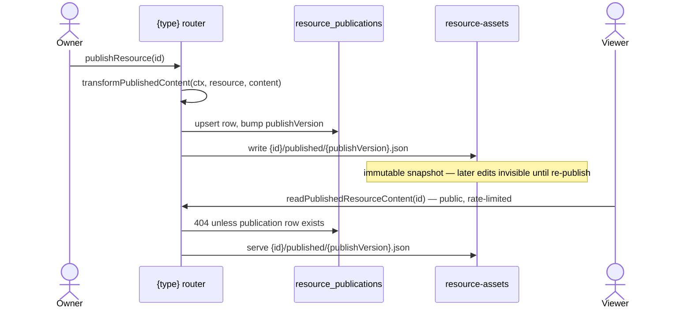

# Publishing

The **Publishable capability** ([/docs/architecture/resources](/docs/architecture/resources)): the standard for making a resource publicly shareable — a versioned publish copy plus a public, rate-limited, read-only route. Whenever a product needs "share this with people who aren't logged in", it opts into this capability — never ad-hoc public reads of working data.

Adopters: Dashboard, Email, Flowchart, Note, Survey, Webpage. A type opts in by declaring `publishable: true` in `ResourceDefinitionMap`; the derived `PublishableResourceType` union then _requires_ it to provide a view component and _grants_ it the publish procedures — a non-publishable type has no publish endpoints at the type level.

## How it works

Publish state lives in its own `resource_publications` table ([/docs/architecture/resources](/docs/architecture/resources)) — a row exists iff the resource is currently published. This keeps publish attributes off resources that can't publish.

- **Publish = snapshot copy.** `publishResource` upserts the `resource_publications` row (bumping `publishVersion` in SQL), then copies the content blob to `{id}/published/{publishVersion}.json`. Edits after publish are invisible until re-publish — that is the feature (a stable public artifact), not a limitation.
- **Public reads serve only the publish copy**, never the working copy, and are rate-limited with no auth. A resource with no publication row 404s publicly.
- **Unpublish** deletes the publication row and the publish blobs; the public URL 404s.

## Procedures

| Procedure                      | Auth                 | Purpose                                                    |
| ------------------------------ | -------------------- | ---------------------------------------------------------- |
| `publishResource`              | owner                | upsert publication + snapshot copy → `ResourcePublication` |
| `unpublishResource`            | owner                | delete publication row + publish blobs                     |
| `readResourcePublication`      | owner                | current publish state (for editor UI), or undefined        |
| `readPublishedResourceContent` | public, rate-limited | serve the publish copy                                     |
| `readPublishedVersionContent`  | owner                | serve a **retained** snapshot by version number            |
| `readResourceViewCount`        | owner                | total public views of the resource                         |

`readPublishedVersionContent` is what the view route's `version` query param reads: an anonymous visitor always gets the latest publish from the public procedure, while the owner can open any snapshot the `{id}/published/` prefix still holds ([publish history](/docs/platform/publish-history)).

Two hooks on `createResourceProcedures` support publishing needs:

- `transformPublishedContent(ctx, resource, content)` — rewrite content at publish time with the **owner's** authority. It runs **before** the transaction that claims `publishVersion`, and must stay there: a hook may read through `ctx.db` (Dashboard resolves every bound dataset), and issuing that read while the connection holds an open transaction deadlocks. **So nothing the hook writes may be keyed by the version** — it would have to predict it, two concurrent publishes predict the same one, and they race a copy destination Azure rejects, unwinding a publish that did nothing wrong. Asset clones therefore go into a per-attempt directory (`createPublishedAssetsDirectoryName`), which nothing reads a version back out of; the snapshot's own content is what points at them. Dashboard resolves every bound visual and bakes the result into `VisualDatasetBinding.snapshot` (public viewers render the static snapshot, never resolve references — live viewer data stays [deferred](/docs/platform/deferred/realtime-dataset-refresh)). Survey and Webpage use the generic `transformPublishedBlobUrls`, which clones referenced asset blobs into the publish directory and rewrites their stable urls to the clones ([resource file assets](/docs/platform/resource-file-assets)); Email composes it with a guard that rejects publishing without compiled MJML html and strips the owner-only `datasetReference` so the snapshot can never leak it.

  Running before the transaction is also what lets an `unpublishResource` land between the clone and the claim: its prefix sweep is bounded at the instant it was decided, so it takes the clones this attempt just wrote, while the snapshot content — written **inside** the transaction, past that bound — survives, and the upsert re-creates the publication row. The resource would report itself published with every image 404ing, and no operation the owner would think to run rebuilds it. **`publishVersion` is what detects this, and it is exact**: the sweep only ever follows a row delete, and the delete restarts the sequence at 1, so a claim that is not the successor of the version the attempt read before cloning proves one landed. An attempt that read no row expects to claim 1, exactly as one that read version 3 expects 4 — the check is on the successor, never on there being a previous row, or every first publish would be exempt from it. `publishResource` re-runs the transform and re-uploads the snapshot when it sees that, writing the clones past the sweep's bound. A concurrent _publish_ also breaks the succession and pays one redundant clone; nothing swept can slip through, because any successor the attempt could expect is at least 2.

  That repair runs **after** the transaction has committed, and cannot move inside it for the same deadlock reason the transform itself cannot. The transaction's guarantee is unaffected — the version it claimed does point at a blob that was written — so what a failed repair leaves behind is not a dangling version but that blob still naming the swept assets: a live publication whose images 404. The rejection is therefore **reported to the owner rather than swallowed**, and says exactly that, because republishing re-clones and overwrites — the owner's own retry is the repair, and a silent success would leave the page broken with nothing to signal it.

  The succession is only a complete signal because **`unpublishResource` sweeps only when its delete actually removed a row**. A delete that removes none leaves the sequence untouched, so an unpublish fired from a stale tab against an unpublished resource would sweep a bound stamped after a concurrent first publish's clones, and nothing downstream could tell. Nothing was published, so there is nothing of its own for it to sweep.

  Running before the transaction also means the hook's writes are not rolled back with it: **a publish that fails after the clone leaves that attempt's asset directory orphaned**, and because the directory is per-attempt a retry never overwrites it — a user retrying a failing publish pays for one copy of their assets per attempt. Accepted: unpublish and delete both wipe the whole `{id}/published` prefix, so nothing leaks past the resource's own lifetime, and the alternative is either a version-keyed directory (which two concurrent publishes race) or a compensating delete on a path that already failed.

- `transformPublicReadContent(ctx, resource, content)` — rewrite on the anonymous public read. Only Survey uses it, merging live collection settings over the immutable snapshot. Asset urls need no read-time rewriting — content embeds stable app urls that never expire, served through `/api/resource-assets`.

## Route

One dynamic public page, `pages/view/[type]/[id].vue`, dispatches through `ViewComponentMap: Record<PublishableResourceType, Component>` — a missing renderer is a compile error. The survey respondent experience is simply Survey's published view (an interactive renderer that writes responses); Email and Webpage serve their save-time captured HTML through a sandboxed iframe, and Flowchart a read-only VueFlow render. View pages set OG meta tags (`ogTitle`, `ogUrl`) so a published URL unfurls when shared. A published URL is the share unit everywhere: paste it in an esbabbler message, a post, or externally.

## Key files

| File                                                                      | Role                                            |
| ------------------------------------------------------------------------- | ----------------------------------------------- |
| `packages/db-schema/src/schema/resourcePublications.ts`                   | publish state table                             |
| `packages/app/server/trpc/procedure/resource/createResourceProcedures.ts` | publish procedures + transform hooks            |
| `packages/app/app/pages/view/[type]/[id].vue`                             | public view route                               |
| `packages/app/app/services/resource/ViewComponentMap.ts`                  | `PublishableResourceType` → view page component |
