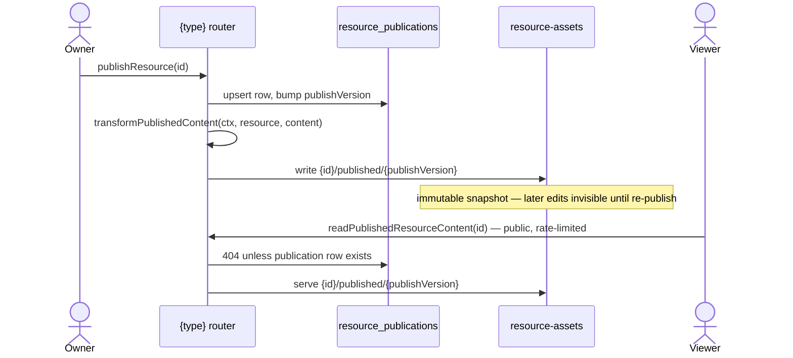

# Publishing

The **Publishable capability** ([/docs/architecture/resources](/docs/architecture/resources)): the standard for making a resource publicly shareable — a versioned publish copy plus a public, rate-limited, read-only route. Whenever a product needs "share this with people who aren't logged in", it opts into this capability — never ad-hoc public reads of working data.

Adopters: Dashboard, Email, Flowchart, Note, Survey, Webpage. A type opts in by declaring `publishable: true` in `ResourceDefinitionMap`; the derived `PublishableResourceType` union then _requires_ it to provide a view component and _grants_ it the publish procedures — a non-publishable type has no publish endpoints at the type level.

## How it works

Publish state lives in its own `resource_publications` table ([/docs/architecture/resources](/docs/architecture/resources)) — a row exists iff the resource is currently published. This keeps publish attributes off resources that can't publish.

- **Publish = snapshot copy.** `publishResource` upserts the `resource_publications` row (bumping `publishVersion` in SQL), then copies the content blob to `{id}/published/{publishVersion}`. Edits after publish are invisible until re-publish — that is the feature (a stable public artifact), not a limitation.
- **Public reads serve only the publish copy**, never the working copy, and are rate-limited with no auth. A resource with no publication row 404s publicly.
- **Unpublish** deletes the publication row and the publish blobs; the public URL 404s.

## Procedures

| Procedure                      | Auth                 | Purpose                                                    |
| ------------------------------ | -------------------- | ---------------------------------------------------------- |
| `publishResource`              | owner                | upsert publication + snapshot copy → `ResourcePublication` |
| `unpublishResource`            | owner                | delete publication row + publish blobs                     |
| `readResourcePublication`      | owner                | current publish state (for editor UI), or undefined        |
| `readPublishedResourceContent` | public, rate-limited | serve the publish copy                                     |

Three hooks on `createResourceProcedures` support publishing needs:

- `transformPublishedContent(ctx, resource, content)` — rewrite content at publish time with the **owner's** authority. Dashboard resolves every bound visual and bakes the result into `VisualDatasetBinding.snapshot` (public viewers render the static snapshot, never resolve references — live viewer data stays [deferred](/docs/platform/deferred/realtime-dataset-refresh)). Survey and Webpage use the generic `transformPublishedBlobUrls`, which clones referenced asset blobs into the publish directory and rewrites their URLs ([resource file assets](/docs/platform/resource-file-assets)); Email composes it with a guard that rejects publishing without compiled MJML html and strips the owner-only `datasetReference` so the snapshot can never leak it.
- `transformPublicReadContent(ctx, resource, content)` — rewrite on the anonymous public read. Every FileAssets adopter re-signs baked asset SAS urls through the generic `transformReadBlobUrls` so a published page never breaks past a SAS expiry; Survey additionally merges live collection settings over the immutable snapshot.
- `transformReadContent(ctx, resource, content)` — rewrite on owner read (the same `transformReadBlobUrls` re-sign against the working-copy blobs).

## Route

One dynamic public page, `pages/view/[type]/[id].vue`, dispatches through `ViewComponentMap: Record<PublishableResourceType, Component>` — a missing renderer is a compile error. The survey respondent experience is simply Survey's published view (an interactive renderer that writes responses); Email and Webpage serve their save-time captured HTML through a sandboxed iframe, and Flowchart a read-only VueFlow render. View pages set OG meta tags (`ogTitle`, `ogUrl`) so a published URL unfurls when shared. A published URL is the share unit everywhere: paste it in an esbabbler message, a post, or externally.

## Key files

| File                                                                      | Role                                            |
| ------------------------------------------------------------------------- | ----------------------------------------------- |
| `packages/db-schema/src/schema/resourcePublications.ts`                   | publish state table                             |
| `packages/app/server/trpc/procedure/resource/createResourceProcedures.ts` | publish procedures + transform hooks            |
| `packages/app/app/pages/view/[type]/[id].vue`                             | public view route                               |
| `packages/app/app/services/resource/ViewComponentMap.ts`                  | `PublishableResourceType` → view page component |
