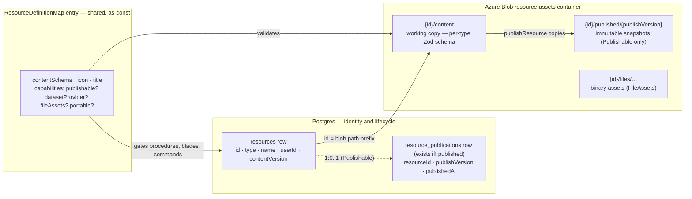
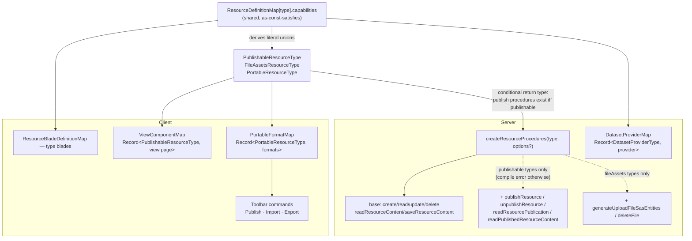

# Resources

The standard for product persistence and product surface. **Everything is a resource**: a file, a survey, a todo list, a dashboard, an email, a webpage, a flowchart. One Postgres table, one blob container, one procedure factory, one explorer UI. Cross-cutting behaviors (publishing, dataset serving, asset hosting, import/export) are opt-in **capabilities**, never baked into the core.

## Anatomy

A resource is three things: an identity row (Postgres), a content blob (Azure Blob), and a definition (shared code).



**Settings vs data is a UX separation, not a storage separation.** A resource's parse settings and its actual data are distinct sections of one content blob, edited in distinct blades, saved through one procedure with one `contentVersion`. Never split one artifact across two write paths.

## Data model

Drizzle table `resources` (`packages/db-schema/src/schema/resources.ts`) — pure identity + content lifecycle:

| Column           | Type                   | Notes                                                                                   |
| ---------------- | ---------------------- | --------------------------------------------------------------------------------------- |
| `id`             | uuid PK                | becomes the blob path prefix                                                            |
| `type`           | `ResourceType` pg enum | Blueprint, Dashboard, Email, Flowchart, Note, Program, Sheet, Survey, TodoList, Webpage |
| `name`           | text + length check    | `createNameSchema` pattern                                                              |
| `userId`         | FK → users, cascade    | owner; resources are single-owner                                                       |
| `contentVersion` | integer                | optimistic concurrency on content saves                                                 |

Publish state is **normalized into its own table**, `resource_publications` — a row exists iff the resource is currently published. Publishing is a capability, not a base attribute, so publish columns do not belong on every resource row:

| Column           | Type                             | Notes                                      |
| ---------------- | -------------------------------- | ------------------------------------------ |
| `resourceId`     | uuid PK, FK → resources, cascade | one publication per resource               |
| `publishVersion` | integer, default 1               | keys the immutable published blob snapshot |
| `publishedAt`    | timestamp, default now           | when the current publish happened          |

Content blobs live in one container, `AzureContainer.ResourceAssets`, keyed by id only (type lives in the row; ids are UUIDs — a type prefix would duplicate authoritative data into path strings):

```text
{id}/content                      working copy (JSON, validated by the type's content schema)
{id}/published/{publishVersion}   publish snapshots (Publishable only)
{id}/files/…                      binary assets (FileAssets types only)
```

Ownership is enforced through the Postgres row, never inferred from the blob path. Deleting a resource is soft — identically for every type: it stamps `deletedAt` and drops the publication row, leaving the `{id}/` blob directory intact so a restore can hand the content back. Purging is what deletes the directory and then the row ([recycle bin](/docs/platform/recycle-bin)).

Each type owns one content schema (Zod, interface-first, one export per file) in `packages/app/shared/models/`. A content schema always produces an **object** (never a bare string/array) so future fields extend without a blob-shape break.

## Capabilities

A capability is a cross-cutting mechanism a resource type opts into via its definition. **Admission rule: a capability exists only when ≥2 resource types need the same mechanism, or when the type system must guarantee its absence** (a TodoList must not have publish endpoints). Anything used by exactly one type is type-specific code — promoting a single-consumer mechanism is over-engineering.

| Capability          | Contract                                                                                                                                               | Adopters                                                                |
| ------------------- | ------------------------------------------------------------------------------------------------------------------------------------------------------ | ----------------------------------------------------------------------- |
| **Publishable**     | versioned snapshot + publish procedures + `/view/[type]/[id]` route + Publish command → [/docs/architecture/publishing](/docs/architecture/publishing) | Dashboard, Email, Flowchart, Note, Survey, Webpage                      |
| **DatasetProvider** | registers a provider so `dataset.readDataset` resolves the type → [/docs/architecture/datasets](/docs/architecture/datasets)                           | Program (participant status), Sheet, Survey (responses)                 |
| **FileAssets**      | owner-only upload/download/delete of binary assets under `{id}/files/…` → [/docs/platform/resource-file-assets](/docs/platform/resource-file-assets)   | Email, Survey, Webpage                                                  |
| **Portable**        | import/export via declared formats (self-contained `export()` / `import()`) + Import/Export commands                                                   | Sheet (csv/json/xlsx, both ways), Email (personalized html export only) |

Explicitly **not** capabilities: collecting public responses (Survey-only — stays survey-specific code) and dataset _consumption_ (just calling `dataset.readDataset` from a component; no per-type wiring to declare).

### Declaration — `ResourceDefinitionMap`

One shared as-const-satisfies map (`packages/app/shared/services/resource/ResourceDefinitionMap.ts`) is the single source of truth for what a type is: its `contentSchema`, `icon`, `title`, and `capabilities` (`{ datasetProvider?: true; fileAssets?: true; portable?: true; publishable?: true }`), keyed by `ResourceType`.

A generic mapped type derives the subset of types declaring each capability:

```ts
// packages/app/shared/models/resource/CapabilityResourceType.ts
export type CapabilityResourceType<TCapability extends keyof ResourceCapabilities> = {
  [T in ResourceType]: (typeof ResourceDefinitionMap)[T]["capabilities"] extends Record<TCapability, true> ? T : never;
}[ResourceType];
```

`PublishableResourceType`, `FileAssetsResourceType`, and `PortableResourceType` are its aliases, and `hasCapability(type, capability)` is the matching runtime type guard. Capability implementation maps are keyed by the derived unions — `ViewComponentMap: Record<PublishableResourceType, Component>`, `PortableFormatMap: Record<PortableResourceType, …>` — so a missing view page or format entry is a compile error, and adding one for a non-capable type is also a compile error.

### Wiring



Component wiring cannot live in shared code, so exactly three thin client satellite maps exist: `ResourceBladeDefinitionMap` (type-specific blades), `PortableFormatMap` (import/export formats), and `ViewComponentMap` (public view renderers). Server-side hooks (publish transform, read transform) are passed at router construction because they import server code.

## Procedures

One factory, `createResourceProcedures(type, options?)` (`server/trpc/procedure/resource/createResourceProcedures.ts`), spread into each type's router. Content schema and container come from `ResourceDefinitionMap[type]` — callers never pass them. Publish procedures are spread **conditionally with a conditional return type** (guarded by `hasCapability(type, "publishable")` at runtime), so a non-publishable type's router has no publish endpoints at the type level — a compile error on the client `$trpc` type, a 404 on the wire. The options argument itself is a conditional tuple: publish hooks are only accepted when `TType extends PublishableResourceType`.

| Procedure                                                                                            | Auth                                                               | Purpose                                                        |
| ---------------------------------------------------------------------------------------------------- | ------------------------------------------------------------------ | -------------------------------------------------------------- |
| `createResource`                                                                                     | authed                                                             | metadata row; content blob written on first save               |
| `readResources`                                                                                      | authed                                                             | per-type offset-paginated list, publication state joined along |
| `updateResource`                                                                                     | owner                                                              | rename                                                         |
| `deleteResource`                                                                                     | owner                                                              | soft delete — stamps `deletedAt`, blobs survive until purge    |
| `readResourceContent` / `saveResourceContent`                                                        | owner                                                              | blob read/write with `contentVersion` check                    |
| `onSaveResourceContent`                                                                              | owner                                                              | subscription — streams each save's content to other devices    |
| `publishResource` / `unpublishResource` / `readResourcePublication` / `readPublishedResourceContent` | see [/docs/architecture/publishing](/docs/architecture/publishing) | Publishable types only                                         |

`saveResourceContent` bumps `contentVersion` and writes the blob in one transaction — the version check is part of the `UPDATE`'s `WHERE`, so concurrent saves cannot both pass and silently lose a write, and a failed blob upload rolls the version back.

Every content write funnels through the `saveResourceContent` service (`server/services/resource/`), not just the procedure of the same name: the editor's save, [blueprint](/docs/platform/blueprint-resource) deploy, [duplicate](/docs/platform/resource-page-parity) and [restore](/docs/platform/publish-history) all write their content through it. It parses the caller's content against `ResourceDefinitionMap[type].contentSchema` and then performs the blob write, the `resourceEventEmitter` emit, the [activity](/docs/platform/activity-log) entry and the type's after-save hook as one unit, because a path that writes content and misses one of them leaves a resource whose reminders, schedules or derived state exist or not depending on which door its content came through.

The parse belongs to that unit for the same reason. `content` arrives as `unknown` and the hook reads it as the type's own shape, so a caller that hands over content it never parsed — a blueprint manifest carries every entry's content as `z.unknown()` — reaches the hook with ISO strings where it declares `Date`s, and the hook's failure is best-effort and swallowed. Parsing at the one door means no caller can be the one that forgets; a caller that already parsed pays an idempotent second pass.

So real-time sync is one subscription: after a successful write it emits on `resourceEventEmitter` and `onSaveResourceContent` streams `{ content, contentVersion, id }` to the owner's other devices (the emitting device is filtered out, same as the messaging emitters). Subscribers adopt both the content and the `contentVersion`, so a remote write keeps their next save from being rejected as stale. TodoList wires this up client-side (`useTodoListSubscribables` → `storeSaveResourceContent`), making every item table operation live; other types can reuse the same subscription as needed.

The type's after-save hook is registered in `ResourceAfterSaveContentMap`, keyed by `ResourceType`, rather than handed to the procedure factory — a hook reachable from only one of the paths that write content is the failure above. It receives the prior content (read before the write overwrites it, `undefined` on a first write) so it can diff, and is fire-and-forget and best-effort: it must never fail or delay the write. TodoList registers [due reminders](/docs/platform/todolist-due-reminders) there.

The factory also accepts two optional content-transform hooks, `transformPublishedContent` and `transformPublicReadContent` — see [/docs/architecture/publishing](/docs/architecture/publishing).

Ownership middleware: `getOwnerProcedure(type, schema, resourceIdKey)` in `server/trpc/procedure/resource/`, querying `resources` and exposing `ctx.resource`; a typeless overload (`type: undefined`) backs the cross-type `resource.readResource`.

### Router topology

Router-per-type plus one thin cross-type router:

| Router                                                                    | Contents                                                                                                                                                                             |
| ------------------------------------------------------------------------- | ------------------------------------------------------------------------------------------------------------------------------------------------------------------------------------ |
| `resource`                                                                | `readResource` (single row by id, cross-type), `readResources` (explorer list, all types), `count` (filtered total, shares its filter schema with the list so they stay in lockstep) |
| `sheet`, `todoList`, `dashboard`, `email`, `webpage`, `flowchart`, `note` | `createResourceProcedures(type, …)`                                                                                                                                                  |
| `survey`                                                                  | factory + type-specific procedures (public respondent responses)                                                                                                                     |
| `program`                                                                 | factory + type-specific procedures (`generateProgramParticipants`, `readProgramStatus`)                                                                                              |
| `blueprint`                                                               | factory + type-specific procedures (`captureBlueprint`, `deployBlueprint`)                                                                                                           |

Router-per-type is load-bearing, not cosmetic: achievement `triggerPath`s key off the literal tRPC path (`"flowchart.saveResourceContent"`), and type-specific procedures need a home.

## Client

- **Explorer** (`/resources`) is an Azure-portal-style shell: a Home landing (search + quick-create tiles + recent resources), a full list at `/resources/all`, and a route-driven create flow (`/resources/create` gallery → `/resources/create/[type]` form). Home and `/resources/all` read through the shared `useReadResources` composable (`resource.count` + `resource.readResources`, different sort/limit/filter per surface). Resource pages live at `/resources/[id]/[[blade]]`.
- **`useResource(id)`** (`app/composables/resource/useResource.ts`) loads the row (`resource.readResource`) + typed content (`{type}.readResourceContent`) and exposes `save` (optimistic `contentVersion`), `rename`, `remove`, and capability actions (`publish`/`unpublish`, no-ops for non-publishable types).
- Resource pages are auth-gated. There is no unauthenticated/localStorage editing path — one persistence mechanism, not two.

## Key files

| File                                                                      | Role                                       |
| ------------------------------------------------------------------------- | ------------------------------------------ |
| `packages/db-schema/src/schema/resources.ts`                              | identity table                             |
| `packages/db-schema/src/schema/resourcePublications.ts`                   | publish state table                        |
| `packages/app/shared/services/resource/ResourceDefinitionMap.ts`          | type definitions + capability declarations |
| `packages/app/shared/models/resource/CapabilityResourceType.ts`           | derived capability unions                  |
| `packages/app/shared/services/resource/getFilesDirectoryName.ts`          | the `{id}/files` path convention           |
| `packages/app/shared/services/resource/hasCapability.ts`                  | runtime capability guard                   |
| `packages/app/server/trpc/procedure/resource/createResourceProcedures.ts` | the procedure factory                      |
| `packages/app/server/trpc/procedure/resource/getOwnerProcedure.ts`        | ownership middleware                       |
| `packages/app/app/composables/resource/useResource.ts`                    | client resource lifecycle composable       |
| `packages/app/app/services/resource/ResourceBladeDefinitionMap.ts`        | type-specific blades                       |
| `packages/app/app/services/resource/ViewComponentMap.ts`                  | public view renderers (Publishable)        |
| `packages/app/app/services/resource/PortableFormatMap.ts`                 | import/export formats (Portable)           |
