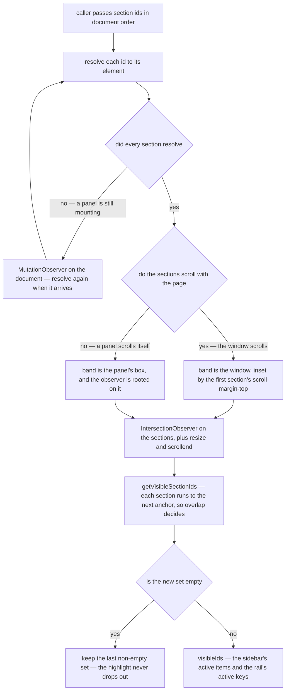

# Section Navigation

A surface long enough to need a sidebar of its own sections gets that sidebar from two shared pieces and nothing else: `useVisibleSectionIds` decides which sections are on screen, and `StyledSlideIndicator` draws the rail that follows them. The docs table of contents, the `/user/settings` page and the settings dialog are three different lists over three different scroll containers, and all three are the same mechanism with different items — so a fourth one is a list and a call, not a design.

The behaviour the mechanism defines: **every section overlapping the viewport is active at once**, not the nearest heading. A section spans from its own anchor down to the next one, so reading the body under one heading while the next heading is on screen lights up both, and the rail stretches across them rather than jumping between them. That is the whole reason the composable returns ids rather than an id.

## How a highlight is decided

## The rules

**The sidebar reads visibility, never the route or a click.** An active item is one whose id is in `visibleIds`. Clicking an item scrolls — `NuxtLink` with a hash on a page, `useVGoTo` with the container on a panel — and the highlight follows because the content moved, not because the item was clicked. Nothing tracks "the section the user last clicked", and there is no flag guarding the animated scroll against the scrollspy: they cannot disagree when only one of them writes.

**Anchors are the section elements themselves.** The id that the sidebar links to is on the `<section>` (or heading) the reader is scrolling to, so a section that renders is a section the scrollspy can find, and an id that is absent is simply not in the set rather than an error. No registry, no per-section reporting, and no scrollspy state in a store — the DOM already holds it.

**A section that scrolls with the page carries `scroll-margin-top`.** It clears the sticky app bar an anchored link would otherwise land behind, and the composable reads the same value back as the top of the visible band — one number, declared where it is visible, doing both jobs. A section inside a panel needs none: the panel's own box is the band, and the panel's header sits **outside** its scroll container, so a section clipped above it is genuinely not visible.

**Observers, never scroll handlers.** The set changes at exactly one kind of moment — an anchor crossing an edge of the band — and that is the observer's own callback. A scroll listener would re-measure every anchor several hundred times per section to catch the handful of frames where the answer moved. Two events fill the observer's blind spots: `resize`, because it moves the bottom edge without any anchor crossing it, and `scrollend`, because an anchor that comes to rest exactly on the top line approached it from below and never crossed it.

**Sections that arrive late are found by the `MutationObserver`, not by the caller.** A panel resolving its `Suspense`, a card rendering behind a skeleton, a docs page swapping its content: the ids are known before the elements exist, and nothing else would ever look for them again. This is what lets a caller pass a plain list of ids for content it does not own.

**Never a raw `IntersectionObserver` callback, and never `v-intersect`.** They hand you an entry on every ratio change, so an in-content reflow — a warning toggling, a slider expanding — moves the sidebar highlight even though no section crossed an edge. The composable uses the observer as a _change signal_ and re-derives the whole set from measurements, so a reflow that changes nothing produces the same set and the sidebar does not move.

## The rail

`StyledSlideIndicator` is the animated bar, and there is exactly one per list, placed in a `position: relative` container, with each item carrying `data-slide-indicator-key`. It measures the active items and spans them, so several contiguous keys stretch the bar rather than splitting it. One per group instead of one per list is the mistake worth naming: a bar that is `v-if`-ed per group is destroyed and rebuilt when the selection crosses a boundary, so every move starts at the top of its own group instead of sliding from where it was.

## Key files

| File                                                         | Role                                                                    |
| :----------------------------------------------------------- | :---------------------------------------------------------------------- |
| `app/composables/useVisibleSectionIds.ts`                    | The scrollspy — resolves ids, watches the band, returns the visible ids |
| `app/services/shared/getVisibleSectionIds.ts`                | The span rule — which sections overlap the band, given their tops       |
| `app/components/Styled/SlideIndicator.vue`                   | The rail that measures the active keys and slides across them           |
| `app/components/Docs/TableOfContents/Index.vue`              | Page-scrolled list over content headings                                |
| `app/components/User/Settings/SideBar.vue`                   | Page-scrolled list over the settings sections                           |
| `app/components/Message/Model/User/Settings/LeftSideBar.vue` | Panel-scrolled list, bounded by the settings dialog's scroll container  |
