# Serialization

How class instances (e.g. `StandardMessageEntity`) are serialized and deserialized across all three paths in the app: Azure Table read, SSR payload hydration, and tRPC transport.

## The three paths

Each path is independent. They do not compose or run in sequence.

```mermaid
flowchart TB
  subgraph at [Azure Table read — server-side only]
    ROW["Azure SDK row<br/>date columns → Date · JSON columns → string"]
    DE["deserializeEntity.ts<br/>jsonDateParse(String(value)) per JSON column"]
    INST1["class instance<br/>createdAt: Date ✓"]
    ROW --> DE --> INST1
  end

  subgraph ssr [SSR / Nuxt payload — page load]
    PINIA["Pinia state (Date objects)"]
    RED["customPayloads.ts reducer<br/>JSON.stringify(entity)"]
    HTML["HTML payload<br/>createdAt: string"]
    REV["customPayloads.ts reviver<br/>new cls(jsonDateParse(data))"]
    INST2["class instance ✓<br/>instanceof cls"]
    PINIA --> RED --> HTML --> REV --> INST2
  end

  subgraph trpc [tRPC transport — query / mutation / subscription]
    SRV["server class instance (Date objects)"]
    SER["transformer.ts (SuperJSON)<br/>registerCustom serialize → JSON.stringify"]
    WIRE["HTTP or WebSocket"]
    DES["registerCustom deserialize<br/>new cls(jsonDateParse(data))"]
    INST3["class instance ✓<br/>instanceof cls"]
    SRV --> SER --> WIRE --> DES --> INST3
  end
```



## Why `jsonDateParse` is needed on the transport paths

`StandardMessageEntity` (and all classes in `JSONClassMap`) extend `Serializable`, which defines:

```typescript
toJSON(): this {
  return structuredClone(toRawDeep(this));
}
```

`JSON.stringify(entity)` calls `toJSON()` first, producing a plain-object clone. `JSON.stringify` then converts any `Date` fields in that clone to ISO strings. By the time the transport layer sees the bytes, the type metadata is gone.

Both the SSR and tRPC paths fix this by passing the raw JSON string through `jsonDateParse` during revival, which re-applies ISO date → `Date` conversion via its JSON reviver. The reviver also reconstructs the class instance (`new cls(...)`) so the result is a proper typed instance — preserving `instanceof` checks and class methods — not a plain object.

## Implementation

### Azure Table path — `packages/db/src/services/azure/transformer/deserializeEntity.ts`

Runs server-side only, before any transport. The Azure SDK already returns `Date` objects for columns stored as `Edm.DateTime`. For columns stored as JSON strings (arrays, nested objects), `getIsSerializable` detects them and `jsonDateParse` restores any dates inside.

```typescript
const instance = new cls(); // restores class identity
for (const [property, value] of Object.entries(entity))
  if (!(value instanceof Date) && getIsSerializable(instance[property]))
    instance[property] = jsonDateParse(String(value)); // JSON column → parse + restore dates
  else instance[property] = value; // date column → already a Date
```

`getIsSerializable` returns `true` for arrays and non-Date objects — i.e. properties that were stored in Azure Table as a JSON string (e.g. `files: FileEntity[]`, `mentions: string[]`).

### SSR path — `packages/app/app/plugins/customPayloads.ts`

Registered with Nuxt's payload plugin API. Fires for any class instance in Pinia state or `useAsyncData` that Nuxt serializes into the HTML payload for client hydration.

```typescript
definePayloadReducer(name, (data) => data instanceof cls && JSON.stringify(data));
definePayloadReviver(name, (data) => new cls(jsonDateParse(data)));
```

### tRPC path — `packages/app/shared/services/trpc/transformer.ts`

Used as the SuperJSON transformer for all tRPC HTTP batch links and WebSocket links. `registerClass` alone does not call `jsonDateParse` on revival, so `registerCustom` is used instead.

```typescript
SuperJSON.registerCustom(
  {
    isApplicable: (value): value is InstanceType<typeof cls> => value instanceof cls,
    serialize: (value) => JSON.stringify(value),
    deserialize: (data) => new cls(jsonDateParse(data as string)),
  },
  name,
);
```

## Class registry

All three transport paths share the same source of truth: `packages/app/shared/services/superjson/JSONClassMap.ts`.

Adding a new serializable class requires a single entry in that map. The SSR and tRPC paths pick it up automatically. The Azure Table path uses `MessageEntityMap` (in `@esposter/db-schema`) to select the correct concrete class per `type` discriminant — new message entity types must be registered there separately.

Registry keys are frozen: `JSONClassMap` keys are persisted inside serialized payloads, so renaming a registered class name breaks revival of existing data — treat the map keys as an on-disk format.

## What does not apply here

- **Plain objects / tRPC primitives**: SuperJSON handles these natively without class registration.
