# Serialization

How class instances (e.g. `StandardMessageEntity`) are serialized and deserialized across all three paths in the app: Azure Table read, SSR payload hydration, and tRPC transport.

## The three paths

Each path is independent. They do not compose or run in sequence.

```mermaid
flowchart TB
  subgraph at [Azure Table read — server-side only]
    ROW["Azure SDK row<br/>date columns → Date · JSON columns → string"]
    DE["deserializeEntity.ts<br/>jsonDateParse(String(value)) per JSON column"]
    INST1["class instance<br/>createdAt: Date ✓"]
    ROW --> DE --> INST1
  end

  subgraph ssr [SSR / Nuxt payload — page load]
    PINIA["Pinia state (Date objects)"]
    RED["customPayloads.ts reducer<br/>JSON.stringify(entity)"]
    HTML["HTML payload<br/>createdAt: string"]
    REV["customPayloads.ts reviver<br/>new cls(jsonDateParse(data))"]
    INST2["class instance ✓<br/>instanceof cls"]
    PINIA --> RED --> HTML --> REV --> INST2
  end

  subgraph trpc [tRPC transport — query / mutation / subscription]
    SRV["server class instance (Date objects)"]
    SER["transformer.ts (SuperJSON)<br/>registerCustom serialize → JSON.stringify"]
    WIRE["HTTP or WebSocket"]
    DES["registerCustom deserialize<br/>new cls(jsonDateParse(data))"]
    INST3["class instance ✓<br/>instanceof cls"]
    SRV --> SER --> WIRE --> DES --> INST3
  end
```



`jsonDateParse` is the default parse repo-wide: plain `JSON.parse` is banned by the `no-restricted-syntax` ESLint rule, so each of the deliberate exceptions below carries an `eslint-disable-next-line no-restricted-syntax` with its reason.

## Why `jsonDateParse` is needed on the transport paths

`StandardMessageEntity` (and all classes in `JSONClassMap`) extend `Serializable`, which defines:

```ts
toJSON(): this {
  return structuredClone(toRawDeep(this));
}
```

`JSON.stringify(entity)` calls `toJSON()` first, producing a plain-object clone. `JSON.stringify` then converts any `Date` fields in that clone to ISO strings. By the time the transport layer sees the bytes, the type metadata is gone.

Both the SSR and tRPC paths fix this by passing the raw JSON string through `jsonDateParse` during revival, which re-applies ISO date → `Date` conversion via its JSON reviver. The reviver also reconstructs the class instance (`new cls(...)`) so the result is a proper typed instance — preserving `instanceof` checks and class methods — not a plain object.

## Implementation

### Azure Table path — `packages/db/src/services/azure/transformer/deserializeEntity.ts`

Runs server-side only, before any transport. The Azure SDK already returns `Date` objects for columns stored as `Edm.DateTime`. For columns stored as JSON strings (arrays, nested objects), `checkIsSerializable` detects them and `jsonDateParse` restores any dates inside.

```ts
const instance = new cls(); // restores class identity
for (const [property, value] of Object.entries(entity))
  if (!(value instanceof Date) && checkIsSerializable(instance[property]))
    instance[property] = jsonDateParse(String(value)); // JSON column → parse + restore dates
  else instance[property] = value; // date column → already a Date
```

`checkIsSerializable` returns `true` for arrays and non-Date objects — i.e. properties that were stored in Azure Table as a JSON string (e.g. `files: FileEntity[]`, `mentions: string[]`).

### SSR path — `packages/app/app/plugins/customPayloads.ts`

Registered with Nuxt's payload plugin API. Fires for any class instance in Pinia state or `useAsyncData` that Nuxt serializes into the HTML payload for client hydration.

```ts
definePayloadReducer(name, (data) => data instanceof cls && JSON.stringify(data));
definePayloadReviver(name, (data) => new cls(jsonDateParse(data)));
```

### tRPC path — `packages/app/shared/services/trpc/transformer.ts`

Used as the SuperJSON transformer for all tRPC HTTP batch links and WebSocket links. `registerClass` alone does not call `jsonDateParse` on revival, so `registerCustom` is used instead.

```ts
SuperJSON.registerCustom(
  {
    isApplicable: (value): value is InstanceType<typeof cls> => value instanceof cls,
    serialize: (value) => JSON.stringify(value),
    deserialize: (data) => new cls(jsonDateParse(data as string)),
  },
  name,
);
```

## Class registry

All three transport paths share the same source of truth: `packages/app/shared/services/superjson/JSONClassMap.ts`.

Adding a new serializable class requires a single entry in that map. The SSR and tRPC paths pick it up automatically. The Azure Table path uses `MessageTypeEntityMap` (in `@esposter/db-schema`) to select the correct concrete class per `type` discriminant — new message entity types must be registered there separately.

Registry keys are frozen: `JSONClassMap` keys are persisted inside serialized payloads, so renaming a registered class name breaks revival of existing data — treat the map keys as an on-disk format.

This is why a class name may legitimately disagree with the feature name around it. `FlowchartEditor`, `EmailEditor` and `WebpageEditor` keep the `…Editor` suffix — and their `store/`/`models/`/`services/` folders keep the matching names — even though those products are now resources rendered by one explorer ([resources](/docs/architecture/resources)). The name is a registry key holding persisted blobs readable, so a rename sweep stops at the map: rename the surrounding folder if it helps, never the registered class.

## Resource content blobs — schemas own date coercion

Resource content (Sheet, Dashboard, TodoList, …) takes a **fourth** path that is deliberately not one of the three above. Content is saved as a JSON blob (`JSON.stringify(content)`) and read back through its Zod content schema in `readResourceContent`, `readPublishedResourceContent`, and `readSheetDataset`. That read path uses **plain `JSON.parse`** — never `jsonDateParse`.

Blanket revival is wrong here because the content is already schema-validated, so the schema knows exactly which fields are dates and coerces them itself with `z.coerce.date()`: the item-metadata timestamps (`aItemEntitySchema` — `createdAt`, `updatedAt`, `deletedAt`), `Metadata.importedAt`, and `TodoListItem.dueAt`. A reviver that guesses from string shape instead would mis-revive a genuine string field: a Sheet cell value is typed `boolean | null | number | string`, so an ISO-datetime string typed into a cell would be turned into a `Date` that `columnValueSchema` then rejects — failing the entire resource read, not just one cell. The same rule covers the localStorage draft path: `getDraft` parses with `JSON.parse` and `draftSchema.updatedAt` is a `z.coerce.date()`, so a draft body that is itself an ISO datetime stays a string.

## Machine JSON whose strings are paths — same rule, other side of the repo

The same argument applies wherever a schema reads a document that a program wrote but a person named parts of: virrun's overlay manifests, task-cache entries, source-mirror publications and on-disk probe caches all carry repo-relative paths and symlink targets as plain `z.string()` fields. A path may legitimately be an ISO datetime (`2026-08-05T12:00:00Z` is a legal Linux filename), and a reviver reads shape rather than schema, so blanket revival turns that path into a `Date` the schema rejects — failing the whole read over one filename, and on the write-back path throwing after the command already ran, so every file it wrote is discarded.

These parse plainly through a single named helper per package (`parseMachineJson` in virrun), so the exception lives in one place with one disable rather than being re-argued per file. "The data has no dates" is still not the test — the test is whether any string field is free-form text a person chose.

## An unregistered class instance is worse than a plain object

SuperJSON annotates nested values by walking the payload, and it only walks **plain** objects and arrays. A class instance it does not recognise is neither registered (so no `registerCustom` hook fires) nor plain (so it is not walked), and it crosses the wire with no annotations for anything inside it — every nested `Date` arrives as a string:

```ts
// hasMore/items survive; items[0].createdAt arrives as a string, not a Date
return new OffsetPaginationData({ hasMore, items });
// annotated as `items.0.createdAt: ["Date"]`, revived as a Date
return { hasMore, items };
```

This is why `getOffsetPaginationData` and `getCursorPaginationData` return **object literals** typed as their class rather than constructing one. Both classes are pure data holders with no methods, so the literal satisfies the type and the annotations survive.

The failure is silent and only visible at the leaves, which makes it easy to misread as "the transformer isn't wired up". Two rules follow:

- A procedure returns either a **registered** class instance (in `JSONClassMap`) or a **plain object**. Never an unregistered instance.
- A test handler must return the same shape the server does. A fixture that constructs `new SomeClass(...)` where the server returns a literal fails on dates alone, and asserting around it (comparing ids instead of rows) hides the mismatch rather than fixing it.

## What does not apply here

- **Plain objects / tRPC primitives**: SuperJSON handles these natively without class registration.
