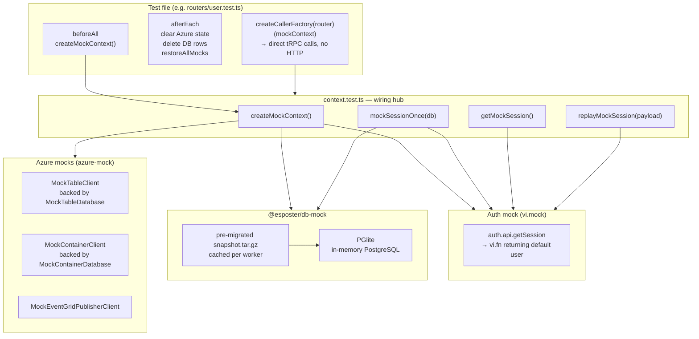

# Server-Side Testing

How tRPC router tests wire up an in-memory database, mocked Azure services, and a controlled auth session so procedures can be called directly without HTTP or real cloud resources.

## Overview



## Components

### 1. `@esposter/db-mock` — in-memory PostgreSQL

`createMockDb()` in `packages/db-mock/src/createMockDb.ts`:

1. Reads the pre-migrated PGlite data directory snapshot (`snapshot.tar.gz`) from disk.
2. Creates a `PGlite` instance with `loadDataDir: <snapshot>` (WebAssembly PostgreSQL, runs in-process).
3. Awaits `client.waitReady` — `new PGlite()` returns before init finishes, so without this the first query pays the boot cost and can blow past the per-test timeout.
4. Returns the drizzle-orm `db` instance cast to `PostgresJsDatabase<typeof relations>`.

**Why a snapshot instead of running migrations at runtime?** Loading a pre-migrated data directory skips PGlite's `initdb` boot + migration generation, roughly halving boot per call. Regenerate it with `pnpm snapshot:gen` (in `packages/db-mock`) whenever the schema changes. `createMockDb.test.ts` fails if the committed snapshot drifts from the live schema (it diffs the snapshot against a freshly `generateMigration`-built DB). The hookTimeout in `vitest.config.ts` stays at five minutes to absorb PGlite boot under parallel test load.

**Why PGlite instead of a real PostgreSQL?** No external process, no port, no cleanup — each test suite gets an isolated in-memory database that vanishes when the worker exits.

**Environment cost.** Server tests — including almost every tRPC router test — run in the default `node` environment. They get **no DOM** — happy-dom is built by the nuxt environment only, so there is no manual happy-dom registration and node-env tests run without a `window`. A server test pays only PGlite boot + the Azure/auth `vi.mock`s (plus the cheap global `fake-indexeddb/auto` polyfill). The one exception is a router that calls a Nuxt composable `context.test.ts` does not mock: the message router uses `useWebPubSubServiceClient` (which needs `useRuntimeConfig`), so `message/index.test.ts` and `message/scheduledMessageJob.test.ts` declare `// @vitest-environment nuxt` and pay the Nuxt environment build.

### 2. `azure-mock` — in-memory Azure services

`packages/azure-mock` ships mock implementations:

| Mock class                     | Replaces                                                        | In-memory store                         |
| ------------------------------ | --------------------------------------------------------------- | --------------------------------------- |
| `MockTableClient`              | `CustomTableClient` (Azure Table Storage)                       | `MockTableDatabase` (static `Map`)      |
| `MockContainerClient`          | `ContainerClient` (Azure Blob Storage)                          | `MockContainerDatabase` (static `Map`)  |
| `MockBlobClient`               | `BlobClient` (single blob)                                      | `MockContainerDatabase`                 |
| `MockBlockBlobClient`          | `BlockBlobClient` — what every SAS upload path resolves through | `MockContainerDatabase`                 |
| `MockBlobBatchClient`          | `BlobBatchClient` (batch blob deletes)                          | `MockContainerDatabase`                 |
| `MockEventGridPublisherClient` | `EventGridPublisherClient`                                      | `MockEventGridDatabase` (static `Map`)  |
| `MockServiceBusSender`         | `ServiceBusSender`                                              | `MockServiceBusDatabase` (static `Map`) |
| `MockQueueClient`              | `QueueClient` (Azure Storage Queue)                             | `MockQueueDatabase` (static `Map`)      |
| `MockSearchClient`             | `SearchClient` (Azure AI Search)                                | `MockSearchDatabase` (static `Map`)     |
| `MockWebPubSubServiceClient`   | `WebPubSubServiceClient`                                        | none (`sendToAll` no-op)                |

The static maps persist across calls within a test run, so **every store your suite writes to is cleared in `afterEach`** — the Store column above names the one behind each client. `MockEventGridPublisherClient.send` accumulates events, and a suite that fires events but clears only the blob and table stores leaks them into the next test; the same holds for a suite that enqueues Service Bus or storage-queue messages. The common three:

```ts
afterEach(() => {
  MockContainerDatabase.clear();
  MockEventGridDatabase.clear();
  MockTableDatabase.clear();
});
```

### 3. `context.test.ts` — wiring hub

`packages/app/server/trpc/context.test.ts` is the central test utility file. It installs the `vi.mock` for auth — the one whose factory needs this module's session state — and exports helpers consumed by every tRPC router test.

**Every Azure composable is mocked once in `shared/test/setup.ts`, not here.** A `vi.mock` is hoisted only within the file that writes it, so a registration made from an imported module does not intercept a test file's own direct import of the same composable — which is why suites reading a table directly used to repeat the registration verbatim. A setup file runs before the test module is imported, so one registration there covers both the router path and a direct `await useTableClient(...)` in the test. Import the composable from its **real** path; never from its `.test` mock.

**`createMockContext()`** builds a full `Context`: PGlite DB + mocked Azure clients + mocked auth. The default user (base user) is inserted into PGlite and always available via `getMockSession()` — this user becomes the owner for all rooms/resources created in tests.

**Session helpers:**

| Helper                       | What it does                                                                                                                                                           |
| ---------------------------- | ---------------------------------------------------------------------------------------------------------------------------------------------------------------------- |
| `getMockSession()`           | Returns the current queued session (or default). `user.id` is stable; `session.id` is a new UUID each call.                                                            |
| `mockSessionOnce(db, user?)` | Inserts a new test user into PGlite (if no `user` given) and queues their session for the **next** API call only. After that call the default (owner) session resumes. |
| `replayMockSession(payload)` | Re-queues an existing session payload without inserting a new user. Use when the same non-owner user must make multiple sequential calls.                              |

### 4. tRPC caller

Tests call procedures directly without HTTP:

```ts
const caller = createCallerFactory(userRouter)(mockContext);
await caller.readStatuses([userId]);
```

`createCallerFactory` (from `@@/server/trpc`) returns a factory that binds a `Context` to a router, producing a callable object that matches the router's procedure signatures.

## Test lifecycle

```text
beforeAll
  └─ createMockContext()     ← one DB + auth + Azure mocks for the whole suite
  └─ createCallerFactory()   ← bind router to context

beforeEach
  └─ per-test setup only     ← vi.useFakeTimers(), fixture rows (e.g. a fresh room)

[ test body ]
  └─ mockSessionOnce(db)     ← when a non-owner user is needed
  └─ caller.someProc(input)

afterEach
  └─ <every mock store the suite writes to>.clear()   ← Container/Table, plus EventGrid,
  │                                                     ServiceBus, Queue or Search when used
  └─ db.delete(affectedTable)
  └─ vi.restoreAllMocks()    ← restores spy implementations + clears call history
```

All cleanup — Azure mock stores and DB rows — lives in `afterEach`, never `beforeEach`: the mock stores and the PGlite database persist for the whole suite, so each test removes its own writes immediately instead of relying on the next test to sweep up before running. Tests stay order-independent and the suite's last test leaks nothing. `beforeEach` is reserved for per-test setup such as fake timers or fixture rows.

## Key files

| File                                                                                  | Role                                                                     |
| ------------------------------------------------------------------------------------- | ------------------------------------------------------------------------ |
| `packages/db-mock/src/createMockDb.ts`                                                | PGlite setup + snapshot loading                                          |
| `packages/azure-mock/src/`                                                            | `MockTableClient`, `MockContainerClient`, `MockEventGridPublisherClient` |
| `packages/app/server/trpc/context.test.ts`                                            | `createMockContext`, session helpers, `vi.mock` wiring                   |
| `packages/app/server/composables/azure/table/useTableClient.test.ts`                  | `useTableClientMock` export                                              |
| `packages/app/server/composables/azure/container/useContainerClient.test.ts`          | `useContainerClientMock` export                                          |
| `packages/app/server/composables/azure/eventGrid/useEventGridPublisherClient.test.ts` | `useEventGridPublisherClientMock` export                                 |
| `packages/app/server/composables/azure/serviceBus/useServiceBusSender.test.ts`        | `useServiceBusSender` mock export                                        |

## Adding a new router test

1. No environment directive — router tests run in the default `node` environment. Add `// @vitest-environment nuxt` as the first line only when the router calls a Nuxt composable that `context.test.ts` does not mock (currently only `useWebPubSubServiceClient` in the message router).
2. Import `createMockContext`, session helpers, and your router from their canonical locations.
3. Follow the `beforeAll → createMockContext → createCallerFactory` pattern.
4. Use the base user (from `getMockSession()`) as the room/resource owner.
5. Use `mockSessionOnce(db)` only when a non-owner perspective is needed.
6. Clean up DB rows and Azure mock state in `afterEach` (not `beforeEach`).
