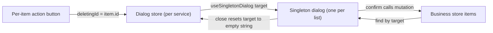

# Singleton Dialogs

Every dialog that acts on a list item (delete a message, edit a row, open room settings) is mounted **once** at the list level and targeted through a store ref, instead of being embedded inside each list item. This is the repo-wide answer to a class of performance bug: a `v-for` over N items that each mount their own `v-dialog` (plus its form, preview, and validation subtree) creates N full component trees that all mount, hydrate, and patch together. On the messages page this pattern (dialogs, options toolbars, and emoji pickers per message) pushed Interaction to Next Paint from milliseconds into whole seconds before conversion.

## How it works

Three parts cooperate, and each lives in a fixed place:

1. **A per-service dialog store** holds only the dialog targets — plain string refs like `deletingId` or `editingColumnName` that default to `""` (the empty-string default convention, never `undefined`). Dialog UI state is deliberately kept out of business-logic stores: each service gets a dialog store next to its business store, e.g. `store/message/dialog.ts` (`useMessageDialogStore`), `store/post/dialog.ts`, `store/resource/file/rowDialog.ts`.
2. **Per-item action buttons write the target.** The button in the list item is a dumb icon button whose click handler is one assignment: `@click.stop="deletingId = item.id"`. There are no activator slots and no `@update:delete-mode` emit chains plumbed up the component tree.
3. **One singleton dialog component** is mounted at the list/table/page level. It resolves the full item from the business store by the target (`items.find(({ id }) => id === deletingId)`), guards rendering with `v-if="item"`, and derives its open state from the target via the `useSingletonDialog` composable — a writable computed whose getter is `Boolean(target)` and whose setter resets the target to `""` on close.



Because the target is a single ref, only two components react when it changes: the singleton dialog and (at most) the one item whose derived state depends on it. The other N-1 items are untouched.

## Per-open local state

A confirm dialog is stateless, so a plain `v-if="item"` guard inside the singleton suffices. An edit dialog that clones its item into a local draft (`structuredClone` for vjsf, `useCloned` for row edits) must re-create that draft per target — mount it at the list level with a `v-if` **and a `:key`** so Vue recreates the component when the target changes:

```vue
<ResourceFileRowEditDialog v-if="editingRow" :key="editingRow.id" :row="editingRow" :index="..." />
```

## Scope and non-goals

- **Hover toolbars and options menus** in list items follow the same principle with `v-if` (mount on hover/activation) rather than `v-show` — an always-mounted `v-show` toolbar per item is the same O(N) mount problem in menu form. See `/docs/esbabbler/message-list-rendering` for the message list's full treatment.
- **Single-instance dialogs are fine as combined button+dialog components.** A create button in a toolbar or a page-level settings dialog mounts exactly once, so the rule does not apply — it targets per-item multiplication only.

## Key files

| File                                                                                 | Role                                                                                 |
| ------------------------------------------------------------------------------------ | ------------------------------------------------------------------------------------ |
| `app/composables/useSingletonDialog.ts`                                              | Writable `v-model` computed over a target ref — open while set, close resets to `""` |
| `app/store/message/dialog.ts`                                                        | Message dialog targets (`deletingRowKey`, `pinningRowKey`)                           |
| `app/store/message/room/dialog.ts`                                                   | Room dialog state (`settingsRoomId`, `isEditRoomDialogOpen`)                         |
| `app/store/message/roomCategoryDialog.ts`, `app/store/message/room/webhookDialog.ts` | Category / webhook delete targets                                                    |
| `app/store/post/dialog.ts`, `app/store/post/comment/dialog.ts`                       | Post / comment delete targets                                                        |
| `app/store/resource/file/columnDialog.ts`, `app/store/resource/file/rowDialog.ts`    | File table editor chart/edit/delete targets                                          |
| `app/components/Message/Model/Message/ConfirmDeleteDialog.vue`                       | Canonical stateless singleton (resolve → `v-if` → `useSingletonDialog`)              |
| `app/components/Resource/File/Row/EditDialog.vue`                                    | Canonical stateful singleton (`v-if` + `:key` mount for a fresh edit draft)          |
| `app/components/Message/Model/Room/Settings/Dialog.vue`                              | Fullscreen settings dialog driven by `settingsRoomId`                                |

## Notes

- The emit-plumbing style this replaces (`@update:delete-mode` chains + activator slots per item) was the original convention; it was retired in July 2026 after profiling showed per-item dialog trees dominated interaction latency.
- Targets are resolved back to full items through the business store, so the dialog always shows live data — no stale item props captured at open time.
