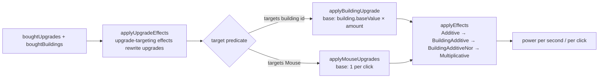

# Effect Engine

All production math is a pure pipeline: an upgrade owns `Effect[]`, and power is computed by folding every relevant effect over a base value. Nothing is stored — building power and mouse power are recomputed from the save on every read.

## How it works

An `Effect` has a `value`, `targets` (which building ids or `Target.Mouse` it applies to), and a `configuration` naming its `EffectType`:

- `Additive` — adds `value` to the power.
- `Multiplicative` — multiplies the power by `value`.
- `BuildingAdditive` — adds `value` per owned unit of the configured target buildings (e.g. "cursors gain +0.1 for each grandma").
- `BuildingAdditiveNor` — adds `value` per owned unit of every building **except** the configured targets (the "Thousand Fingers"-style effects).

`applyEffects` applies the four types in the fixed `EffectTypes` order via `EffectOperatorMap` (a constant map from effect type to its pure applier), so additive effects always land before multiplicative ones.

One meta level exists: an effect whose `configuration.itemType` is `Target.Upgrade` enhances _other upgrades'_ effects rather than production directly. `applyUpgrades` first rewrites each bought upgrade through `applyUpgradeEffects` using those meta effects, then filters the rewritten upgrades by the caller's target predicate and folds the surviving effects.

Consumers: the building store's `allBuildingPower` (total production) and `getBoughtBuildingPower` (per-building stats), and the mouse store's `mousePower` (click value) — all Pinia computeds over the save, so any purchase reactively reprices everything.

## Key files

Paths relative to `packages/app`.

| File                                                       | Role                                       |
| ---------------------------------------------------------- | ------------------------------------------ |
| `shared/models/clicker/data/effect/Effect.ts`              | effect shape + schema                      |
| `shared/models/clicker/data/effect/EffectConfiguration.ts` | effect type + meta-targeting configuration |
| `app/services/clicker/effect/EffectOperatorMap.ts`         | effect type → pure applier                 |
| `app/services/clicker/effect/applyEffects.ts`              | ordered fold over all effect types         |
| `app/services/clicker/upgrade/applyUpgrades.ts`            | meta-upgrade rewrite + target filtering    |
| `app/services/clicker/upgrade/applyBuildingUpgrade.ts`     | per-building power (baseValue × amount)    |
| `app/services/clicker/upgrade/applyMouseUpgrades.ts`       | click power                                |

## Notes

- Appliers are pure functions of `(basePower, effects, boughtBuildings)` — trivially unit-testable and free of store coupling.
- `applyBuildingAdditiveEffects` `break`s out of a target loop when a target building isn't owned yet, skipping that effect's remaining targets; with today's single-target effects this is invisible, but a multi-target effect would silently drop later targets.
