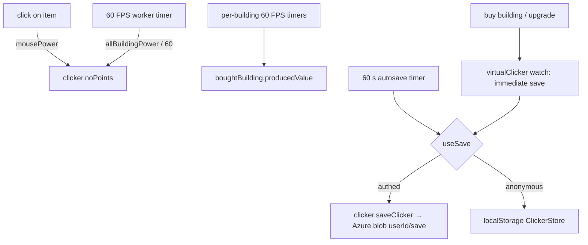

# Game Loop and Saves

Production ticks on worker-based timers, and the entire game state is one `Clicker` entity saved to a per-user Azure blob (authenticated) or localStorage (anonymous).

## How it works

`pages/clicker.vue` loads the save with `useReadClicker`, then `useTimers` starts three timer composables. All intervals come from `worker-timers`, which runs in a Web Worker so production continues when the tab is backgrounded (browsers throttle main-thread timers there).

- `useBuildingClickerTimer` — one 60 FPS interval adding `allBuildingPower / FPS` points per tick.
- `useBuildingStatsTimer` — one 60 FPS interval **per bought building** accumulating its lifetime `producedValue`; all intervals are torn down and recreated whenever the bought-building powers change.
- `useAutosaveTimer` — saves the full state every 60 seconds.

Clicking the central item goes through the popup store: it adds `mousePower` points and spawns a floating `+N` popup at the cursor that despawns after 10 seconds.

**Save timing** — `useReadClicker` watches a `virtualClicker` computed that deep-omits `noPoints` and `producedValue`; only _manual_ state changes (purchases, type switches) trigger an immediate save, while the ever-ticking counters are picked up by the periodic autosave. The omitted view is reference-stabilized with `deepEqual` so the watch doesn't fire on every tick.

**Persistence** — `useSave` and `useReadData` are the app-wide single-blob-per-user pattern (shared with dungeons): authenticated users read/write through `clicker.readClicker` / `clicker.saveClicker` (generic blob-state procedures over the `clicker-assets` container, blob name `${userId}/save`, validated by `clickerSchema`); anonymous users get the same state in localStorage under `ClickerStore`. Why games stay off the resource layer: [games integration](/docs/platform/rejected/games-integration).

## Procedures

| Procedure             | Auth | Input           | Purpose                        |
| --------------------- | ---- | --------------- | ------------------------------ |
| `clicker.readClicker` | user | —               | read the user's save blob      |
| `clicker.saveClicker` | user | `clickerSchema` | overwrite the user's save blob |

`saveClicker` is also the trigger path for all five clicker achievements (save-count thresholds 1/5/10/100/1000).

## Key files

Paths relative to `packages/app`.

| File                                                 | Role                                    |
| ---------------------------------------------------- | --------------------------------------- |
| `app/composables/clicker/useReadClicker.ts`          | load save + immediate-save watch        |
| `app/composables/clicker/useTimers.ts`               | starts the three timers                 |
| `app/composables/clicker/useBuildingClickerTimer.ts` | production tick                         |
| `app/composables/clicker/useBuildingStatsTimer.ts`   | per-building producedValue accumulation |
| `app/composables/clicker/useAutosaveTimer.ts`        | periodic save                           |
| `app/store/clicker/index.ts`                         | save root, `useSave` wiring             |
| `app/store/clicker/popup.ts`                         | click handling + floating point popups  |
| `server/trpc/routers/clicker.ts`                     | read/save + content-map procedures      |
| `shared/models/clicker/data/Clicker.ts`              | save entity + schema                    |

## Notes

- The save stores **full** `Upgrade` and `Building` objects, not ids — content rebalances never reach existing saves. The [normalize save data](/docs/proposals/clicker/normalize-save-data) proposal fixes this.
- One 60 FPS interval per bought building is O(buildings) timer churn for a stat display; the [single game tick](/docs/proposals/clicker/single-game-tick) proposal consolidates the loop.
- There is no offline progress: production only happens while the page is open (the worker timers keep it alive across tab switches, not across sessions).
