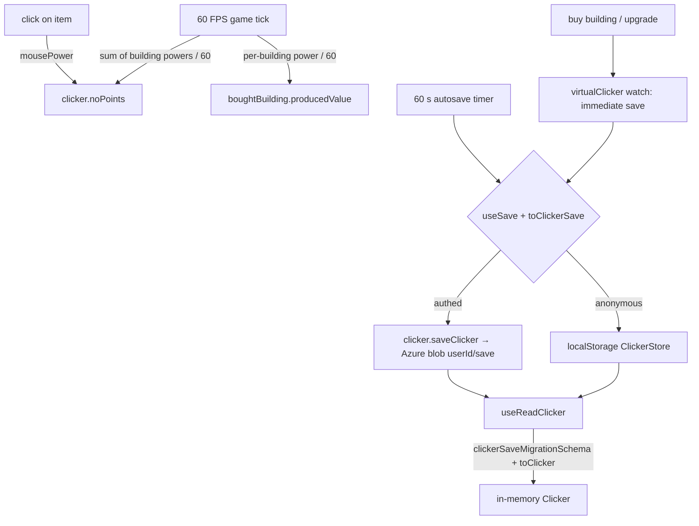

# Game Loop and Saves

Production runs on one worker-based game tick, and the entire game state is one `Clicker` entity in memory, persisted as a normalized id-based `ClickerSave` to a per-user Azure blob (authenticated) or localStorage (anonymous).

## How it works

`pages/clicker.vue` loads the save with `useReadClicker`, then `useTimers` starts two timer composables. Both intervals come from `worker-timers`, which runs in a Web Worker so production continues when the tab is backgrounded (browsers throttle main-thread timers there).

- `useGameTickTimer` — one 60 FPS interval calling `applyGameTick`: it computes each bought building's power once per tick, accumulates the building's lifetime `producedValue`, and adds the summed power to `noPoints`. Powers are read fresh every tick, so purchases apply on the next tick with no watch/teardown machinery.
- `useAutosaveTimer` — saves the full state every 60 seconds.

Clicking the central item goes through the popup store: it adds `mousePower` points and spawns a floating `+N` popup at the cursor that despawns after 10 seconds.

**Save timing** — `useReadClicker` watches a `virtualClicker` computed that deep-omits `noPoints` and `producedValue`; only _manual_ state changes (purchases, type switches) trigger an immediate save, while the ever-ticking counters are picked up by the periodic autosave. The omitted view is reference-stabilized with `deepEqual` so the watch doesn't fire on every tick, and `useSave` stamps `updatedAt` on the serialized copy rather than the in-memory state so saving never re-triggers the watch.

**Normalized save data** — the save stores only what the player _did_: `boughtUpgrades` as `UpgradeId[]` and `boughtBuildings` as `{ id, amount, producedValue }[]` (the `ClickerSave` entity). On write, `toClickerSave` strips the in-memory definitions down to ids, and on load `toClicker` resolves them back through `UpgradeMap`/`BuildingMap` — so a balance change to the content maps reaches every existing save on its next load, and unknown ids (removed content) are silently dropped so saves self-heal. The in-memory `Clicker` keeps full definition objects, leaving the effect engine and components untouched.

**Migration** — `clickerSaveMigrationSchema` is a union that also accepts the legacy pre-normalization shape (full `Upgrade`/`Building` objects embedded in the save) and converts it by extracting the ids; the immediate-save watch then re-persists the migrated shape on first load. The legacy arm can be deleted once existing saves have cycled through a load + re-save.

**Persistence** — `useSave` and `useReadData` are the app-wide single-blob-per-user pattern (shared with dungeons): authenticated users read/write through `clicker.readClicker` / `clicker.saveClicker` (generic blob-state procedures over the `clicker-assets` container, blob name `${userId}/save`, validated by `clickerSaveSchema`); anonymous users get the same state in localStorage under `ClickerStore`. Why games stay off the resource layer: [games integration](/docs/platform/rejected/games-integration).

## Procedures

| Procedure             | Auth | Input               | Purpose                        |
| --------------------- | ---- | ------------------- | ------------------------------ |
| `clicker.readClicker` | user | —                   | read the user's save blob      |
| `clicker.saveClicker` | user | `clickerSaveSchema` | overwrite the user's save blob |

`saveClicker` is also the trigger path for all five clicker achievements (save-count thresholds 1/5/10/100/1000).

## Key files

Paths relative to `packages/app`.

| File                                          | Role                                              |
| --------------------------------------------- | ------------------------------------------------- |
| `app/composables/clicker/useReadClicker.ts`   | load + hydrate save, immediate-save watch         |
| `app/composables/clicker/useTimers.ts`        | starts the two timers                             |
| `app/composables/clicker/useGameTickTimer.ts` | the single 60 FPS game tick interval              |
| `app/composables/clicker/useAutosaveTimer.ts` | periodic save                                     |
| `app/services/clicker/applyGameTick.ts`       | per-tick production math (points + producedValue) |
| `app/services/clicker/save/toClickerSave.ts`  | serialize in-memory state to ids/counters         |
| `app/services/clicker/save/toClicker.ts`      | parse (with migration) + hydrate ids back         |
| `app/store/clicker/index.ts`                  | save root, `useSave` wiring                       |
| `app/store/clicker/popup.ts`                  | click handling + floating point popups            |
| `server/trpc/routers/clicker.ts`              | read/save + content-map procedures                |
| `shared/models/clicker/data/Clicker.ts`       | in-memory game state entity                       |
| `shared/models/clicker/data/ClickerSave.ts`   | persisted save entity, schema + migration schema  |

## Notes

- There is no offline progress: production only happens while the page is open (the worker timers keep it alive across tab switches, not across sessions).
- Late-game blob size shrank by an order of magnitude with normalization (19 full upgrade objects → 19 short ids).
