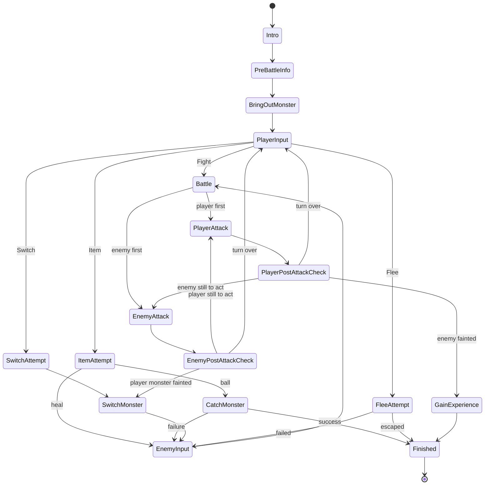

# Battle

Turn-based 1v1 battles driven by a state machine: the player picks Fight / Switch / Item / Flee, states play out both sides' actions with tweens and dialog, and the battle ends in victory experience, a capture, a flee, or a party wipe.

## How it works

`StateMachine` is a minimal generic class — a map of named states with `onEnter`/`onExit` hooks and an async `setState` — instantiated once as `battleStateMachine` over the 17 battle states. Each state file under `models/dungeons/state/battle/states/` owns one phase and decides the next transition, so a turn is a chain of small, testable steps rather than a monolithic update loop.

The math, all in small pure services under `services/dungeons/monster/` and `services/dungeons/item/`:

- **Damage** — `ceil(random(0.85, 1.01) × attacker.stats.attack)`. There is no defense stat and attacks carry no power value (an `Attack` is currently id + sound effect + animation component), so every attack of a monster hits equally hard.
- **Experience** — on a kill, `round(baseExp × enemyLevel / 7)`; `useExperience` applies it and loops `levelUp` while the threshold (`calculateLevelExperience`) is crossed. Level-ups add randomized `maxHp` (+5–8) and `attack` (+1–2).
- **Capture** — ball items roll `0.5 + (1 − hp/maxHp) × 0.2` against a uniform random: success joins the party, a near miss (within 0.1) gets its own dialog, otherwise failure — so weakening the enemy first genuinely helps.
- **Flee** — a random escape attempt; failure forfeits the turn.

Attack visuals are Vue components (`Battle/Attack/Slash.vue`, `IceShard.vue`) selected by `AttackComponentMap` and animated with spritesheet tweens; monster HP/EXP bars are the shared `UI/Bar` components.

## Key files

Paths relative to `packages/app/app`.

| File                                                   | Role                                              |
| ------------------------------------------------------ | ------------------------------------------------- |
| `models/dungeons/state/StateMachine.ts`                | generic state machine                             |
| `models/dungeons/state/battle/StateMap.ts`             | the 17 battle states                              |
| `services/dungeons/scene/battle/battleStateMachine.ts` | the singleton instance                            |
| `services/dungeons/monster/calculateDamage.ts`         | damage roll                                       |
| `services/dungeons/monster/calculateExperienceGain.ts` | experience award                                  |
| `services/dungeons/monster/levelUp.ts`                 | stat growth                                       |
| `services/dungeons/item/createCaptureResult.ts`        | capture roll                                      |
| `store/dungeons/battle/`                               | per-battle stores (player, enemy, dialog, action) |

## Notes

- The `Battle` state orders the two attacks through `useAttackStatePriorityMap` and the post-attack checks route to the other side's attack via the same map. The enemy AI is trivial: `EnemyAttack` picks a uniformly random attack from the monster's `attackIds`.
- Deepening the combat math (attack power, defense) is proposed in [attack power and defense](/docs/proposals/dungeons/attack-power-and-defense).
