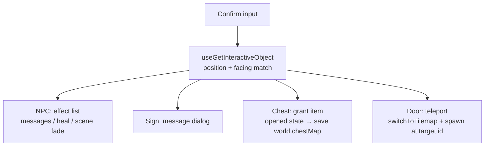

# World

The overworld: tile-based maps authored in Tiled Map Editor, walked with grid-engine, populated by NPCs and interactive objects, with random monster encounters in marked areas.

## How it works

**Tiled pipeline** — maps live as `.tmx` files; `pnpm tiled:gen` (`scripts/tiled/index.ts`, built on the `parse-tmx` package) generates typed artifacts into `shared/generated/tiled/`: the `TilemapKey` enum (Home, HomeBuilding1, HomeBuilding2), per-map `LayerName` enums, object-group names, and typed object-property classes (`TeleportObjectProperty`, `EncounterObjectProperty`, `NpcId`, `ItemId`, …). Map content changes are therefore compile-time-checked against the code that consumes them.

**Movement** — the grid-engine Phaser plugin moves the player cell-by-cell; position/direction live in the player store and persist in the save. NPCs move by `MovementPattern` (idle or clockwise patrol) via `useMoveNpcs`.

**Interactions** — pressing Confirm facing an object walks `ObjectInteractionEffectMap`, keyed by Tiled object group:

NPC dialog and effects come from the `NpcMap` content map (`assets/dungeons/data/npcs.ts`); chest opened-state is per-map in `save.world[tilemapKey].chestMap`; doors read a typed `TeleportTarget` property and fade-switch tilemaps, spawning the player at the matching door id.

**Random encounters** — each step on an encounter layer increments `stepsSinceLastEncounter`, and the encounter chance is `steps / MAX_STEPS_BEFORE_NEXT_ENCOUNTER` (guaranteed at the cap). The layer's Tiled `area` property selects an `EncounterAreaMap` entry, a weighted random pick chooses the monster, and the scene fade-switches to [battle](/docs/dungeons/battle). A settings toggle (`isSkipEncounters`, dev convenience) bypasses the roll.

## Key files

Paths relative to `packages/app`.

| File                                                                                 | Role                                    |
| ------------------------------------------------------------------------------------ | --------------------------------------- |
| `scripts/tiled/index.ts`                                                             | `pnpm tiled:gen` codegen entrypoint     |
| `shared/generated/tiled/`                                                            | generated enums + typed map properties  |
| `app/composables/dungeons/scene/world/tilemap/`                                      | tilemap asset/metadata creation         |
| `app/composables/dungeons/scene/world/interaction/`                                  | interaction dispatch composables        |
| `app/services/dungeons/scene/world/interaction/effect/ObjectInteractionEffectMap.ts` | object group → effect                   |
| `app/composables/dungeons/scene/world/useRandomEncounter.ts`                         | encounter roll + battle handoff         |
| `app/assets/dungeons/data/npcs.ts`                                                   | NPC content (dialog, effects, movement) |
| `app/assets/dungeons/data/encounterAreas.ts`                                         | weighted encounter tables               |

## Notes

- `encounterAreas` precomputes cumulative weights at module load so the weighted pick is a single threshold scan.
- World state that must survive reloads (chests) lives in the save's per-tilemap `WorldData`; everything else (NPC positions) resets on scene entry.
