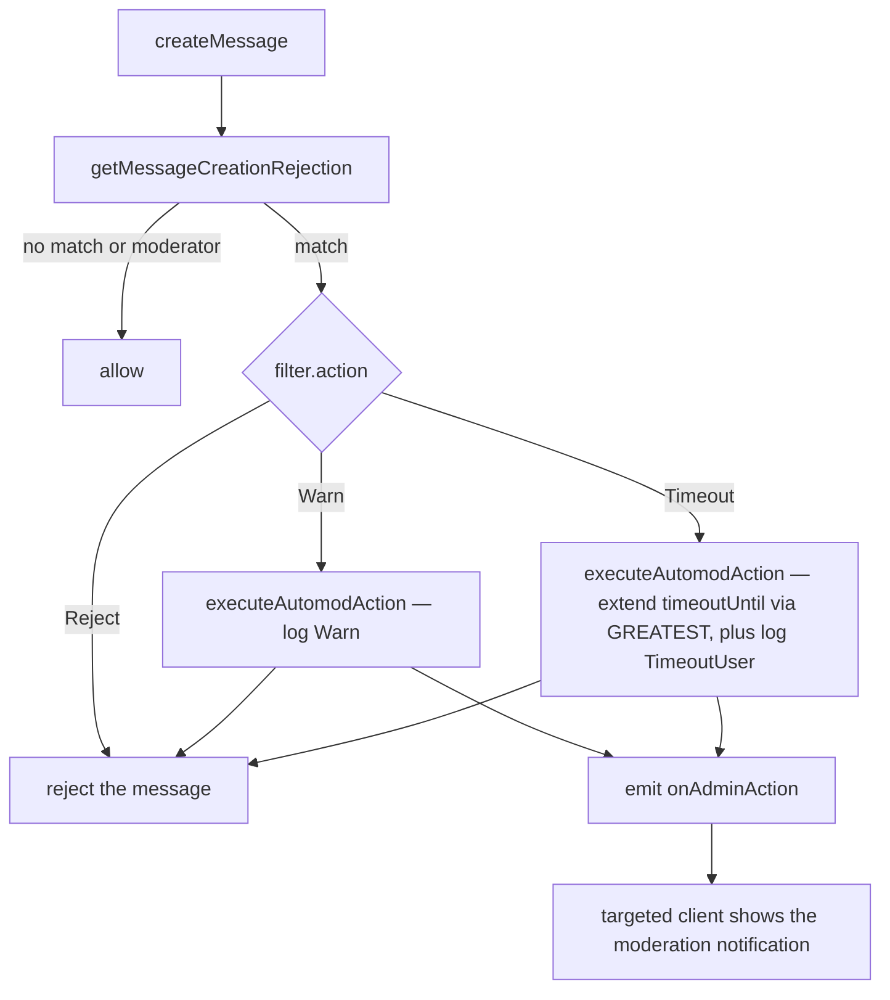

# Automod Actions

The room word filter does more than block: each filter carries a configurable action — **Reject** (the default), **Warn**, or **Timeout** — turning the shipped filter into a Discord-style AutoMod-lite. Every action still rejects the matching message (Discord blocks and acts) — the action decides what happens to the sender afterwards.

## How it works

`getMessageCreationRejection` (the shared gate in `@esposter/db`) runs on every message-producing path. It is free of side effects: on a match by a member who cannot manage messages it hands back the matched filter rather than applying it, and the caller that rejects the message is the one that spends the consequence — `assertCanCreateMessage` in the app, its namesake in the Function worker. Warn and Timeout call `executeAutomodAction`, which records a moderation-log row attributed to a reserved **AutoMod** actor id; the app's wrapper additionally emits the same `onAdminAction` event a manual warn or timeout would, so the targeted client reacts identically. Timeout additionally **extends** `timeoutUntil` on the member: the write is `GREATEST(existing, new)`, so an automod timeout can never shorten a longer one a moderator already applied, and — because Postgres `GREATEST` ignores nulls — a null or expired existing value simply becomes the new date.

The moderation-log write is best-effort — a logging failure never turns the block into a server error. The audit log renders the reserved actor as **AutoMod** instead of resolving a member name.

## Data model

`roomFiltersInMessage` gains `action` (Postgres enum `word_filter_action`: `Reject` default, `Warn`, `Timeout`) and `timeoutDurationMs` (nullable integer). A database CHECK enforces that a `Timeout` action always carries a positive duration, and the router clears the duration whenever the action is not `Timeout` so a stale value can never re-arm a timeout.

## Procedures

No new procedure — `room.filter.upsertRoomFilter` (gated `ManageRoom`) accepts the new `action` and `timeoutDurationMs` fields, and `readRoomFilter` now returns the full filter row so the settings panel can render them. Automod is a caller of the moderation internals, not a new moderation primitive.

## Key files

| File                                                                                | Role                                                          |
| :---------------------------------------------------------------------------------- | :------------------------------------------------------------ |
| `packages/db-schema/src/schema/roomFiltersInMessage.ts`                             | `action` + `timeoutDurationMs` + enum                         |
| `packages/db/src/services/message/moderation/getMessageCreationRejection.ts`        | the shared gate — returns the matched filter, applies nothing |
| `packages/db/src/services/message/moderation/executeAutomodAction.ts`               | timeout + moderation-log core                                 |
| `packages/app/server/services/message/moderation/executeAutomodAction.ts`           | app wrapper — adds the `onAdminAction` emit                   |
| `packages/db/src/services/message/moderation/writeModerationLogEntry.ts`            | shared audit-log writer                                       |
| `packages/db-schema/src/services/message/constants.ts`                              | reserved AutoMod actor id (`AUTOMOD_USER_ID`)                 |
| `packages/app/app/components/Message/Model/Room/Settings/Type/WordFilter/Index.vue` | action + duration settings                                    |

## Notes

Raid-mode (bulk-join throttling) is intentionally not part of this — see [deferred](/docs/esbabbler/deferred/raid-mode).
