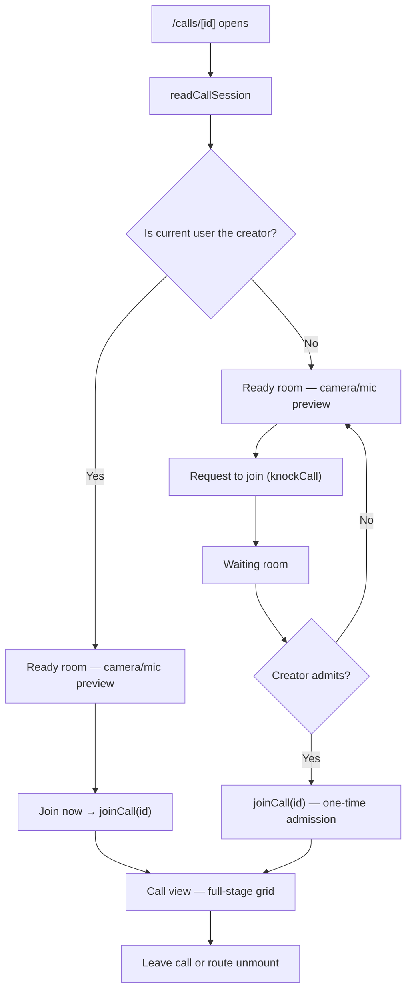

# Call View UI

Full-screen call experience for `/calls/[id]`, with `/calls` as the standalone lobby/start page. The same components render the inline room call (compact panel + fullscreen dialog in `Message/Content/`), so the two surfaces never diverge.

## Layout

The participant grid (or, when presenting, the screenshare stage) **is** the surface — it fills `<main>` directly with no outer wrapper card. Grid distribution by count: 1 participant = one full-stage column, 2 = up to two columns, 3+ = the wider responsive grid; no side panel is reserved in the default view. The control bar is an absolute bottom-center `StyledCard` pill.

- **`Call/View.vue`** — theme-backed full-size flex column. Its top bar is an absolute top-right overlay (never pushes the stage down), rendered only when there is something to show: the Meet-style **presenter pill** (`{name} is presenting` + inline tonal **Stop presenting** when you are the presenter) plus an `append` slot where the room dialog injects its **Close call view** button — pill and close share one container.
- **`Call/Participant/Tile.vue`** — `StyledCard` tile: camera `<video>` when available, else centered `StyledAvatar`; speaking ring (animated green outline); bottom-left name + mute badge; raise-hand, screenshare, and self-only deafened badges.
- **`Call/Control/Bar.vue`** — grouped mic + up-caret audio settings, grouped camera + up-caret video settings/virtual backgrounds, deafen, raise hand, screenshare, PiP pop-out, leave. Moderators (`MuteMembers`) get "Lower Hand" in a participant's action menu.
- **`Call/Stage.vue`** — the shared presenter/grid stage used by both the full view and the PiP window (`isDense`); see [screenshare](/docs/esbabbler/calls/screenshare) for the presenter layout.

## Prejoin / ready room

Every standalone visitor sees prejoin before entering — it is where mic/camera state gets verified, so even the creator is never auto-joined on mount.

Prejoin layout: `flex-col` on mobile, `lg:flex-row` — a `flex-1` left column (camera preview hero above centered media controls) and a `shrink-0` right column ("Ready to join?" card above an invisible spacer whose height mirrors the controls via `useElementSize`, so the card lines up with the preview exactly). No manual widths/heights; mic/camera state is conveyed by the toggle buttons' icon/error colour, never duplicated as text.

## Room call vs standalone call

| Aspect                     | Room call (`useCallSubscribables`)                                                      | Standalone (`useCallIdSubscribables`)         |
| -------------------------- | --------------------------------------------------------------------------------------- | --------------------------------------------- |
| Entry                      | one `joinCallByRoomId({ roomId })` mutation — finds or creates the session and joins it | creator/admitted `joinCall({ id })`           |
| `callRoomId`               | set (enables admin actions)                                                             | not set                                       |
| `currentRoomCallSessionId` | set for the viewed room                                                                 | not set                                       |
| Layout                     | compact strip in messages view + dialog                                                 | full-screen (`layout: false`)                 |
| Moderation actions         | available                                                                               | not available (no room membership)            |
| Route cleanup              | unsubscribe viewed-room observers only                                                  | unsubscribe **and** leave (unless popped out) |

`readCallSessionId` is not part of that entry path — `useCallSubscribables` queries it to learn whether the viewed room already has a call running (so the messages view can show the compact strip), and the server-side `StopScreenShare` admin action resolves the room's session through it.

`/calls/[id]` unmount cancels any pending knock, unsubscribes, and calls `store.leaveCall()` — the page is the call context. The one exception is a [picture-in-picture](/docs/esbabbler/calls/picture-in-picture) pop-out, which keeps the standalone call alive across navigation.

## Key files

| File                                                                       | Role                                             |
| :------------------------------------------------------------------------- | :----------------------------------------------- |
| `packages/app/app/pages/calls/index.vue`                                   | lobby/start page                                 |
| `packages/app/app/pages/calls/[id].vue`                                    | fullscreen call route (prejoin → waiting → call) |
| `packages/app/app/components/Message/Content/Call/View.vue`                | full call surface + top bar                      |
| `packages/app/app/components/Message/Content/Call/Stage.vue`               | shared presenter/grid stage                      |
| `packages/app/app/components/Message/Content/Call/Participant/Tile.vue`    | participant tile                                 |
| `packages/app/app/components/Message/Content/Call/Control/Bar.vue`         | control pill                                     |
| `packages/app/app/components/Message/Content/Call/PreJoin/`                | prejoin preview                                  |
| `packages/app/app/composables/message/room/call/useCallIdSubscribables.ts` | standalone page membership                       |
