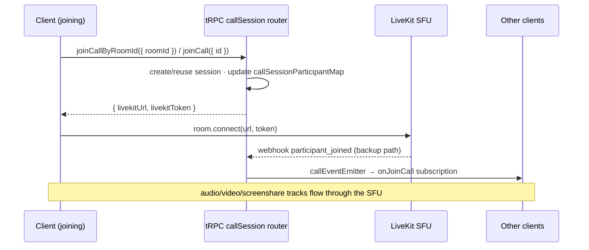
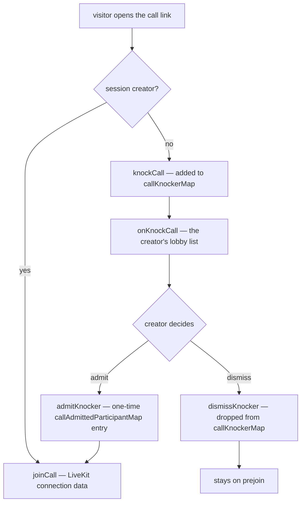
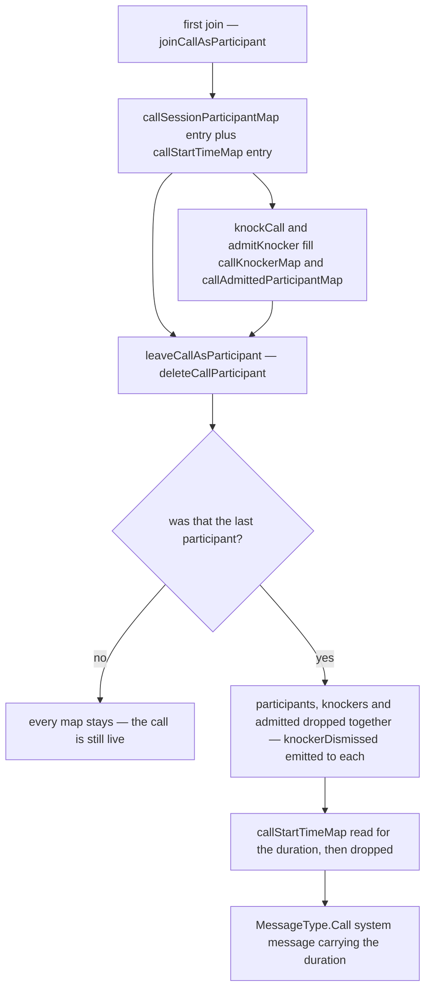

# Calls

Discord-style persistent per-room drop-in audio/video plus standalone share-link calls (like Google Meet). Room members join/leave room calls freely; `/calls` starts a roomless call joinable by anyone with the link. Media runs through the **LiveKit SFU** — the server generates access tokens and keeps a participant map for observers; LiveKit handles all WebRTC signaling, track publication, simulcast, and bandwidth estimation.

Sub-pages: [call view UI](/docs/esbabbler/calls/call-view) · [screenshare](/docs/esbabbler/calls/screenshare) · [picture-in-picture](/docs/esbabbler/calls/picture-in-picture) · [per-user volume](/docs/esbabbler/calls/per-user-volume). Voice preferences applied to calls: [/docs/esbabbler/voice-video](/docs/esbabbler/voice-video).

## The session model

A call is anchored to a `callSessionsInMessage` row, not a route:

- `id: text` PK — a **12-char alphanumeric token** (`createId(CALL_ID_LENGTH)`, crypto-secure); the id _is_ the shareable link token.
- `roomId` — set for room calls (unique FK → rooms, cascade); null-scoped standalone calls persist ownership on `userId` (creator).
- The session row is the persistent 1:1 anchor per room and survives restarts; participants do not (in-memory `callSessionParticipantMap`).

`CallParticipant.id` is the **auth `session.id`, not `user.id`** — the LiveKit `AccessToken` uses `identity: session.id`, so each device is its own participant (separate tracks, separate mute state). Using `user.id` would make multi-device join last-write-wins and let device A's leave evict device B.

## The call lifetime boundary

**Call membership is anchored to `activeCallSessionId`, never the viewed route.** `activeCallSessionId` answers "what call am I in?"; `currentRoomCallSessionId` answers "what call belongs to the room I'm looking at?" — they can differ, and that is valid. Navigating rooms swaps the observer only.

Leave happens only on: explicit **Leave Call**, moderation (`KickFromCall`/`KickFromRoom`/`TimeoutUser`/`CreateBan` on the call's room), real session loss (logout, tab close, LiveKit `participant_left` webhook), or `/calls/[id]` unmount (that page _is_ the call context — except when popped out to [picture-in-picture](/docs/esbabbler/calls/picture-in-picture)).

| Owner                       | Responsibility                                                                                      | Must not do                                         |
| --------------------------- | --------------------------------------------------------------------------------------------------- | --------------------------------------------------- |
| `callStore.leaveCall()`     | the only normal path that leaves, disconnects LiveKit, and resets active state                      | run implicitly during room navigation               |
| `useCallSubscribables()`    | observes the viewed room's session; updates `currentRoomCallSessionId` / participants               | remove the active participant or disconnect LiveKit |
| `useCallIdSubscribables()`  | owns `/calls/[id]` membership; validates session, subscribes, leaves on unmount (unless popped out) | reuse room-navigation cleanup semantics             |
| `LeftSideBar/StatusBar.vue` | surfaces **any** active call (room or standalone) and links back to it                              | decide membership from `currentRoomCallSessionId`   |

## Join flow

The LiveKit webhook (`server/api/webhooks/livekit.post.ts`, validated with `WebhookReceiver`) is the **backup** for clients that disconnect without calling `leaveCall` (tab crash, network drop) — never the primary path for in-app route changes.

### Standalone knock lobby

Every `/calls/[id]` visitor sees prejoin (verify mic/camera) first. The creator (persisted `callSessionsInMessage.userId`) gets **Join now**; non-creators get **Request to join** → `knockCall` puts them in `callKnockerMap`, the creator admits (`admitKnocker` → one-time entry in `callAdmittedParticipantMap`) or dismisses, and only then does `joinCall({ id })` succeed.

The creator's lobby list is optimistic: admitting or dismissing removes that knocker at once, and each knocker is its own write target so a host can work down the queue without the writes queueing. A rejected one therefore puts back **only** its own knocker — reinstating the list as it stood would resurrect one already admitted beside it and drop whoever `onKnockCall` delivered meanwhile.

## Ephemeral server state

Everything about a live call except its anchor row lives in module-level maps under `server/services/message/call/`, each keyed by `callSessionId` and each lost on restart. There are four of them rather than one record per session, and the split is load-bearing rather than incidental:

- `callSessionParticipantMap` — the participants, keyed by auth session id. Created by the first join and deleted when the last participant leaves, so its presence _is_ what "this call is live" means, and `requireJoinedCallSession` reads nothing else.
- `callKnockerMap` and `callAdmittedParticipantMap` — the standalone waiting room. They are torn down with the participant map, because a call nobody is in has nobody left to admit anyone.
- `callStartTimeMap` — set by the first joiner and read by the **last leaver, after the other three are already gone**, to word the call-duration system message. It outlives the teardown on purpose, which is exactly why it cannot be a field of a record deleted as a unit.

Every teardown path funnels through `leaveCallAsParticipant` — the explicit leave, the LiveKit `participant_left` webhook and the moderation actions alike — so the start time is never orphaned by a call that ended some other way.

### A restart does not end the calls

Losing these maps is survivable, not correct. LiveKit is an external SFU reached over `LIVEKIT_URL`; this process mints tokens and receives webhooks but holds no media connection, so a call in progress is entirely unaffected by the process going away and its participants stay connected to the SFU throughout. What the restart destroys is only this side's picture of them, and three things follow from that:

- `requireJoinedCallSession` reads the participant map and nothing else, so every pre-restart participant is locked out of the call procedures until they rejoin, while still being in the call.
- Their eventual `participant_left` webhook finds no map entry, `deleteCallParticipant` returns `false`, and `leaveCallAsParticipant` returns early — no `leaveCall` event, no duration message.
- The next join reads `isFirstJoiner` from that same empty map and re-stamps `callStartTimeMap`, so the duration the call finally reports is measured from the restart rather than from the call.

**Undecided: whether to reconcile.** The fix is to ask LiveKit who is actually in the room and rebuild the maps from the answer, or to close the rooms on boot and make the clients rejoin. The first needs a trigger, and a poll is the wrong one — there is a `RoomServiceClient` listing to call, but nothing native that fires on "this process just lost its state", which is what the `no-scheduled-jobs` rule is about. The second is a visible interruption for something that only happens on deploy. Nothing here is load-bearing until calls outlive deploys often enough to notice, so it is written down rather than built.

## Procedures

All in `server/trpc/routers/call/index.ts`, registered as `callSession`; the waiting-room procedures live in `server/trpc/routers/call/knocker.ts` and merge in under a `knocker` key:

| Procedure                                                                             | Auth               | Purpose                                                                              |
| ------------------------------------------------------------------------------------- | ------------------ | ------------------------------------------------------------------------------------ |
| `createCall`                                                                          | authed             | create a standalone roomless session (`/calls`)                                      |
| `readCallSessionId({ roomId })`                                                       | member             | room observer entry; returns `""` if none (never null)                               |
| `readCallSession({ id })`                                                             | authed             | standalone validation for `/calls/[id]`                                              |
| `joinCallByRoomId({ roomId })`                                                        | member             | create/reuse room session; returns LiveKit connection data                           |
| `joinCall({ id })`                                                                    | authed             | standalone join — creator or admitted knocker only                                   |
| `leaveCall({ callSessionId })`                                                        | authed             | remove from participant map; last leaver posts the `MessageType.Call` system message |
| `readCallParticipantMap({ callSessionId })`                                           | authed             | initial participant map for observers                                                |
| `setMute` / `setCamera`                                                               | authed             | sync state to the server map; broadcast                                              |
| `setHandRaised`                                                                       | authed / moderator | raise own hand; lowering another's needs `MuteMembers` on the call's room            |
| `knocker.knockCall` / `knocker.admitKnocker` / `knocker.dismissKnocker`               | authed / creator   | standalone waiting room                                                              |
| `onJoinCall` / `onLeaveCall` / `onSetMute` / `onVideoChanged` / `onHandRaisedChanged` | authed             | subscriptions keyed by `callSessionId`                                               |
| `knocker.onKnockCall` / `knocker.onKnockerAdmitted` / `knocker.onKnockerDismissed`    | authed             | waiting-room subscriptions keyed by `callSessionId`                                  |

Tokens grant `canPublishSources: [Microphone, Camera, ScreenShare, ScreenShareAudio]` with `room: callSessionId` and `metadata: { userId }`.

## Client stores

`store/message/room/call/index.ts` is the orchestration root (session boundaries, tRPC + SDK coordination); focused state lives in smaller stores so the LiveKit bridge never imports the root:

| Store                 | Owns                                                                                                                                                      |
| --------------------- | --------------------------------------------------------------------------------------------------------------------------------------------------------- |
| `call/index.ts`       | `activeCallSessionId`, `currentRoomCallSessionId`, `callRoomId` (admin-action room checks)                                                                |
| `call/participant.ts` | `callSessionParticipantsMap` (keyed by session id), `speakingIds`, join notice                                                                            |
| `call/media.ts`       | deafen, force-mute, camera, screenshare + pin state, virtual background, `isPoppedOut`, streams, [per-user volume](/docs/esbabbler/calls/per-user-volume) |
| `call/knocker.ts`     | `knockingCallSessionId`, pre-join options, knocker queue                                                                                                  |
| `liveKit.ts`          | the LiveKit `Room` media bridge: connect, track events, device switching, mic processor                                                                   |

DM calls work identically — call procedures accept `RoomType.DirectMessage`; membership via `usersToRooms` gates access. The first joiner posts the `MessageType.Call` "started a call" system message, and call end writes the call-duration variant.

## Key files

| File                                                     | Role                                                     |
| :------------------------------------------------------- | :------------------------------------------------------- |
| `packages/db-schema/src/schema/callSessionsInMessage.ts` | session anchor table                                     |
| `packages/app/server/trpc/routers/call/index.ts`         | all call procedures (registered as `callSession`)        |
| `packages/app/server/trpc/routers/call/knocker.ts`       | waiting-room procedures (merged under `knocker`)         |
| `packages/app/server/services/message/call/`             | participant/knocker/admitted maps + CRUD                 |
| `packages/app/server/api/webhooks/livekit.post.ts`       | webhook backup for join/leave                            |
| `packages/app/app/store/message/room/call/`              | root + participant + media + knocker stores              |
| `packages/app/app/store/message/room/liveKit.ts`         | LiveKit `Room` bridge                                    |
| `packages/app/app/pages/calls/`                          | standalone lobby (`index.vue`) + call route (`[id].vue`) |

## Notes

- **An SFU rather than a mesh.** Mesh WebRTC costs each participant an upload per peer, which video and screenshare make unsustainable past a handful of people; routing through LiveKit also means the app owns no signaling procedures of its own.
- Hosting: LiveKit Cloud free tier (5,000 participant-minutes/month) now; self-hosted LiveKit on Azure Container Apps (~$5–15/month, scales to zero) when usage exceeds ~10,000 participant-minutes/month.
- Empty-string sentinel: `readCallSessionId` returns `""` when the room has no session, never `null`.
- Virtual backgrounds: starter image presets via `@livekit/track-processors`; selecting a preset turns the camera on, and camera-off resets the processor.
