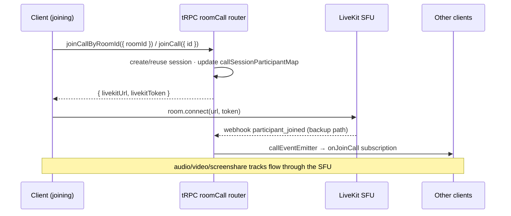

# Calls

Discord-style persistent per-room drop-in audio/video plus standalone share-link calls (like Google Meet). Room members join/leave room calls freely; `/calls` starts a roomless call joinable by anyone with the link. Media runs through the **LiveKit SFU** — the server generates access tokens and keeps a participant map for observers; LiveKit handles all WebRTC signaling, track publication, simulcast, and bandwidth estimation.

Sub-pages: [call view UI](/docs/esbabbler/calls/call-view) · [screenshare](/docs/esbabbler/calls/screenshare) · [picture-in-picture](/docs/esbabbler/calls/picture-in-picture). Voice preferences applied to calls: [/docs/esbabbler/voice-video](/docs/esbabbler/voice-video).

## The session model

A call is anchored to a `callSessionsInMessage` row, not a route:

- `id: text` PK — a **12-char alphanumeric token** (`createToken`, crypto-secure); the id _is_ the shareable link token.
- `roomId` — set for room calls (unique FK → rooms, cascade); null-scoped standalone calls persist ownership on `userId` (creator).
- The session row is the persistent 1:1 anchor per room and survives restarts; participants do not (in-memory `callSessionParticipantMap`).

`CallParticipant.id` is the **auth `session.id`, not `user.id`** — the LiveKit `AccessToken` uses `identity: session.id`, so each device is its own participant (separate tracks, separate mute state). Using `user.id` would make multi-device join last-write-wins and let device A's leave evict device B.

## The call lifetime boundary

**Call membership is anchored to `activeCallSessionId`, never the viewed route.** `activeCallSessionId` answers "what call am I in?"; `currentRoomCallSessionId` answers "what call belongs to the room I'm looking at?" — they can differ, and that is valid. Navigating rooms swaps the observer only.

Leave happens only on: explicit **Leave Call**, moderation (`KickFromCall`/`KickFromRoom`/`TimeoutUser`/`CreateBan` on the call's room), real session loss (logout, tab close, LiveKit `participant_left` webhook), or `/calls/[id]` unmount (that page _is_ the call context — except when popped out to [picture-in-picture](/docs/esbabbler/calls/picture-in-picture)).

| Owner                       | Responsibility                                                                                      | Must not do                                         |
| --------------------------- | --------------------------------------------------------------------------------------------------- | --------------------------------------------------- |
| `callStore.leaveCall()`     | the only normal path that leaves, disconnects LiveKit, and resets active state                      | run implicitly during room navigation               |
| `useCallSubscribables()`    | observes the viewed room's session; updates `currentRoomCallSessionId` / participants               | remove the active participant or disconnect LiveKit |
| `useCallIdSubscribables()`  | owns `/calls/[id]` membership; validates session, subscribes, leaves on unmount (unless popped out) | reuse room-navigation cleanup semantics             |
| `LeftSideBar/StatusBar.vue` | surfaces **any** active call (room or standalone) and links back to it                              | decide membership from `currentRoomCallSessionId`   |

## Join flow

The LiveKit webhook (`server/api/webhooks/livekit.post.ts`, validated with `WebhookReceiver`) is the **backup** for clients that disconnect without calling `leaveCall` (tab crash, network drop) — never the primary path for in-app route changes.

### Standalone knock lobby

Every `/calls/[id]` visitor sees prejoin (verify mic/camera) first. The creator (persisted `callSessionsInMessage.userId`) gets **Join now**; non-creators get **Request to join** → `knockCall` puts them in `callKnockerMap`, the creator admits (`admitKnocker` → one-time entry in `callAdmittedParticipantMap`) or dismisses, and only then does `joinCall({ id })` succeed.

## Procedures

All in `server/trpc/routers/room/call.ts`, registered as `roomCall`:

| Procedure                                                                                                                  | Auth             | Purpose                                                                              |
| -------------------------------------------------------------------------------------------------------------------------- | ---------------- | ------------------------------------------------------------------------------------ |
| `createCall`                                                                                                               | authed           | create a standalone roomless session (`/calls`)                                      |
| `readCallSessionId({ roomId })`                                                                                            | member           | room observer entry; returns `""` if none (never null)                               |
| `readCallSession({ id })`                                                                                                  | authed           | standalone validation for `/calls/[id]`                                              |
| `joinCallByRoomId({ roomId })`                                                                                             | member           | create/reuse room session; returns LiveKit connection data                           |
| `joinCall({ id })`                                                                                                         | authed           | standalone join — creator or admitted knocker only                                   |
| `leaveCall({ callSessionId })`                                                                                             | authed           | remove from participant map; last leaver posts the `MessageType.Call` system message |
| `readCallParticipants({ callSessionId })`                                                                                  | authed           | initial list for observers                                                           |
| `setMute` / `setCamera`                                                                                                    | authed           | sync state to the server map; broadcast                                              |
| `knockCall` / `admitKnocker` / `dismissKnocker`                                                                            | authed / creator | standalone waiting room                                                              |
| `onJoinCall` / `onLeaveCall` / `onSetMute` / `onVideoChanged` / `onKnockCall` / `onKnockerAdmitted` / `onKnockerDismissed` | authed           | subscriptions keyed by `callSessionId`                                               |

Tokens grant `canPublishSources: [Microphone, Camera, ScreenShare, ScreenShareAudio]` with `room: callSessionId` and `metadata: { userId }`.

## Client stores

`store/message/room/call/index.ts` is the orchestration root (session boundaries, tRPC + SDK coordination); focused state lives in smaller stores so the LiveKit bridge never imports the root:

| Store                 | Owns                                                                                            |
| --------------------- | ----------------------------------------------------------------------------------------------- |
| `call/index.ts`       | `activeCallSessionId`, `currentRoomCallSessionId`, `callRoomId` (admin-action room checks)      |
| `call/participant.ts` | `callSessionParticipantsMap` (keyed by session id), `speakingIds`, join notice                  |
| `call/media.ts`       | deafen, force-mute, camera, screenshare + pin state, virtual background, `isPoppedOut`, streams |
| `call/knocker.ts`     | `knockingCallSessionId`, pre-join options, knocker queue                                        |
| `liveKit.ts`          | the LiveKit `Room` media bridge: connect, track events, device switching, mic processor         |

DM calls work identically — call procedures accept `RoomType.DirectMessage`; membership via `usersToRooms` gates access. The first joiner posts the `MessageType.Call` "started a call" system message, and call end writes the call-duration variant.

## Key files

| File                                                     | Role                                                     |
| :------------------------------------------------------- | :------------------------------------------------------- |
| `packages/db-schema/src/schema/callSessionsInMessage.ts` | session anchor table                                     |
| `packages/app/server/trpc/routers/room/call.ts`          | all procedures                                           |
| `packages/app/server/services/message/call/`             | participant/knocker/admitted maps + CRUD                 |
| `packages/app/server/api/webhooks/livekit.post.ts`       | webhook backup for join/leave                            |
| `packages/app/app/store/message/room/call/`              | root + participant + media + knocker stores              |
| `packages/app/app/store/message/room/liveKit.ts`         | LiveKit `Room` bridge                                    |
| `packages/app/app/pages/calls/`                          | standalone lobby (`index.vue`) + call route (`[id].vue`) |

## Notes

- v1 was mesh WebRTC (≤ 8 users, audio only, N² upload); LiveKit replaced it because video/screenshare make mesh bandwidth unsustainable and LiveKit removes all signaling procedures (`sendSignal`/`onSendSignal` deleted).
- Hosting: LiveKit Cloud free tier (5,000 participant-minutes/month) now; self-hosted LiveKit on Azure Container Apps (~$5–15/month, scales to zero) when usage exceeds ~10,000 participant-minutes/month.
- Empty-string sentinel: `readCallSessionId` and `readInviteToken` return `""`, never `null`.
- Virtual backgrounds: starter image presets via `@livekit/track-processors`; selecting a preset turns the camera on, and camera-off resets the processor.
