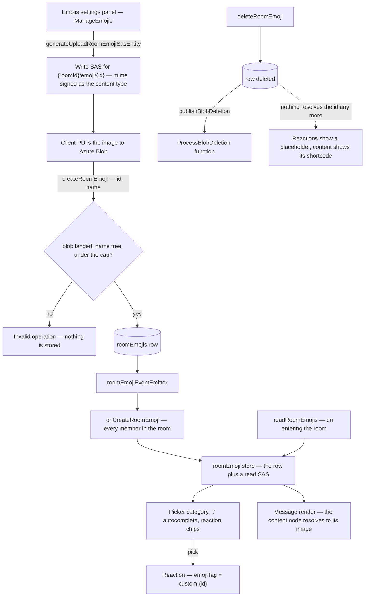

# Custom Emoji

A room uploads its own emoji, and from then on they behave like any other emoji: they appear in the picker under a category of the room's own, `:` autocomplete completes them, they can be reacted with, and they render inline in message content. Everything about the picking surfaces is [the one emoji index](/docs/esbabbler/emoji) — this page is the room-owned half: where the image lives, what bounds it, and how a room's emoji is named in the two places it can be stored.

Stickers are a different feature and deliberately not this one — a sticker is a message rather than a glyph ([stickers](/docs/esbabbler/deferred/stickers)).

## The shape of it

## Data model

One table, `roomEmojis`, holding an `id`, a `name`, and its `roomId`. The blob is **derived** from the id — `{roomId}/emoji/{id}` in the message-assets container — so there is no url column to keep in step with storage, nothing to migrate if the layout changes, and no second answer to where the image is.

Two constraints carry the whole shortcode contract:

- **A unique index on `(roomId, name)`**, so one shortcode names at most one emoji in a room.
- **A name check constraint** restricting the name to lowercase letters, digits and underscores — the same closed charset the Unicode dataset's slugs use, which is what lets `:name:` resolve against one vocabulary rather than two.

A name a Unicode slug already owns is **rejected at upload**, not shadowed at read. Shadowing would make the same `:fire:` render differently per room, and a room that later deleted its own entry would silently change every message that used it.

That check reads the dataset as it stands, so a later Unicode release can still introduce a slug an existing room emoji already uses. Nothing breaks when it does: every reaction and every message resolves by id, so the room's own emoji renders exactly as before and only the shortcode becomes ambiguous in search and `:` completion, which a rename settles.

## What bounds the cost

Room emoji are room-owned, exactly like attachments, so they sit outside the personal [storage quota](/docs/platform/storage-quotas) for the reason that mechanism states — a room's files belong to the room, not to whoever uploaded them. What bounds them instead is a **per-room count cap** plus the per-file size and mime caps the write SAS is minted under, which is also Discord's model.

The cap is the whole accounting story: a room's worst case is a fixed number rather than an open-ended one, with nothing to meter, no ledger row per emoji, and no usage figure for a room owner to act on. It is checked twice on purpose — once when the write target is minted, so a full room never receives one it cannot use, and again inside the transaction that inserts, which is what stops two uploads racing the last slot.

The cap counts **rows**, so a member with `ManageEmojis` who mints write targets and never creates the rows leaves blobs the cap cannot see, bounded per file by the size the SAS is signed with and swept only when the room is deleted. That is the known limit of counting rows rather than reservations; if abandoned uploads ever appear in a room's storage figures, the answer is a pending row that counts toward the cap and expires, not a sweeper.

## Identity: the id, never the name

**A reaction stores `custom:{id}`.** A Unicode tag is a sequence of code points and can never contain a colon, so the two namespaces cannot collide, and `emojiTag` stays a single opaque string compared by equality — nothing about storing, matching or delivering a reaction knows that custom emoji exist.

**Message content stores a node** carrying the id and the name, and no url: the image is a short-lived read SAS, so serializing one would persist a credential that expires. The node's own text is the shortcode, which is what the composer shows while typing and what a reader sees when the emoji is gone.

Both are keyed by **id**, which is the one deliberate divergence from Discord's `name:id`: renaming an emoji leaves every existing reaction and every message that used it intact.

## Resolution, and what a deleted emoji does

A room's set is read when the room is entered and kept current by its subscription, so every surface resolves an id through one store map. Rendering follows [content token rewriting](/docs/architecture/content-token-rewriting): the message is parsed once, and each custom-emoji node is replaced in that same tree with an `` sized in `em` so it follows the line's own text size.

An id that resolves to nothing is **data, not an error**. A reaction to a deleted emoji still counts and renders a placeholder rather than disappearing; a content node keeps the shortcode it was authored with; and one unresolvable emoji never fails the render of the message around it.

## Teardown

Deleting an emoji removes the row first and then publishes the blob deletion, best-effort and post-persist like every other attachment delete ([file & media](/docs/esbabbler/file-media)). An abandoned upload — a write SAS that was used but whose create never ran — leaves a blob no row reaches, under the `{roomId}/…` prefix the room's own deletion sweeps, and it is invisible until then because every read goes through the row.

## Key files

| File                                                                    | Role                                                       |
| :---------------------------------------------------------------------- | :--------------------------------------------------------- |
| `packages/db-schema/src/schema/roomEmojisInMessage.ts`                  | the table, the name charset, and the per-room unique index |
| `packages/app/server/trpc/routers/room/emoji.ts`                        | upload SAS, create, rename, delete, read, subscriptions    |
| `packages/app/server/services/message/emoji/getRoomEmojiBlobName.ts`    | the one place the blob name is spelled                     |
| `packages/app/server/services/message/emoji/getIsUnicodeEmojiSlug.ts`   | the shadowing guard                                        |
| `packages/app/app/store/message/room/emoji.ts`                          | the room's set, its upload action, and the id-keyed map    |
| `packages/app/app/models/message/emoji/CustomEmoji.ts`                  | what a picking surface sees                                |
| `packages/app/app/components/Styled/Emoji.vue`                          | one glyph component — a character or an image              |
| `packages/app/app/components/Message/Model/Message/EmojiTag.vue`        | a stored reaction tag, resolved or placeheld               |
| `packages/app/app/composables/message/emoji/useCustomEmojiExtension.ts` | the content node, carrying id and name and no url          |
| `packages/app/app/composables/message/useMessageHtml.ts`                | the render pass — mentions and emoji, one parse            |
| `packages/app/app/components/Message/Model/Room/Settings/Type/Emoji/`   | the settings panel: upload, rename, delete                 |

## Notes

The composer shows the shortcode while an emoji is being typed rather than the image. A Tiptap node view would preview it, and would change nothing about storage — the node is the same either way.

Animated emoji are out of scope: an animated upload is a different content type, a different size cap, and a per-render cost on a list that already has a per-item weight budget ([message list rendering](/docs/esbabbler/message-list-rendering)).
