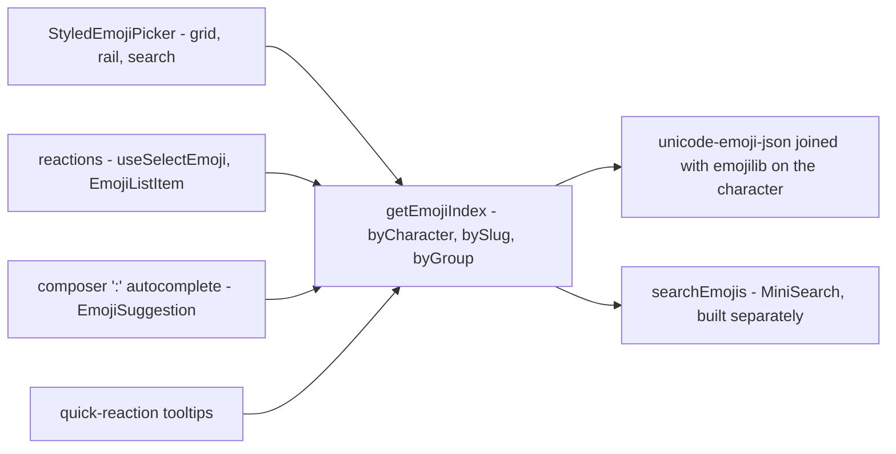

# Emoji

Every emoji surface — the picker grid, a stored reaction, the composer's `:` autocomplete and the quick-reaction tooltips — resolves through **one index built from one dataset**. There is no emoji dependency: the picker is our own `<script setup>` components, and the lookups are three maps.

This replaced two libraries that agreed on nothing. `emoji-mart-vue-fast` drew the grid from an Apple sprite sheet on `unpkg.com` (pinned in `ImageSourceWhitelist` so the CSP allowed it), had no dark mode, and forced `vue.optionsApi` back on for the whole app because its `Picker.vue` is Options API. `node-emoji` resolved shortcodes from a pre-Unicode-14 dataset, compiled the user's query as a regex, and ignored the keywords its own dependency shipped. The two vocabularies disagreed: 😄 stored as `:smile:` while 🫠 stored as a raw glyph, and the round trip only appeared to work because both directions fall back to their input.

## The shape of it

## The dataset

Two data-only MIT packages, both keyed by the emoji character and both tracking the same Unicode release, so the join is a lookup rather than a reconciliation.

| Package              | Provides                                                        |
| -------------------- | --------------------------------------------------------------- |
| `unicode-emoji-json` | name, slug, CLDR group, canonical order, skin-tone support flag |
| `emojilib`           | keywords per character                                          |

**No version cutoff.** Whichever Unicode release `unicode-emoji-json` is pinned to in the catalog is the release the picker offers, so bumping the dependency is the whole of "support the newest emoji". Whether a glyph actually renders is the reader's OS and font talking, which no build-time filter can know — if a box is ever reported, the answer is runtime canvas measurement, not a hardcoded version. Ordering, both of the categories and within them, is the CLDR order the dataset already ships in.

`emojibase-data` is the richer alternative — tags, subgroups, shortcode presets for several vocabularies — but it unpacks to tens of megabytes because it ships every locale, and we would import one file. Reconsider only if localisation lands.

## The index

`getEmojiIndex` builds three maps on first use, once for the whole app. It is deliberately not built at import: a page with no emoji surface never pays for it, and the server never builds it at all.

| Structure          | Answers                                  |
| ------------------ | ---------------------------------------- |
| `bySlug: Map`      | what a stored reaction renders as        |
| `byCharacter: Map` | what a picked character is stored as     |
| `byGroup: Map`     | what a category tab shows, in CLDR order |

`byCharacter` is keyed by `getEmojiCharacterKey`, which strips skin-tone modifiers and variation selectors. That is what makes one emoji have exactly one identity however it arrives: a toned pick (👋🏽), a legacy unqualified glyph (`❤`) and the dataset's own qualified form (`❤️`) all resolve to the same record. There are no collisions across the whole dataset under that normalisation, and slugs are unique, so both maps are total.

**A reaction's tag is also its identity.** `useSelectEmoji` finds the existing row by matching it, so both sides go through `getEmojiSlug` before anything is compared — a row written as a raw glyph and one written as its shortcode are the same reaction and toggle rather than duplicating. Nothing is rewritten in Table Storage; only the identity rows are compared on becomes canonical. A tag the index does not know renders as itself rather than as nothing.

**Reactions are tone-insensitive, and this is the one deliberate divergence from Discord.** Because a reaction is stored as a slug, reacting with 👍🏽 and reacting with 👍 are the same reaction and toggle each other, and the row renders untoned. Discord keys reactions on the exact character instead, which fragments one sentiment into up to six separate rows on the same message. Tone is preserved everywhere the emoji is content rather than a key — the picker's grid, and anything the composer inserts.

### Search

Search is **MiniSearch**, the repo's one client-side index, per the [search standard](/docs/architecture/search) — a `computed` over an already-built index, with no server call, abort or pending state. It is built separately from the three maps, so a surface that only renders a stored reaction never builds a search index at all.

Three fields are indexed — slug, name, keywords — with the slug boosted hardest, because the shortcode is what a `:` query is naming. Two settings carry most of the relevance: `combineWith: "AND"` (the default unions terms, which makes `grin f` return most of the dataset) and `prefix: true`. An exact shortcode is pinned ahead of the ranked results, so `thumbs_up` resolves to 👍 alone. `fuzzy` is off: on names this short it manufactures noise.

**Punctuation is a delimiter, never an operator.** MiniSearch tokenizes on it rather than parsing it, so `grin(` searches for `grin`, and a query that is punctuation alone tokenizes to nothing and shows the empty state. There is no escaping step and no query syntax.

The picker and the `:` autocomplete share this one function and therefore one ranking — the two surfaces cannot disagree about what a query means.

## Skin tones

One tone, chosen once and persisted per device, applied to every emoji that supports one — Discord's model, not a per-emoji long-press.

`applySkinTone` takes the record rather than the character so the support flag cannot be forgotten; toning an emoji that does not support one would otherwise append a stray modifier beside it (🍎🏽). **The modifier attaches to the first code point, never the end**: 🧑‍💻 is a ZWJ sequence whose tone belongs to the person, so appending naively gives 🧑‍💻🏻 where the correct form is 🧑🏽‍💻. Variation selectors are dropped from the remainder, since a toned code point is already fully qualified.

The accepted limitation: Unicode allows a different tone per person in a sequence like 🧑‍🤝‍🧑, and one global setting only tones the first. Discord behaves the same way.

## The picker

`StyledEmojiPicker` is the `v-menu` and its activator; everything else lives in `StyledEmojiPicker/`. The overlay renders its content only once opened, which is what defers the index build to first open.

- **Search** replaces the grid wholesale while a query is running. The rail stays live rather than being disabled by it — picking a category clears the query.
- **One category renders at a time, and there is no virtualisation.** The largest CLDR group is under four hundred buttons, which a grid handles without help; the repo has no virtual-scroll primitive, and adding one for a cost that does not exist would be the opposite of lean. Discord scrolls continuously across all categories, which does need virtualisation — a deliberate deferral.
- **Categories are data, not the enum.** `getEmojiCategories` pins Frequently Used ahead of the nine CLDR groups when it has anything in it. That is also the seam [custom emoji](/docs/esbabbler/deferred/custom-emoji) would append to.
- **Recents and the chosen tone live in Pinia**, persisted through the `LocalStorageKey` registry. Recents are stored as slugs rather than characters so they survive a change of skin tone, and holding them in a store rather than a module singleton is what makes the category update the moment an emoji is picked.
- **Both themes come free** — Vuetify components and theme tokens throughout, no hardcoded palette.

## Key files

| File                                                              | Role                                                            |
| ----------------------------------------------------------------- | --------------------------------------------------------------- |
| `packages/app/app/services/message/emoji/getEmojiIndex.ts`        | The three maps, built once on first use                         |
| `packages/app/app/services/message/emoji/searchEmojis.ts`         | MiniSearch index and the exact-shortcode pin                    |
| `packages/app/app/services/message/emoji/getEmojiCharacterKey.ts` | Normalisation that gives one emoji one identity                 |
| `packages/app/app/services/message/emoji/applySkinTone.ts`        | Tone synthesis, including the ZWJ rule                          |
| `packages/app/app/services/message/emoji/getEmojiSlug.ts`         | Reverse lookup — the identity a reaction is compared on         |
| `packages/app/app/services/message/emoji/getEmojiCharacter.ts`    | Forward lookup — what a stored reaction renders as              |
| `packages/app/app/services/message/emoji/getEmojiCategories.ts`   | Frequently Used plus the nine CLDR groups                       |
| `packages/app/app/services/message/emoji/EmojiSuggestion.ts`      | The composer's `:` trigger, on the same index and ranking       |
| `packages/app/app/components/Styled/EmojiPicker.vue`              | The menu and its activator                                      |
| `packages/app/app/components/Styled/EmojiPicker/Panel.vue`        | Search field, category rail, grid, footer                       |
| `packages/app/app/store/message/emojiPicker.ts`                   | Recents and the chosen skin tone                                |
| `packages/app/app/types/unicodeEmojiJson.d.ts`                    | Declares the dataset's shape so TypeScript never reads the JSON |
