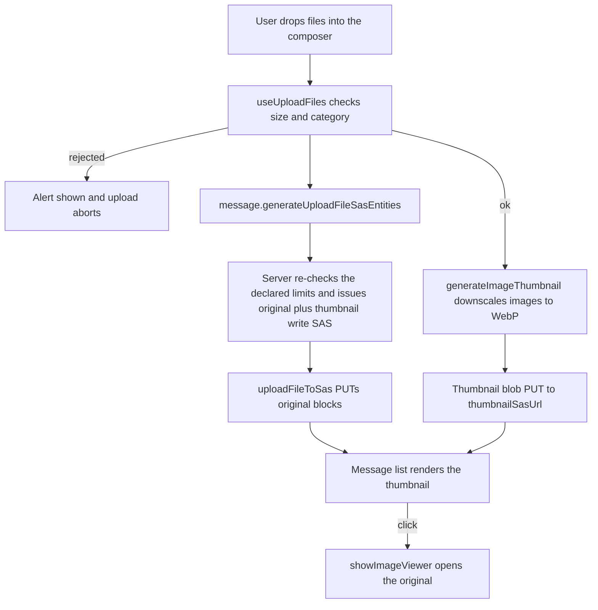

# File & Media

Message attachments upload through one shared SAS round-trip ([file uploads](/docs/architecture/file-uploads)). This page covers three enhancements layered on top of it: image thumbnails, per-room attachment limits, and browsing a room's attachments.

## How it works

Every upload site funnels through the `uploadFileToSas` service, which generates the write targets, PUTs the blocks, and optionally returns read urls. The message composer adds two things on top: it validates each file against the room's limits before the SAS query, and it downscales images to a thumbnail that uploads alongside the original.

Thumbnails are generated on the client with a canvas — each image is scaled so its longest edge is a fixed size and re-encoded to WebP. The server issues a second write SAS for the sibling blob at `{roomId}/{fileId}.thumb` whenever an image is uploaded, so the thumbnail lands in the same container and inherits the same blob-lifecycle tiering as the original. The message list renders the thumbnail inline and opens the full-resolution original in the lightbox.

Per-room limits live as columns on the `rooms` table and are checked at the SAS-issuing procedure, the only place a server sees an upload at all — the block PUT goes straight to Azure and never passes back through Nitro. The composer mirrors the same limits so a rejected file is surfaced before any network call.

The two limits are not enforced equally, and the difference matters:

- **The mime category is enforced.** The category is derived from the declared mimetype, and that same mimetype is signed into the write SAS as the blob's content type, so the PUT cannot store the blob as anything else.
- **The size cap is not enforced — it is checked against the size the client declares.** An Azure write SAS carries no length constraint, nothing re-reads the committed blob, and the persisted `FileEntity.size` is the declared number rather than a measured one. A client that declares a small size receives a SAS and can write past the room's cap with it until the SAS expires (`WRITE_SAS_DURATION_MS`). The check rejects an honest oversized drop early; it is not a defence against a client that lies.

Closing that gap needs something the direct-to-blob design does not have: either the upload passes back through the server, or a post-commit reader measures the blob and reconciles it. Neither exists today, so the size cap is a room-configured guardrail rather than a security boundary, and nothing downstream should assume an attachment is no larger than `maxFileSizeBytes`.

One rejected file rejects the whole drop, and the alert names it — the repo-wide rule for batch input ([file uploads](/docs/architecture/file-uploads)).

## Data model

Two columns on `rooms` (`packages/db-schema/src/schema/roomsInMessage.ts`):

- `maxFileSizeBytes` — nullable integer; null falls back to the global `MAX_FILE_REQUEST_SIZE`. The server clamps the effective cap to that global maximum regardless of the stored value.
- `allowedMimeCategories` — a `mime_category` enum array (`Image` / `Video` / `Audio` / `Document`), defaulting to every category. A file's category is derived from its mimetype prefix via `getMimeCategory`.

## Procedures

| Procedure                                  | Auth        | Input                               | Purpose                                                                                       |
| :----------------------------------------- | :---------- | :---------------------------------- | :-------------------------------------------------------------------------------------------- |
| `message.generateUploadFileSasEntities`    | Room member | files (filename, mimetype, size)    | Check the declared limits, issue original and thumbnail write SAS                             |
| `message.generateDownloadThumbnailSasUrls` | Room member | file ids                            | Read SAS for the `.thumb` blobs the message list renders                                      |
| `message.searchMessages`                   | Room member | query, filters                      | `has: file` lists a room's attachments — see [message search](/docs/esbabbler/message-search) |
| `room.updateRoom`                          | ManageRoom  | room fields incl. attachment limits | Persist per-room limits from the settings Moderation group                                    |

## Deletion is eventual, not guaranteed

Removing an attachment (`deleteFile`), deleting a message with attachments, or deleting a whole room does not delete the blobs inline. Read SAS urls are signed for a day (`generateReadSasUrl`, long enough to outlast a session held open, short enough that a leaked url dies quickly), so a delete that silently failed would still leave the file downloadable for the rest of that window. Instead the mutation publishes a `ProcessBlobDeletion` Event Grid event carrying the blob names (every delete funnels through the shared `publishBlobDeletion` helper), and an idempotent Azure Function (`deleteIfExists` per blob) retries the delete to completion — through Event Grid's retries and, past those, the [dead-letter replay](/docs/infra/eventgrid-dead-letter). Once the event is published, delivery is durable. The **publish itself stays best-effort** after the primary write ([persist then notify](/docs/architecture/persist-then-notify)), and there is no outbox or reconciliation sweep behind it: if the publish call fails, no event is ever created to retry or dead-letter, so the orphaned blob stays downloadable through its day-long SAS url until that expires. The delete cannot fail for the _user_ (the row is already gone), but blob removal is best-effort/eventual, not a hard guarantee — a durable outbox would be required to close that gap. The helper splits blob names into one event per `MAX_BLOB_DELETION_EVENT_BLOB_NAMES` chunk, so a room deletion's listing can never outgrow Event Grid's per-event size cap.

**Every delete names the thumbnail too**, unconditionally — `{roomId}/{fileId}.thumb` sits in the same container as its original, so it rides the same event. There is no is-this-an-image check because there is no need for one: `deleteIfExists` makes naming a thumbnail that was never generated a no-op, while deriving image-ness at delete time has to agree with whatever the upload decided — and the delete that guesses wrong leaves the thumbnail behind with nothing left to name it.

## Key files

| File                                                                                 | Role                                                        |
| :----------------------------------------------------------------------------------- | :---------------------------------------------------------- |
| `packages/app/app/services/file/uploadFileToSas.ts`                                  | The one SAS upload round-trip every site funnels through    |
| `packages/app/app/services/file/validateFile.ts`                                     | Single file validator returning a discriminated result      |
| `packages/app/app/services/file/generateImageThumbnail.ts`                           | Canvas downscale to a WebP thumbnail blob                   |
| `packages/app/app/services/file/showImageViewer.ts`                                  | Builds the hidden gallery element the lightbox engine reads |
| `packages/app/app/composables/message/file/useUploadFiles.ts`                        | Composer path — validate, upload original, upload thumbnail |
| `packages/app/app/composables/message/file/useReadFileUrls.ts`                       | Batch-resolves originals and thumbnails into read urls      |
| `packages/app/app/components/Message/Model/FileRenderer/Image.vue`                   | Renders the thumbnail inline, original in the lightbox      |
| `packages/db-schema/src/schema/roomsInMessage.ts`                                    | `maxFileSizeBytes` + `allowedMimeCategories` columns        |
| `packages/db-schema/src/services/file/getMimeCategory.ts`                            | Mimetype to coarse category mapping                         |
| `packages/db/src/services/azure/container/generateUploadFileSasEntities.ts`          | Issues the original and sibling thumbnail write SAS         |
| `packages/db/src/services/azure/search/filtersToClauses.ts`                          | `has: file` — the non-empty-attachments clause              |
| `packages/app/app/components/Message/Model/Room/Settings/Type/Attachments/Index.vue` | Room-settings Moderation page editing the limits            |
| `packages/app/server/services/azure/eventGrid/publishBlobDeletion.ts`                | The one chunked best-effort deletion publish                |
| `packages/azure-functions/src/handlers/processBlobDeletionHandler.ts`                | Durable blob deletion — idempotent `deleteIfExists` worker  |
| `packages/db-schema/src/models/azure/eventGrid/BlobDeletionEventGridData.ts`         | The deletion event payload and its schema                   |

## Notes

There is no server-side image processing — the [server-side transcoding](/docs/esbabbler/deferred/server-side-transcoding) deferral still stands. Thumbnails are best-effort: if a browser cannot produce one, or an older image predates the feature, the message list falls back to the original url. Older attachments therefore keep working without a backfill.

The renderer records **which thumbnail urls failed, as a set** — not a single "the thumbnail failed" flag. Whether the thumbnail blob exists at all is already recorded on the file by the upload that wrote it (`hasThumbnail`), so a load error here can only mean the url went stale: the read SAS expired ahead of the store's hourly sweep. Keying the failure to the url is what makes that terminate on its own — the sweep re-mints, the new url is not in the set, and the thumbnail comes back. A flag latched on the error never recovers, and downgrades every image in the room to its full-resolution original for the component's whole lifetime. The cost is that entries accumulate for as long as the message list stays mounted — one dead string per failed thumbnail per refresh cycle — and nothing prunes them. Accepted: a single ref reads as the tidier shape and is the one to reach for, which is why this says so — it is the shape that breaks recovery.
