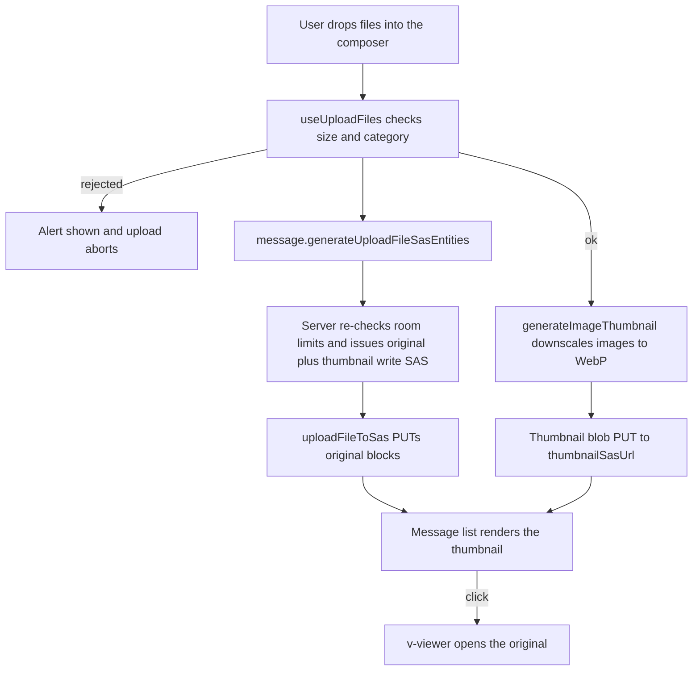

# File & Media

Message attachments upload through one shared SAS round-trip ([/docs/architecture/file-uploads](/docs/architecture/file-uploads)). This page covers three enhancements layered on top of it: image thumbnails, per-room attachment limits, and a files-in-room search tab.

## How it works

Every upload site funnels through the `uploadFileToSas` service, which generates the write targets, PUTs the blocks, and optionally returns read urls. The message composer adds two things on top: it validates each file against the room's limits before the SAS query, and it downscales images to a thumbnail that uploads alongside the original.

Thumbnails are generated on the client with a canvas — each image is scaled so its longest edge is a fixed size and re-encoded to WebP. The server issues a second write SAS for the sibling blob at `{roomId}/{fileId}.thumb` whenever an image is uploaded, so the thumbnail lands in the same container and inherits the same blob-lifecycle tiering as the original. The message list renders the thumbnail inline and opens the full-resolution original in the lightbox.

Per-room limits live as columns on the `rooms` table and are enforced at the only server chokepoint that sees every upload — the SAS-issuing procedure — because the block PUT goes straight to Azure and never passes back through Nitro. The composer mirrors the same limits so a rejected file is surfaced before any network call.

## Data model

Two columns on `rooms` (`packages/db-schema/src/schema/roomsInMessage.ts`):

- `maxFileSizeBytes` — nullable integer; null falls back to the global `MAX_FILE_REQUEST_SIZE`. The server clamps the effective cap to that global maximum regardless of the stored value.
- `allowedMimeCategories` — a `mime_category` enum array (`Image` / `Video` / `Audio` / `Document`), defaulting to every category. A file's category is derived from its mimetype prefix via `getMimeCategory`.

## Procedures

| Procedure                                  | Auth        | Input                               | Purpose                                                         |
| :----------------------------------------- | :---------- | :---------------------------------- | :-------------------------------------------------------------- |
| `message.generateUploadFileSasEntities`    | Room member | files (filename, mimetype, size)    | Enforce room limits, issue original and thumbnail write SAS     |
| `message.generateDownloadThumbnailSasUrls` | Room member | file ids                            | Read SAS for the `.thumb` blobs the message list renders        |
| `message.searchMessages`                   | Room member | query, filters, `hasFiles`          | Files-in-room listing filters to messages that have attachments |
| `room.updateRoom`                          | ManageRoom  | room fields incl. attachment limits | Persist per-room limits from the settings Moderation group      |

## Deletion is durable

Removing an attachment (`deleteFile`), deleting a message with attachments, or deleting a whole room does not delete the blobs inline. Read SAS urls are signed for a year, so a delete that silently failed would leave the file downloadable long after it should be gone. Instead the mutation publishes a `ProcessBlobDeletion` Event Grid event carrying the blob names, and an idempotent Azure Function (`deleteIfExists` per blob) retries the delete to completion — through Event Grid's retries and, past those, the [dead-letter replay](/docs/infra/eventgrid-dead-letter). The publish itself stays best-effort after the primary write ([persist then notify](/docs/architecture/persist-then-notify)): a failed publish leaves an orphaned blob, never a failed delete for the user. A room deletion lists the room's blobs and splits them into one event per `MAX_BLOB_DELETION_EVENT_BLOB_NAMES` chunk, so the listing can never outgrow Event Grid's per-event size cap.

**Every delete names the thumbnail too**, unconditionally — `{roomId}/{fileId}.thumb` sits in the same container as its original, so it rides the same event. There is no is-this-an-image check because there is no need for one: `deleteIfExists` makes naming a thumbnail that was never generated a no-op, and the alternative — deriving image-ness at delete time — is exactly how the thumbnail outlived its attachment before.

## Key files

| File                                                                                 | Role                                                        |
| :----------------------------------------------------------------------------------- | :---------------------------------------------------------- |
| `packages/app/app/services/file/uploadFileToSas.ts`                                  | The one SAS upload round-trip every site funnels through    |
| `packages/app/app/services/file/validateFile.ts`                                     | Single file validator returning a discriminated result      |
| `packages/app/app/services/file/generateImageThumbnail.ts`                           | Canvas downscale to a WebP thumbnail blob                   |
| `packages/app/app/composables/message/file/useUploadFiles.ts`                        | Composer path — validate, upload original, upload thumbnail |
| `packages/app/app/composables/message/file/useReadThumbnailUrl.ts`                   | Lazily resolves a rendered image's thumbnail read url       |
| `packages/app/app/components/Message/Model/FileRenderer/Image.vue`                   | Renders the thumbnail inline, original in the lightbox      |
| `packages/db-schema/src/schema/roomsInMessage.ts`                                    | `maxFileSizeBytes` + `allowedMimeCategories` columns        |
| `packages/db-schema/src/services/file/getMimeCategory.ts`                            | Mimetype to coarse category mapping                         |
| `packages/db/src/services/azure/container/generateUploadFileSasEntities.ts`          | Issues the original and sibling thumbnail write SAS         |
| `packages/app/app/components/Message/Model/Room/Settings/Type/Attachments/Index.vue` | Room-settings Moderation page editing the limits            |
| `packages/app/server/services/message/searchMessages.ts`                             | `hasFiles` clause backing the files-in-room tab             |
| `packages/azure-functions/src/handlers/processBlobDeletionHandler.ts`                | Durable blob deletion — idempotent `deleteIfExists` worker  |
| `packages/db-schema/src/models/azure/eventGrid/BlobDeletionEventGridData.ts`         | The deletion event payload and its schema                   |

## Notes

There is no server-side image processing — the [server-side transcoding](/docs/esbabbler/deferred/server-side-transcoding) deferral still stands. Thumbnails are best-effort: if a browser cannot produce one, or an older image predates the feature, the message list falls back to the original url. Older attachments therefore keep working without a backfill.
