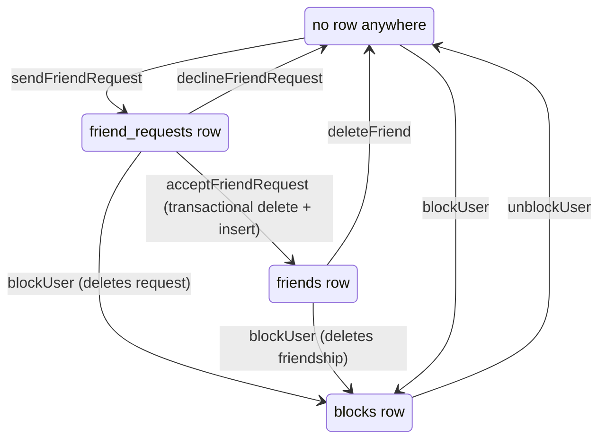

# Friends & Direct Messages

Friends are the only source of DM recipients — there is no separate messaging-permissions layer. Direct messages reuse the entire room/message infrastructure via `RoomType.DirectMessage`.

## How it works

Relationship state is encoded by which table a row lives in — no status enum. All three tables use a deterministic natural key (`getFriendshipId(senderId, receiverId)`, sorted ids joined by a separator), so duplicate sends conflict on the primary key and become no-ops, and any relationship check is an O(1) key lookup.

Blocking is unilateral, but a block in either direction prevents friend requests and excludes the user from `searchUsers` results. Self-relationships are rejected by database CHECK constraints, not just router validation.

The **New Message** dialog lists accepted friends; selecting one or more and confirming calls `createDirectMessage`, which finds or creates the DM room. Idempotency comes from `rooms.participantKey` — the sorted participant ids joined into one string with a unique index — so two users always share exactly one DM room. Group DMs have no size cap of their own — `createDirectMessageInputSchema` bounds the participant list only by the shared `MAX_READ_LIMIT`, and the router's own checks are that every participant is an accepted friend and that none is the creator. They show a generated name ("You, Alice, Bob") unless the creator sets one, and 1:1 DM names are derived at display time from the other participant so they never go stale. Hovering a DM row reveals a close action that soft-hides it (`usersToRooms.isHidden = true`) without deleting the thread.

DMs are invisible to non-participants: invite links are rejected for `RoomType.DirectMessage` and public room discovery excludes them. DM calls work like room calls (see [/docs/esbabbler/calls](/docs/esbabbler/calls)); starting one posts a `MessageType.Call` system message in the thread.

## Data model

| Table            | Key facts                                                                 |
| ---------------- | ------------------------------------------------------------------------- |
| `friendRequests` | pending only; `id` natural key, sender/receiver FKs, no-self CHECK        |
| `friends`        | accepted only; same natural key; directionality preserved (who initiated) |
| `blocks`         | `(blockerId, blockedId)` PK; unilateral                                   |
| `rooms`          | `type` (`Room` \| `DirectMessage`), `participantKey` (unique, DM-only)    |
| `usersToRooms`   | membership for both room types; `isHidden` soft-hide                      |

## Procedures

| Router                          | Procedures                                                                                                                                                             |
| ------------------------------- | ---------------------------------------------------------------------------------------------------------------------------------------------------------------------- |
| `friend`                        | `readFriends`, `deleteFriend`, `searchUsers` (excludes self + blocks)                                                                                                  |
| `friendRequest`                 | `sendFriendRequest`, `acceptFriendRequest`, `declineFriendRequest`, `readFriendRequests`                                                                               |
| `block`                         | `blockUser`, `unblockUser`, `readBlockedUsers`                                                                                                                         |
| `room` (nested `directMessage`) | `createDirectMessage`, `readDirectMessages`, `readDirectMessageParticipants`, `createDirectMessageParticipants`, `deleteDirectMessageParticipant`, `hideDirectMessage` |

## Key files

| File                                                     | Role                                                    |
| -------------------------------------------------------- | ------------------------------------------------------- |
| `packages/db-schema/src/schema/friendRequests.ts`        | Pending-request table                                   |
| `packages/db-schema/src/schema/friends.ts`               | Accepted-friendship table                               |
| `packages/db-schema/src/schema/blocks.ts`                | Block table                                             |
| `packages/app/server/trpc/routers/friend.ts`             | Friend procedures                                       |
| `packages/app/server/trpc/routers/friendRequest.ts`      | Request lifecycle                                       |
| `packages/app/server/trpc/routers/block.ts`              | Blocking                                                |
| `packages/app/server/trpc/routers/room/directMessage.ts` | DM creation, participants, hide                         |
| `packages/app/app/pages/messages/friends.vue`            | Friends management page                                 |
| `packages/app/app/store/message/user/friend.ts`          | Friends client state (+ `friendRequest.ts`, `block.ts`) |

## Notes

- DMs are not a special case in the push path: `getPushSubscriptionsForMessage` has no room-type branch, so a DM is filtered exactly like a room. What makes DMs feel different is the default value of `usersToRooms.notificationType` — `NotificationType.DirectMessage`, whose UI label is **Only @mentions**. That enum value names the _notification preference_, not `RoomType.DirectMessage`, and the two are unrelated: it means notify me when I am mentioned by id. A member who wants every message opts into `All`. See [/docs/esbabbler/push-notifications](/docs/esbabbler/push-notifications).
- Re-adding someone to a group DM they hid works because their `usersToRooms` row is kept (soft-hide, not delete).
