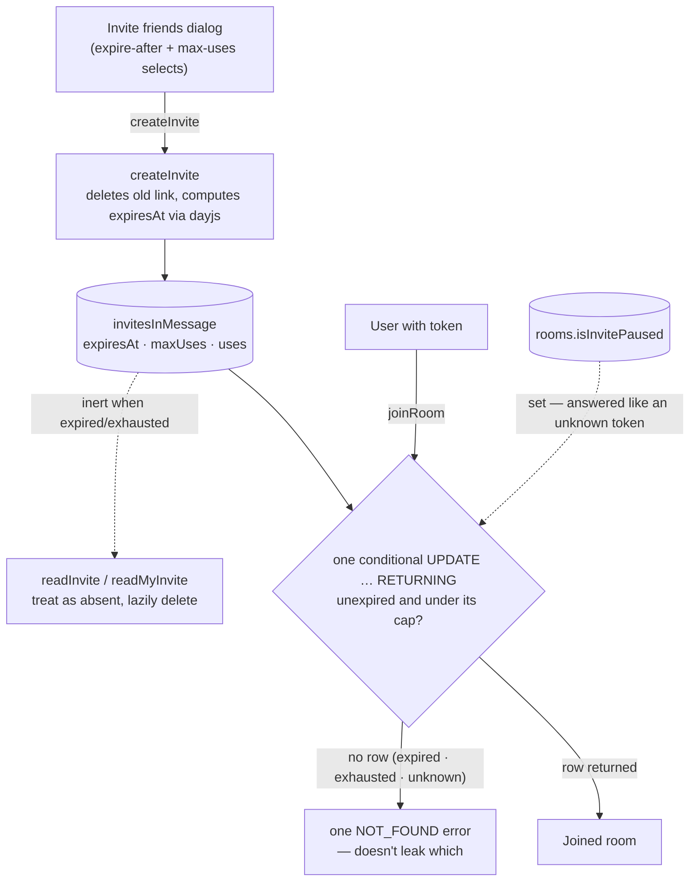

# Invites

Rooms are joined through invite links: an 8-character alphanumeric token (`invitesInMessage.id`, generated by `createId`) embedded in a shareable `/messages/invite/[code]` URL. Each member holds at most **one** invite per room; creating with new options replaces their old link. Invites carry Discord's two options — **expire after** (30 minutes … 7 days, or never) and **max uses** (1 … 100, or unlimited).

## How it works

- **Create**: the invite dialog's selects drive `createInvite`; option values come from the dayjs-computed `InviteExpireAfterMinutesMap` (never manual minute math) and `INVITE_MAX_USES_OPTIONS`. The `0` sentinel means never expires / unlimited uses; `maxUses` stores it as-is (the column is `notNull().default(0)`), while `expireAfterMinutes` maps to a null `expiresAt` since timestamps have no empty value. Changing an option with a live link regenerates it. The dialog shows the real state ("expires in 7 days", "5 uses remaining") from the returned row.
- **Join**: `joinRoom` validates and consumes a use in one `UPDATE … RETURNING` statement — the row matches only while it is unexpired (`expiresAt` null or still in the future) and under its cap (`maxUses` zero, or `uses` below it), and the same statement is what increments `uses` — so two concurrent joins can't both consume the last use. Expired, exhausted, and unknown tokens all produce the same `NOT_FOUND` error.
- **Pause**: `roomsInMessage.isInvitePaused` closes the room to every link at once without deleting any of them — the control for a raid in progress, which the links have to survive. While it is set `joinRoom` answers a live link exactly as it answers an unknown one, so an outsider learns nothing about why, and the use its own statement consumed rolls back with the transaction, so pausing costs a link nothing. `createInvite` refuses too: a paused room minting credentials nobody can use is a slower way of handing out dead links. The button is a `ManageRoom` write through `updateRoom`, like every other room field.
- **Revoke**: a delete rather than a flag — the token is the credential, so the row's absence is what stops it working, and `readInvite` already treats a missing row as unknown. A member revokes their own link; revoking anyone else's is the `ManageInvites` half of [invite management](/docs/proposals/esbabbler/invite-management), which needs the read that lists them first.
- **Cleanup**: no timer — expired/exhausted rows are inert. `readInvite` (the landing page) treats them as absent and `readMyInvite` lazily deletes them; `createInvite` replaces them.
- DM rooms reject invites entirely (see [friends and DMs](/docs/esbabbler/friends-and-dms)); banned users are rejected at join.

## Procedures

All in `server/trpc/routers/room/index.ts`:

| Procedure                                               | Auth   | Purpose                                                        |
| :------------------------------------------------------ | :----- | :------------------------------------------------------------- |
| `createInvite({ roomId, expireAfterMinutes, maxUses })` | member | replace own invite with a new token + options; returns the row |
| `revokeInvite({ id, roomId })`                          | member | delete own invite — the row's absence is what kills the token  |
| `readMyInvite({ roomId })`                              | member | own invite row for the dialog (`null` if none/expired)         |
| `readInvite(id)`                                        | authed | landing-page info; `null` for unknown/expired/exhausted        |
| `joinRoom(id)`                                          | authed | atomic validate + consume + insert membership                  |

## Key files

| File                                                                      | Role                                          |
| :------------------------------------------------------------------------ | :-------------------------------------------- |
| `packages/db-schema/src/schema/invitesInMessage.ts`                       | table + check constraints                     |
| `packages/app/shared/services/room/invite/InviteExpireAfterMinutesMap.ts` | dayjs-computed expiry options (single source) |
| `packages/app/shared/models/db/room/CreateInviteInput.ts`                 | Zod input — only the fixed option values      |
| `packages/app/shared/services/room/invite/checkIsInviteUsable.ts`         | shared usability predicate, client included   |
| `packages/app/server/services/message/readMyInvite.ts`                    | own-invite read + lazy delete                 |
| `packages/app/app/store/message/room/invite.ts`                           | shared per-room invite map                    |
| `packages/app/app/components/Message/Model/Room/Invite/Manager.vue`       | invite manager with option selects            |
| `packages/app/app/components/Message/Model/Room/Invite/Dialog.vue`        | the dialog hosting the manager                |
| `packages/app/app/components/Message/Model/Room/Invite/TableRow.vue`      | the settings panel's row for a live link      |
| `packages/app/app/composables/message/room/useReadMyInvite.ts`            | own-invite read every surface seeds from      |
| `packages/app/app/pages/messages/invite/[code].vue`                       | invite landing page                           |

## Surfaces

Discord's arrangement, and the reason there are two: creating is a dialog, and settings lists what was created.

- **The dialog** — `Invite friends to <room>` — is opened from the room's own row in the sidebar (hover, beside its settings cog) and from the settings panel's `create one` link. It hands over a usable link the moment it opens: the read that finds no live link mints one, and a read that finds one never replaces it, because a live link may already be in someone's inbox. Its option selects then regenerate deliberately.
- **The settings panel** — **User Management → Invites** — is the management side, and where a room's invites are paused and resumed. It reads through the same `useReadMyInvite` without mounting the manager, so opening it creates nothing: it is Discord's table — inviter, invite code, uses, expires — over the link the reader holds, with copy, an `Edit invite link` button into the dialog and a revoke, and Discord's empty state when there is none.

Both display from `useInviteStore`'s per-room map, so a link regenerated on one surface never leaves the other copying a replaced, dead link. Listing the room's other members' links, revoking one and pausing the room's invites are the [invite management](/docs/proposals/esbabbler/invite-management) proposal — none of them has a read or a write today.
