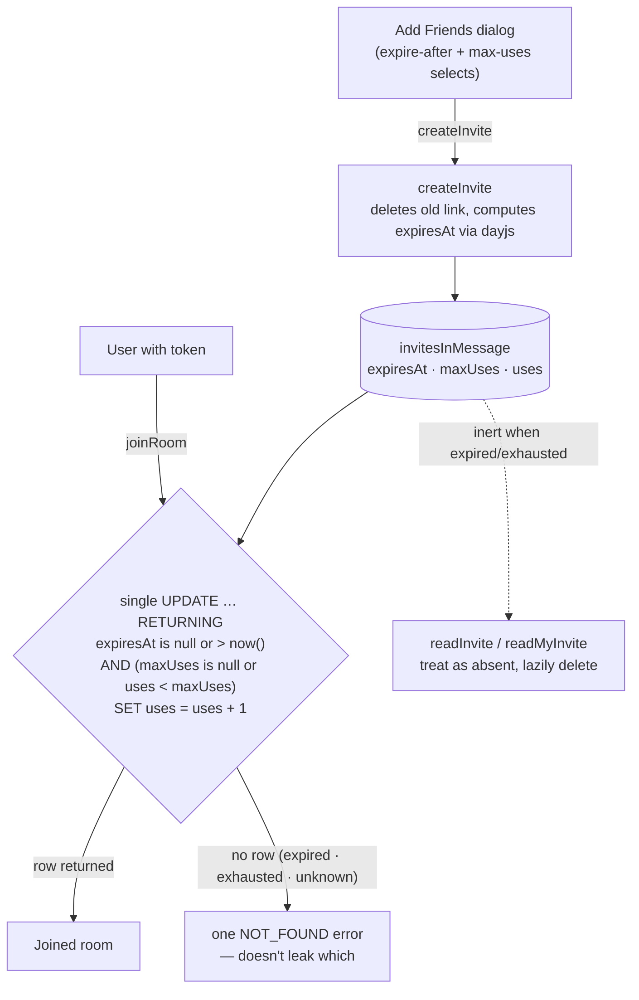

# Invites

Rooms are joined through invite links: an 8-character alphanumeric token (`invitesInMessage.id`, generated by `createId`) embedded in a shareable `/messages/invite/[code]` URL. Each member holds at most **one** invite per room; creating with new options replaces their old link. Invites carry Discord's two options — **expire after** (30 minutes … 7 days, or never) and **max uses** (1 … 100, or unlimited).

## How it works

- **Create**: the Add Friends dialog's selects drive `createInvite`; option values come from the dayjs-computed `InviteExpireAfterMinutesMap` (never manual minute math) and `INVITE_MAX_USES_OPTIONS`. Changing an option with a live link regenerates it. The dialog shows the real state ("expires in 7 days", "5 uses remaining") from the returned row.
- **Join**: `joinRoom` validates and consumes a use in one `UPDATE … RETURNING` statement, so two concurrent joins can't both consume the last use. Expired, exhausted, and unknown tokens all produce the same `NOT_FOUND` error.
- **Cleanup**: no timer — expired/exhausted rows are inert. `readInvite` (the landing page) treats them as absent and `readMyInvite` lazily deletes them; `createInvite` replaces them. Existing rows with null options keep the previous forever-valid behaviour.
- DM rooms reject invites entirely (see [/docs/esbabbler/friends-and-dms](/docs/esbabbler/friends-and-dms)); banned users are rejected at join.

## Procedures

All in `server/trpc/routers/room/index.ts`:

| Procedure                                               | Auth   | Purpose                                                        |
| :------------------------------------------------------ | :----- | :------------------------------------------------------------- |
| `createInvite({ roomId, expireAfterMinutes, maxUses })` | member | replace own invite with a new token + options; returns the row |
| `readMyInvite({ roomId })`                              | member | own invite row for the dialog (`null` if none/expired)         |
| `readInvite(id)`                                        | authed | landing-page info; `null` for unknown/expired/exhausted        |
| `joinRoom(id)`                                          | authed | atomic validate + consume + insert membership                  |

## Key files

| File                                                                      | Role                                          |
| :------------------------------------------------------------------------ | :-------------------------------------------- |
| `packages/db-schema/src/schema/invitesInMessage.ts`                       | table + check constraints                     |
| `packages/app/shared/services/room/invite/InviteExpireAfterMinutesMap.ts` | dayjs-computed expiry options (single source) |
| `packages/app/shared/models/db/room/CreateInviteInput.ts`                 | Zod input — only the fixed option values      |
| `packages/app/server/services/message/checkIsInviteUsable.ts`             | shared usability predicate                    |
| `packages/app/server/services/message/readMyInvite.ts`                    | own-invite read + lazy delete                 |
| `packages/app/app/components/Message/Content/AddFriendsDialogButton.vue`  | dialog with option selects                    |
| `packages/app/app/pages/messages/invite/[code].vue`                       | invite landing page                           |
