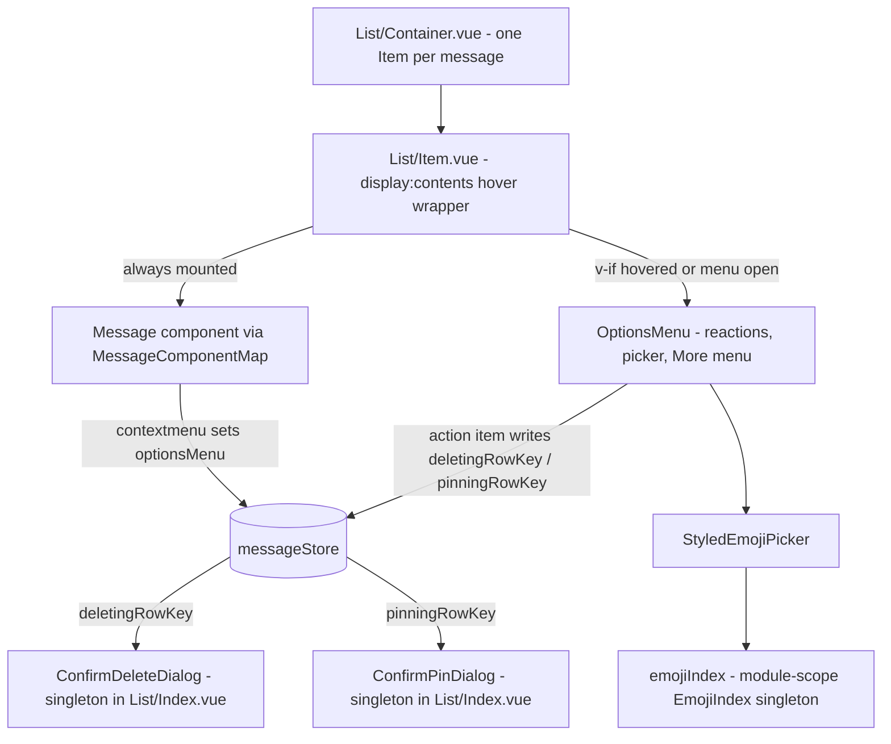

# Message List Rendering

The message list renders every loaded message as live DOM (no virtualization yet), so anything mounted per item multiplies by the page size and every pagination batch. The architecture therefore keeps each item down to its message component plus a hover wrapper, and everything interactive-but-occasional — the hover options menu, the confirm dialogs, the emoji search index — exists at most once for the whole list.

## How it works

`List/Container.vue` renders one `List/Item.vue` per message. Each item is wrapped in a `display: contents` div so the message component and its overlapping options menu stay direct flex children of the column-reversed `v-list` while sharing one `mouseenter`/`mouseleave` region — hovering either keeps the toolbar alive, with no unmount race when the pointer crosses between them.

The options menu (reaction buttons, emoji picker, edit/reply/forward buttons, the "More" context menu) is mounted with `v-if` only for the item that is hovered, the context-menu target (`messageStore.optionsMenu`), or has one of its menus open — so exactly one instance of that Vuetify-overlay-heavy subtree exists at a time. Right-clicking a message sets `optionsMenu = { rowKey, target: [x, y] }`, which both mounts the toolbar on that item and opens its "More" menu at the pointer.

The confirm dialogs follow the same store-driven singleton pattern as the forward dialog: `List/Index.vue` mounts one `ConfirmDeleteDialog` and one `ConfirmPinDialog`, driven by `messageStore.deletingRowKey` / `pinningRowKey`. Action items (`useMessageActionItems`) write those store refs directly instead of threading emit chains through the component tree.

`emojiIndex` is a module-scope singleton service: `EmojiIndex` builds a search index over the ~845&nbsp;KB `emoji-mart-vue-fast` dataset in its constructor, so it is constructed once for the whole app, never per picker instance.

## Key files

| File                                                                        | Role                                                              |
| --------------------------------------------------------------------------- | ----------------------------------------------------------------- |
| `packages/app/app/components/Message/Model/Message/List/Item.vue`           | Hover wrapper, lazy options menu mount, context-menu handling     |
| `packages/app/app/components/Message/Model/Message/OptionsMenu/Index.vue`   | Options toolbar (reactions, picker, items, More menu)             |
| `packages/app/app/components/Message/Model/Message/ConfirmDeleteDialog.vue` | Store-driven delete dialog singleton                              |
| `packages/app/app/components/Message/Model/Message/ConfirmPinDialog.vue`    | Store-driven pin dialog singleton                                 |
| `packages/app/app/composables/message/message/useMessageActionItems.ts`     | Action items writing store targets directly                       |
| `packages/app/app/services/message/emoji/emojiIndex.ts`                     | Shared `EmojiIndex` instance                                      |
| `packages/app/app/store/message/index.ts`                                   | `optionsMenu`, `editingRowKey`, `deletingRowKey`, `pinningRowKey` |

## Notes

- Anything added inside `List/Item.vue` outside the `v-if` toolbar block is paid once per loaded message and again per pagination batch — keep new per-item work O(1) and lazy.
- One options-menu store write must never fan out re-renders: per-item computeds (`isDisabled`, `isContextMenuTarget`) only propagate when their own value changes, so untargeted items stay untouched.
- List virtualization is the remaining lever if very long scrollback sessions become a problem.
