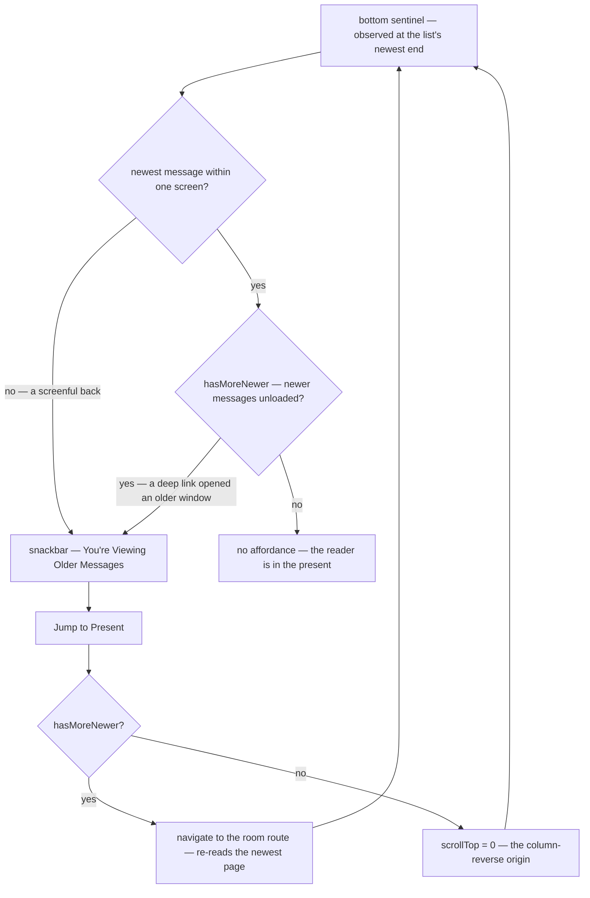

# Message List Scrolling

The message list is a `column-reverse` scroll container, so its scroll origin is the newest message and scrolling back through history moves the offset negative. Everything on this page answers one question: **is the reader looking at the present?** The jump-to-present affordance, the anchoring class on the list, and what a jump actually does are all the same fact read from different places, so they are one predicate in the scroll store rather than a measurement each surface takes for itself.

## Being in the present is two facts, not one

A reader is in the present when **the newest loaded message is on screen** _and_ **the loaded window is the live tail**. Either half can fail on its own:

- **The reader scrolled back by a screenful** — observed with an `IntersectionObserver` over a zero-height sentinel rendered at the list's newest end, whose `rootMargin` is the container's own height. A screen is the threshold every chat client the reader already knows uses: a wheel notch off the newest message is still reading the present, a screen back is browsing history. Expressing it as the reader's viewport rather than a tuned pixel count is what makes it hold on a phone and on a tall monitor alike.
- **The window is not the live tail** — `hasMoreNewer` is set. A deep link into an older message opens the room _around_ that message and leaves the newer ones unloaded ([offline cache](/docs/esbabbler/offline-cache) covers why that cursor is keyed per room), so the bottom of that window is still the past no matter how far down the reader scrolls.

The same sentinel is observed twice, because the two consumers want different edges: the affordance wants the screenful above, while the list's `overflow-anchor` class wants the strict bottom — it may only be disabled where the reader is genuinely pinned, and half a screen up it is the browser's own anchoring that holds their place as a message arrives. Both observers start pinned (`initialValue: true`): an observer reports a frame after it is created, so defaulting to "away from the present" flashes the affordance over every room the reader opens.

**A scroll offset cannot answer either half.** `useScroll` writes its offset from scroll events, and nothing re-measures when the observed element changes — so a list that remounts (a room switch, the jump that leaves the permalink route) inherits the offset of the list that was torn down and keeps reporting it until the reader scrolls the new one. That is what left the affordance on screen after a jump had already reached the present: the click navigated, the new list mounted at the origin, and the stale offset still said the reader was thousands of pixels back. An `IntersectionObserver` re-observes and reports as soon as its target changes, which is why the sentinel — not a threshold — is the instrument.

## What a jump does

`jumpToPresent` branches on the same `hasMoreNewer` the affordance reads, never on the route: **scrolling cannot reach messages that were never loaded.** A window that is not the tail is re-read by navigating to the room's own route, which remounts the list on the newest page; a window that already holds the newest message is scrolled to its origin, keeping every page the reader scrolled through. Keying that branch on the route parameter instead spends a full re-read on a reader who had already paged forward to the present, and would silently scroll-and-do-nothing for any future window whose newer cursor did not come from a permalink.

The affordance is a **persistent** snackbar (`SNACKBAR_PERSISTENT_TIMEOUT`). It reports where the reader is rather than something that happened, and Vuetify's default timeout would retract it while the list is still in the past — with a one-way `:model-value` binding, nothing brings it back until the predicate flips.

## Loading newer pages without moving the reader

The list pages in both directions from a `StyledWaypoint` at each end. Older pages append past the origin, which the browser absorbs. Newer pages insert _before_ everything on screen, so `readMoreNewerMessages` anchors instead of trusting `scrollHeight`: it records the top of the first genuinely visible message element, waits for Vue to render the page, then shifts `scrollTop` by however far that element moved. `column-reverse` height deltas are easy to get subtly wrong, which is why a real element is the anchor and not a measured height. The compensation is skipped while the reader is actively scrolling — a correction applied mid-gesture fights the gesture.

`overflow-anchor` is disabled only while the reader is in the present, so a message arriving at the tail keeps them at the tail; anywhere else the browser's own anchoring is what holds their place.

A permalink lands through `useScrollToMessage`: if the room and the message are already loaded it highlights the row (`activeRowKey`, cleared by a timer) and scrolls it into view, otherwise it navigates to the permalink route, whose mounted list scrolls to the named message.

## Key files

| File                                                             | Role                                                                |
| ---------------------------------------------------------------- | ------------------------------------------------------------------- |
| `app/store/message/ui/scroll.ts`                                 | The present predicate, the sentinel, `jumpToPresent`, row highlight |
| `app/components/Message/Model/Message/List/Index.vue`            | Scroll container, sentinel, both waypoints, anchor compensation     |
| `app/components/Message/Model/Message/JumpToPresentSnackbar.vue` | The affordance itself                                               |
| `app/components/Message/Model/Message/List/Container.vue`        | Mounted scroll to the permalinked message                           |
| `app/composables/message/message/useReadMessages.ts`             | The newer cursor a permalink read leaves behind                     |
| `app/composables/message/message/useScrollToMessage.ts`          | Highlight-and-scroll, or navigate to the permalink route            |

## Notes

- Both halves of the predicate live in the store, so a new surface that needs "is the reader in the present" reads it rather than measuring a scroll offset of its own.
- There is no tuned number here: the threshold is a viewport and everything else is observed state. Message age is deliberately not a signal — nobody's client uses it, and it would announce history constantly in a busy room and never in a quiet one.
