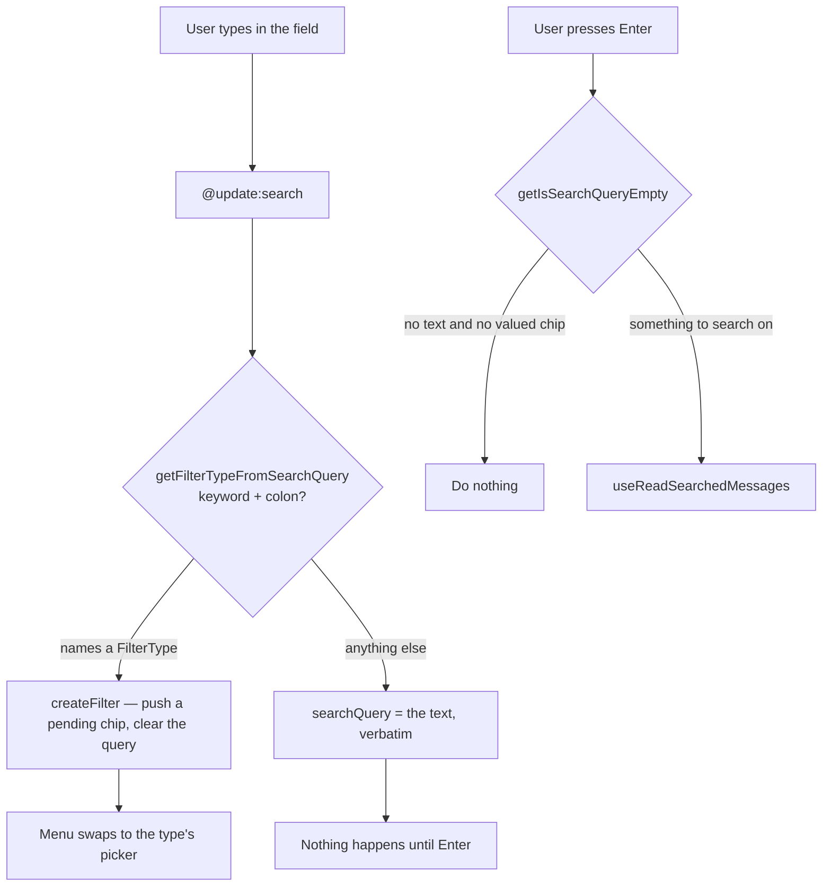
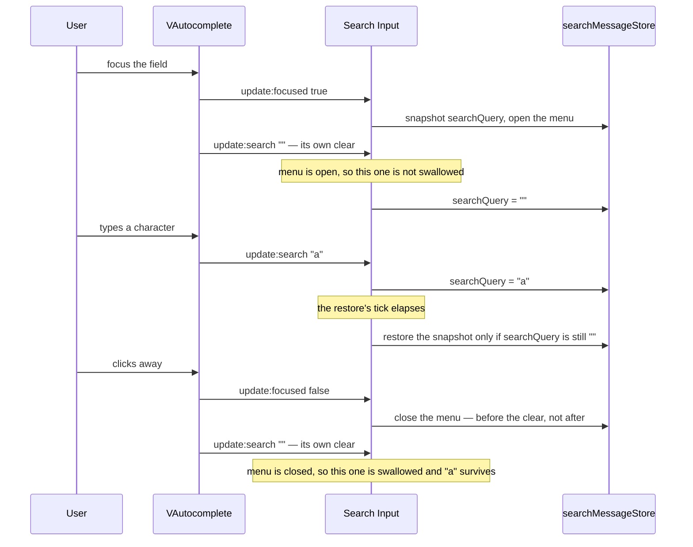
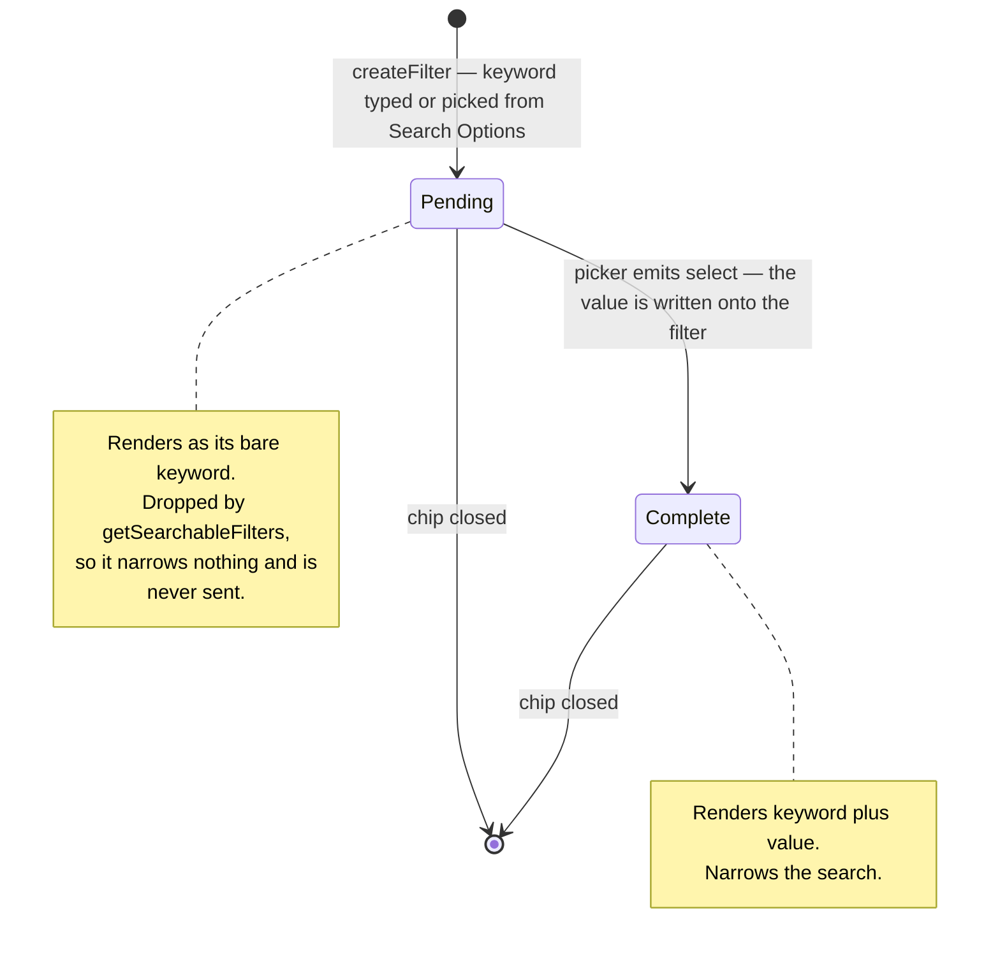
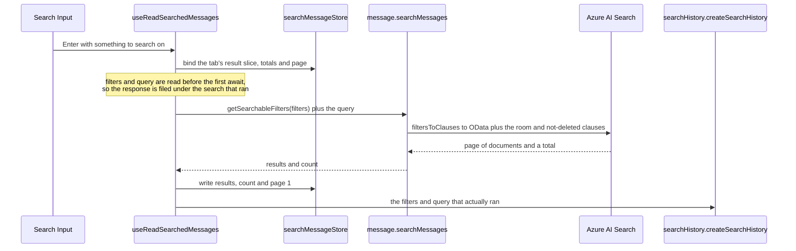

# Message search

The right sidebar searches a room's messages through the Azure AI Search index. One field carries two different things at once: **filter chips** that narrow structurally (`from:`, `has:`, `before:`) and **free text** that is matched against message content. This page is the ground truth for how a keystroke becomes one or the other, and for what a search is allowed to send.

Unlike every other search surface in the app, this one is explicit-submit — nothing fires per keystroke, so it sits outside the [`useAutoSearch` stack](/docs/architecture/search) by design.

## How typed text becomes a chip or a query

There is exactly one rule, and `getFilterTypeFromSearchQuery` is the only place that decides it: **a word becomes a chip when the word names a `FilterType` and is followed by a colon.** Everything else — including a word that ends in a colon but names nothing — stays search text and is searched for literally.

**The colon is the trigger, and the only one.** The rule runs per keystroke on `@update:search`, so the chip appears the instant the colon is typed, the way Discord does. Enter is therefore never a second chance to convert: by the time it is pressed, whatever is in the field is search text by definition, and Enter's only job is to search on it.

Enter never writes typed text into a chip either. No typed text can be the userId, room id, media kind, date or boolean a filter needs, so filling a chip from the field produces a filter the input schema rejects, one `filtersToClauses` throws on, or one that silently matches nothing. **Only a picker gives a filter its value.**

## Vuetify's clear, and why the field saves and restores itself

**The query outlives focus** — clicking away from a query you have not searched yet never empties the field. That takes work, because the text lives in the store rather than in Vuetify (the field is controlled through `:search`) and Vuetify clears its own search text on **every focus transition**, in both directions.

The two directions are handled differently, and neither can be dropped:

- **Focus lost** — the clear is _swallowed_, because `@update:search` ignores an empty value while the menu is closed. That only works if losing focus closes the menu **in the focus handler**: Vuetify's clear arrives before the overlay's own click-away handling, so leaving the close to the overlay lets the clear through and empties the field. Interacting with the menu never reaches this, since the menu prevents mousedown and the field keeps focus.
- **Focus gained** — the same trick is unavailable, because the menu is open by then. So the store's value is snapshotted on focus and written back a tick later, once Vuetify's clear has landed.

That restore is the subtle one: **it only applies while the field is still empty.** A character typed inside that tick is the newer value, and restoring the snapshot over it puts the older empty one back — the search then reaches the server as `query: ""` and the input schema refuses it.

## A chip's lifecycle

`createFilter` pushes `{ type, value: "" }`. That `""` is the absent-value sentinel: the chip exists, shows its keyword, and is waiting. `SearchFilterComponentMap` maps the type to the picker that fills it — members for `from:`/`mentions:`, rooms for `in:`, the media kinds for `has:`, a date picker for `before:`/`during:`/`after:`, true/false for `pinned:`.

The pending test is `value === ""` — **never falsiness**. `pinned: false` is a value the user chose, and reading it as absent leaves the chip blank with its picker still open.

Only the last chip is ever pending, because a chip is created by typing its keyword and immediately needs a value; that is what `activeSelectedFilter` means, and it is what the menu keys its picker off.

## What a search sends

Everything that searches goes through `getSearchableFilters`, on both sides of the wire. It drops pending chips, because they have no value to narrow on, and it drops exact repeats, because a second identical filter narrows nothing the first did not. `getIsSearchQueryEmpty` asks the same question, so a pending chip on its own is not a search.

**Filters are not unique by type.** Azure Search takes one clause per filter, so two `from:` chips or two `has:` chips narrow together — `filtersToClauses` groups by type and emits a clause per value (`mentions:` being the one that collects its values into a single `arrayContains`). The wire and row schemas therefore constrain the array's length, not its uniqueness by type.

A history row therefore records what was searched, not what was on screen — clicking one restores exactly that combination, which is why a pending chip must never reach it.

Browsing a room's attachments is `has: file` and nothing more — a filter like every other narrowing, rather than a second surface asking the same question with its own result slice to keep apart. What those attachments are is [file and media](/docs/esbabbler/file-media)'s subject.

Results, totals and the current page are all keyed by room, so a response that lands after the user has moved on is filed under the room it was issued for rather than shown under the new one.

## Key files

| File                                                          | Role                                                                     |
| ------------------------------------------------------------- | ------------------------------------------------------------------------ |
| `app/components/Message/RightSideBar/Search/Input.vue`        | The chip field — the colon that converts, and the Enter that searches    |
| `app/components/Message/RightSideBar/Search/Menu.vue`         | Picker for the pending chip, otherwise Search Options plus history       |
| `app/services/message/filter/getFilterTypeFromSearchQuery.ts` | The keyword-plus-colon rule, and the only place it is decided            |
| `app/services/message/filter/SearchFilterComponentMap.ts`     | Filter type to the picker that gives it a value                          |
| `app/services/message/filter/getFilterDisplayValue.ts`        | What a chip reads as, pending or complete                                |
| `shared/services/message/getIsFilterPending.ts`               | The `""` sentinel test — the one definition of "waiting for a value"     |
| `shared/services/message/getSearchableFilters.ts`             | The filters a search runs with — pending chips and exact repeats dropped |
| `shared/services/message/getIsSearchQueryEmpty.ts`            | Whether there is anything to search on at all                            |
| `app/composables/message/search/useReadSearchedMessages.ts`   | The explicit-submit read, and the history row it earns                   |
| `app/store/message/search/index.ts`                           | Per-room query, chips, results, totals and page                          |
| `server/services/message/searchMessages.ts`                   | Clause assembly and the paged index read                                 |
| `packages/db/src/services/azure/search/filtersToClauses.ts`   | Each filter type's OData clause                                          |
