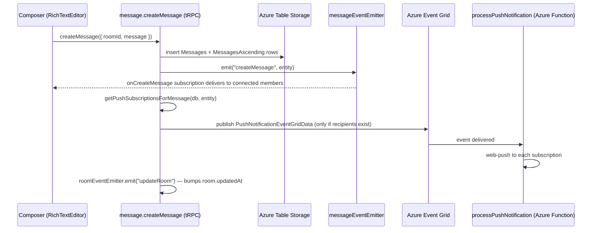

# Messaging

Messages are high-volume, append-heavy, and time-ordered, so they live in Azure Table Storage rather than Postgres. Everything relational around them (rooms, membership, roles) stays in Postgres.

## How it works

Messages are stored in `AzureTable.Messages` with `partitionKey = roomId` and `rowKey = reverseTickedTimestamp` — a reverse-ticked timestamp is `MAX_TICKS - now`, so lexicographic row order is newest-first, which matches how a chat list paginates. `AzureTable.MessagesAscending` is a companion index table keyed by the original timestamp so messages can be read in both directions (thread view, jump-to-message). `AzureTable.MessagesMetadata` holds per-message companion data.

Sending a message flows through one server service, `createUserMessage`, which writes storage, notifies live subscribers, and kicks off push delivery:

Real-time delivery is two-layered:

- **In-process** — `messageEventEmitter` / `roomEventEmitter` drive tRPC subscriptions (`onCreateMessage`, `onUpdateMessage`, `onDeleteMessage`, `onCreateTyping`). The app runs a single Node process, so this is sufficient (see [/docs/esbabbler/decisions](/docs/esbabbler/decisions) — cross-process event bridge).
- **Azure Web PubSub** — used for inbound webhook message delivery; clients get a scoped access URL via `getWebPubSubClientAccessUrl`.

Push notification filtering and delivery detail lives in [/docs/esbabbler/push-notifications](/docs/esbabbler/push-notifications).

## Message types

`MessageType` (in `@esposter/db-schema`) discriminates rendering and behaviour: `Message`, `Poll`, `Call` (call started / call-end duration system message), `EditRoom`, `PinMessage`, `System` (join/leave), and `Webhook`. Adding a type requires updating `MessageEntityMap` (type → entity class) and `MessageComponentMap` (type → Vue rendering component).

Mentions are stored as HTML: the TipTap mention suggestion inserts `` nodes, which the server later parses for notification targeting and the client resolves to display names (see [/docs/esbabbler/nicknames](/docs/esbabbler/nicknames)).

## Procedures

The `message` router is flat-merged at the tRPC root, with `emoji`, `moderation`, and `scheduledMessageJob` nested under it. Highlights:

| Procedure                         | Auth   | Purpose                                             |
| --------------------------------- | ------ | --------------------------------------------------- |
| `createMessage`                   | member | Write message, emit, trigger push                   |
| `updateMessage` / `deleteMessage` | author | Edit/delete own messages (message-scoped procedure) |
| `forwardMessage`                  | member | Forward into another room                           |
| `pinMessage` / `unpinMessage`     | member | Room-wide pins                                      |
| `readMessages` / `readThread`     | member | Cursor pagination / thread view                     |
| `searchMessages`                  | member | Filtered search via the Azure AI Search index       |
| `readMySentMessages`              | authed | Cross-room sent list from the Search index          |
| `onCreateMessage` etc.            | member | Live subscriptions                                  |
| `createTyping` / `onCreateTyping` | member | Typing indicators                                   |
| `generate*FileSas*`               | member | SAS-based file upload/download URLs                 |

## Key files

| File                                                        | Role                                                |
| ----------------------------------------------------------- | --------------------------------------------------- |
| `packages/app/server/trpc/routers/message/index.ts`         | Message router (procedures above)                   |
| `packages/app/server/services/message/createUserMessage.ts` | Send pipeline: table write, emit, EventGrid publish |
| `packages/db-schema/src/models/azure/table/AzureTable.ts`   | Table name enum (Messages, MessagesAscending, …)    |
| `packages/db-schema/src/models/message/MessageType.ts`      | Message type discriminator                          |
| `packages/app/server/services/message/events/`              | `messageEventEmitter` and friends                   |

## Notes

- Never bypass `createUserMessage` when adding a message-producing path — timeout, read-only, slowmode, and word-filter checks happen there and in the member procedures.
- Azure Table has no joins: anything that must be queried relationally (e.g. who to notify) is resolved against Postgres at send time.
