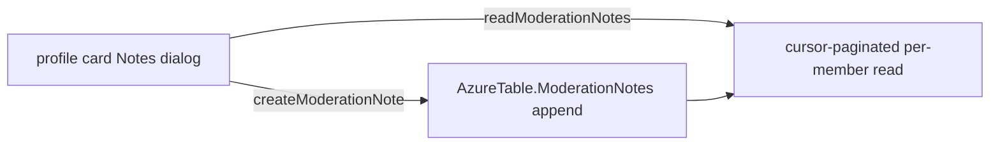

# Moderator Notes

Free-text notes a moderator can attach to a room member, visible only to holders of a moderation permission — context for future moderation decisions ("warned twice for spam in June"). Notes are append-only, so the record stays trustworthy — a correction is a new note, never an edit.

## How it works

Notes are moderation-log-shaped (append-heavy, time-ordered, per-room, no joins), so they live in Azure Table alongside the audit log rather than in Postgres. Each note is partitioned by `roomId` with a reverse-ticked `rowKey` so the newest note sorts first, and carries the target member, the authoring moderator, and the note text. The member's profile-card moderation menu gains a **Notes** item — a count badge shows how many notes exist, and the dialog lists them newest-first with an input to append another.

Room deletion cleans the partition the same way messages are cleaned.

## Data model

Azure Table `AzureTable.ModerationNotes`: `partitionKey = roomId`, `rowKey = reverseTickedTimestamp`, fields `targetUserId`, `actorUserId`, and `note` (bounded by a max-length constant). There is no edit or delete.

## Procedures

All under `message.moderation.` (`server/trpc/routers/message/moderation.ts`), gated on `KickMembers` — the lowest "acts on members" moderation bit, consistent with warn and timeout being visible to the same audience:

| Procedure                                               | Purpose                          |
| ------------------------------------------------------- | -------------------------------- |
| `createModerationNote({ roomId, targetUserId, note })`  | append a note                    |
| `readModerationNotes({ roomId, targetUserId, cursor })` | cursor-paginated per-member view |
| `countModerationNotes({ roomId, targetUserId })`        | note count for the menu badge    |

## Key files

| File                                                                                  | Role                   |
| :------------------------------------------------------------------------------------ | :--------------------- |
| `packages/db-schema/src/models/message/ModerationNoteEntity.ts`                       | note entity            |
| `packages/app/server/trpc/routers/message/moderation.ts`                              | the three procedures   |
| `packages/app/app/store/message/moderation/note.ts`                                   | client note list store |
| `packages/app/app/components/Message/Model/User/ProfileCard/MoreMenu/NotesDialog.vue` | notes menu + dialog    |
